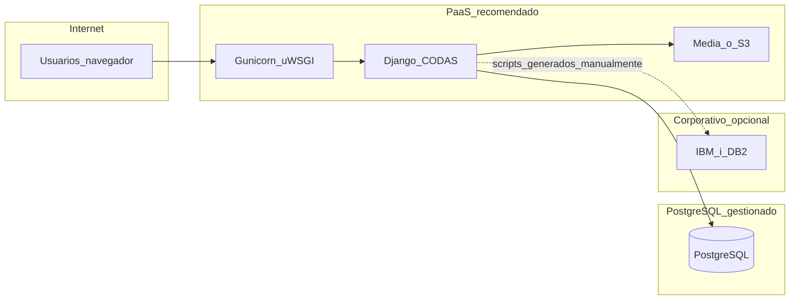
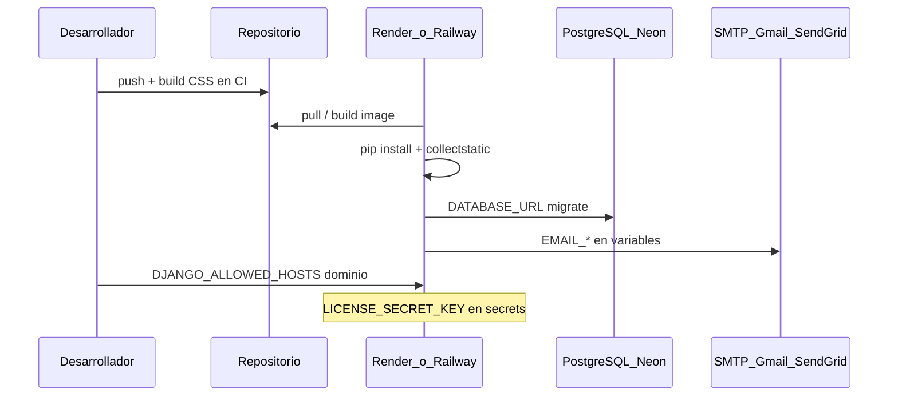

# Despliegue web de CODAS — proveedores y alternativas

Documento de referencia para publicar el **panel CODAS** en internet: requisitos del stack actual, proveedores compatibles con tier gratuito o de prueba, combinaciones recomendadas y brechas pendientes en el repositorio antes del primer go-live.

**Relacionado:** [CODAS_CONTEXTO.md](CODAS_CONTEXTO.md) § 6.1 (entornos y variables), [CODAS_DATABASE.md](CODAS_DATABASE.md) § 6 (PostgreSQL en producción).

---

## Qué exige la estructura actual del proyecto

Según [CODAS_CONTEXTO.md](CODAS_CONTEXTO.md) § 6.1, [CODAS_DATABASE.md](CODAS_DATABASE.md) y `codas/settings/`:

| Componente | Estado en el repo |
|------------|-------------------|
| **Runtime** | Python 3.12+ (reglas del proyecto), Django 6, dependencias en [`requirements.txt`](../requirements.txt) (`psycopg[binary]`, Pillow, pyotp, qrcode) |
| **Entrada HTTP** | WSGI en [`codas/wsgi.py`](../codas/wsgi.py) → `codas.settings.production` por defecto |
| **Base de datos** | **Solo PostgreSQL** (`DATABASE_URL` o `DB_*`); ver [`codas/settings/_database.py`](../codas/settings/_database.py). SQLite no es válido |
| **Variables obligatorias en producción** | `DJANGO_SECRET_KEY`, `DJANGO_ALLOWED_HOSTS`, `LICENSE_SECRET_KEY`, PostgreSQL, **SMTP** (`EMAIL_*` — producción exige correo real en [`codas/settings/production.py`](../codas/settings/production.py)) |
| **Frontend** | Tailwind compilado con npm: `npm run build:css:min` → [`static/css/tailwind.css`](../static/css/tailwind.css) (hoy vía `STATICFILES_DIRS`, sin `STATIC_ROOT` ni WhiteNoise) |
| **Subidas** | `MEDIA_ROOT` para logos de compañía (`apps/company` `ImageField`) — en PaaS hace falta disco persistente o almacenamiento externo |
| **Dominio del producto** | La app **genera SQL para IBM i**; el hosting web **no** sustituye al servidor DB2/iSeries (solo alberga el panel CODAS) |

**Documentación ya alineada:** [CODAS_DATABASE.md](CODAS_DATABASE.md) § 6 menciona explícitamente **PythonAnywhere** + PostgreSQL addon o BD externa.

---

## Proveedores que encajan (y cuáles no)

### Aptos para CODAS (Django + PostgreSQL de larga duración)

| Proveedor | Por qué encaja | Tier gratuito / prueba (orientativo, 2026) |
|-----------|----------------|--------------------------------------------|
| **[Render](https://render.com)** | Web Service (WSGI) + PostgreSQL gestionado; `DATABASE_URL` nativa | Web **Free** (se duerme tras inactividad; arranque lento). Postgres **ya no es free permanente** en muchas cuentas — plan de pago bajo o BD externa |
| **[Railway](https://railway.app)** | Deploy desde Git, variables de entorno, Postgres addon | **Crédito de prueba** (~5 USD/mes equivalente); luego consumo. Muy rápido para estabilizar |
| **[Fly.io](https://fly.io)** | Máquina + volumen para `media/` + Postgres (Fly Postgres o externo) | **Free allowance** limitado; bueno para staging corto |
| **[PythonAnywhere](https://www.pythonanywhere.com)** | Citado en CODAS; Python/Django nativo | **Beginner free**: 1 app web, **sin** Postgres incluido en free → combinar con **Neon/Supabase** |
| **[Neon](https://neon.tech)** | Solo PostgreSQL serverless | **Free tier** generoso para BD; app en Render/Railway/PA |
| **[Supabase](https://supabase.com)** | PostgreSQL + connection string | **Free** con límites; app Django en otro PaaS |
| **[ElephantSQL](https://www.elephantsql.com)** / **[Aiven](https://aiven.io)** | Postgres gestionado pequeño | Plan free/trial pequeño para pruebas |
| **[DigitalOcean App Platform](https://www.digitalocean.com/products/app-platform)** | Django + managed DB | **Crédito inicial** (p. ej. 200 USD 60 días) — no free perpetuo |
| **[Azure](https://azure.microsoft.com)** / **[AWS](https://aws.amazon.com)** | App Service / Elastic Beanstalk + RDS | **Free trial** cuenta nueva (12 meses / créditos); más operación, menos “un clic” |
| **[Google Cloud Run](https://cloud.google.com/run)** + Cloud SQL | Posible con contenedor | Free tier acotado; Cloud SQL casi nunca “gratis”; más complejo para Django tradicional |

### Poco o nada recomendables para este repo

| Proveedor | Motivo |
|-----------|--------|
| **Vercel / Netlify (serverless puro)** | Django WSGI con sesiones, admin y uploads no encaja bien sin contenedor/workaround |
| **GitHub Pages / hosting estático** | No ejecuta Python/Django |
| **Heroku** | Sin free tier clásico; solo pago |

---

## Alternativas recomendadas para “probar gratis mientras se estabiliza”

Ordenadas por equilibrio **facilidad / coste cero-bajo / alineación con CODAS**:

### 1. Render (app) + Neon (PostgreSQL) — recomendación principal staging

- **App:** Render Web Service Free, `DJANGO_SETTINGS_MODULE=codas.settings.production`, comando tipo `gunicorn codas.wsgi:application`.
- **BD:** Neon free → `DATABASE_URL` + `DB_SSLMODE=require` (ya contemplado en [`.env.example`](../.env.example)).
- **Pros:** HTTPS automático, deploy Git, documentación Django abundante.
- **Contras:** App free duerme; cold start; logos en `media/` se pierden al redeploy sin **disco persistente** (Render free no es ideal para `MEDIA_ROOT` — aceptable en prueba sin logos o migrar a S3 después).

### 2. Railway (todo en uno) — mejor UX de prueba unificada

- Un proyecto con servicio **web** + plugin **PostgreSQL**; Railway inyecta `DATABASE_URL`.
- **Pros:** Menos piezas que Render+Neon; ideal para demos internas 2–4 semanas con crédito trial.
- **Contras:** Cuando se acaba el crédito, pasa a facturación; vigilar consumo.

### 3. PythonAnywhere + Neon — alineado con documentación CODAS

- Ya referenciado en [CODAS_DATABASE.md](CODAS_DATABASE.md) § 6.
- **Pros:** Enfoque Python puro, bueno si el equipo ya conoce PA.
- **Contras:** Free muy limitado (subdominio `*.pythonanywhere.com`, sin HTTPS custom en free, BD aparte); menos moderno que Render/Railway.

### 4. Fly.io — si necesitas volumen para `media/`

- Volumen persistente para `media/` (logos).
- **Pros:** Control casi tipo VPS.
- **Contras:** Más DevOps (Dockerfile, `fly.toml`); curva de aprendizaje.

### 5. DigitalOcean / Azure con crédito de cuenta nueva — “staging casi producción”

- Cuando el free tier PaaS se quede corto (SMTP corporativo, dominio propio, SLA).
- Usar solo durante el **trial** para no sorprender con factura.

---

## Comparativa rápida (criterio: estabilizar en web con poco coste)

| Opción | Coste inicial | PostgreSQL | HTTPS | Media/logos | Esfuerzo deploy |
|--------|---------------|------------|-------|-------------|-----------------|
| Render + Neon | ~0 € | Neon free | Sí | Débil en free | Medio |
| **Railway (Git)** | Crédito trial | Incluido | Sí | Volumen opcional | Bajo — **[guía operativa](CODAS_DEPLOYMENT_RAILWAY.md)** |
| PythonAnywhere + Neon | ~0 € | Neon free | Sí (subdominio) | Limitado | Medio |
| **PythonAnywhere + addon PG (ZIP)** | Según plan PA | Addon PA | Sí | Mapeo `/media/` | Medio — **[guía operativa](CODAS_DEPLOYMENT_PYTHONANYWHERE.md)** |
| Fly.io + Neon | ~0 € limitado | Externo o Fly | Sí | Bueno con volumen | Alto |
| DO/Azure trial | Crédito | Managed | Sí | Bueno | Medio-alto |

---

## Brechas en el repo antes del primer despliegue

El proyecto **está preparado a nivel settings** (`production.py`, `_database.py`, `wsgi.py`) pero **falta empaquetado de despliegue**:

1. **Servidor WSGI:** `gunicorn` en [`requirements.txt`](../requirements.txt) — **hecho**.
2. **Estáticos en producción:** `STATIC_ROOT`, middleware WhiteNoise y `collectstatic` en deploy — **hecho** en settings; pendiente comando en `railway.toml`/build.
3. **Build CSS en CI/deploy:** `npm run build:css:min` en [`railway.toml`](../railway.toml) — **hecho**; CSS también versionado en `static/css/tailwind.css`.
4. **HTTPS Django:** `CSRF_TRUSTED_ORIGINS`, `SECURE_PROXY_SSL_HEADER` y cookies secure — **hecho** en `production.py`.
5. **Correo:** SMTP real (Gmail app password, SendGrid free tier, Amazon SES sandbox, etc.) — obligatorio en producción según [`codas/settings/_email.py`](../codas/settings/_email.py).
6. **Comandos post-deploy:** `migrate`, `createsuperuser` (o comando de desarrollo acordado), carga de datos si aplica.
7. **`.env` en servidor:** nunca subir el `.env` local; usar variables del panel del proveedor (el repo ya usa `python-dotenv` + `.env.example`).

Ningún proveedor de la lista evita estos pasos; son estándar Django.

---

## Flujo de despliegue sugerido (staging)

---

## Recomendación práctica

- **Primera URL pública (estabilización):** **Railway** (todo en uno) *o* **Render + Neon** si quieres separar BD y app para migrar después sin lock-in.
- **Si priorizas la doc existente del proyecto:** **PythonAnywhere (web) + Neon (Postgres)**.
- **Si en pruebas subís logos de compañía:** valorar **Fly.io con volumen** o almacenamiento S3-compatible (no está en el repo aún).

**IBM i:** el despliegue web **no despliega** los SP/tablas en el mainframe; los usuarios exportan/ejecutan scripts generados en su entorno iSeries como ya define el producto.

---

## Próximo paso (implementación en el repo)

Tras elegir proveedor, el trabajo técnico pendiente puede incluir: `gunicorn` + WhiteNoise + `STATIC_ROOT` (PaaS genéricos) o los ítems opcionales de [CODAS_DEPLOYMENT_PYTHONANYWHERE.md](CODAS_DEPLOYMENT_PYTHONANYWHERE.md) para PA.

---

## Guías operativas por proveedor

| Proveedor | Documento |
|-----------|-----------|
| **PythonAnywhere (ZIP)** | [CODAS_DEPLOYMENT_PYTHONANYWHERE.md](CODAS_DEPLOYMENT_PYTHONANYWHERE.md) — subida ZIP, addon PostgreSQL PA, WSGI, estáticos, media |
| **Railway (Git)** | [CODAS_DEPLOYMENT_RAILWAY.md](CODAS_DEPLOYMENT_RAILWAY.md) + **[checklist](CODAS_DEPLOYMENT_RAILWAY_CHECKLIST.md)** — deploy Git, PostgreSQL Railway, Gunicorn, WhiteNoise |

---

## Checklist previo al go-live

| # | Tarea | OK |
|---|--------|-----|
| 1 | Elegir combo (Render+Neon, Railway o PythonAnywhere+Neon) | [ ] |
| 2 | Empaquetado: gunicorn, estáticos, HTTPS/CSRF | [ ] |
| 3 | Variables en el PaaS (`DATABASE_URL`, secretos, SMTP) | [ ] |
| 4 | `migrate` + superusuario + smoke test panel | [ ] |
| 5 | Dominio y `DJANGO_ALLOWED_HOSTS` / `CSRF_TRUSTED_ORIGINS` | [ ] |

---

*Última revisión: may/2026 — documento inicial derivado del análisis de arquitectura del repositorio.*
