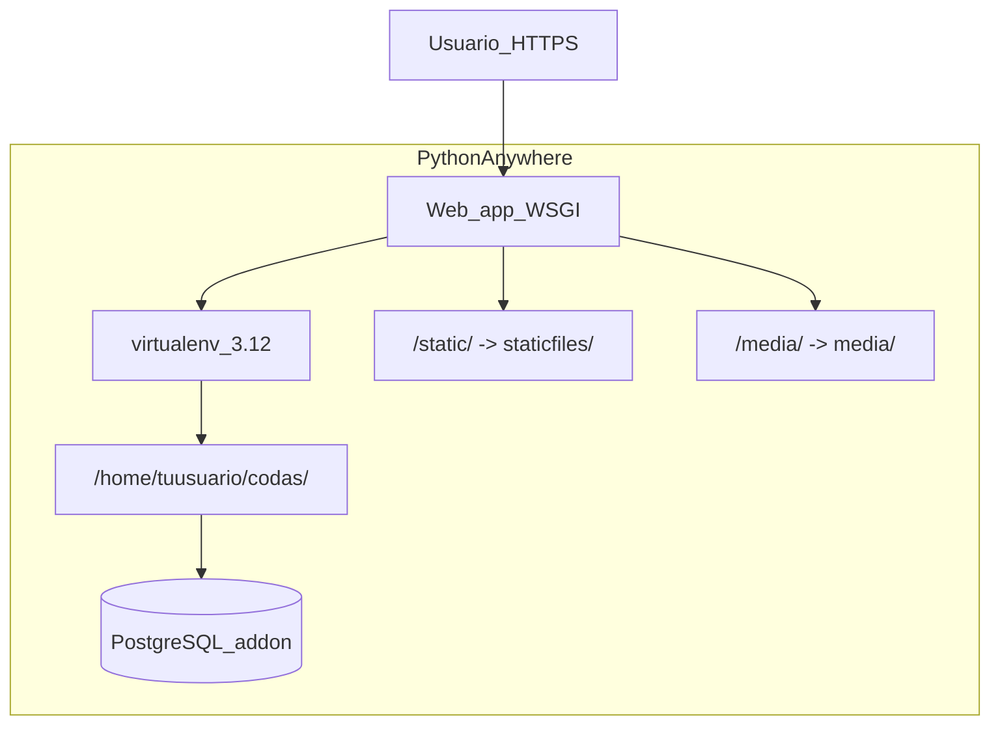

# Despliegue CODAS en PythonAnywhere (archivo ZIP)

Documento de **control operativo** para publicar el panel CODAS en [PythonAnywhere](https://www.pythonanywhere.com) mediante **subida de un archivo ZIP** (sin despliegue desde GitHub).

**Relacionado:** [CODAS_DEPLOYMENT.md](CODAS_DEPLOYMENT.md) (visión de proveedores), [CODAS_DATABASE.md](CODAS_DATABASE.md) § 6, [CODAS_CONTEXTO.md](CODAS_CONTEXTO.md) § 6.1.

**Nota:** este archivo es solo documentación en el repositorio. No sustituye los pasos manuales en el panel de PythonAnywhere ni implica un «build» automático desde el IDE.

---

## Decisión de entorno

| Tema | Valor acordado |
|------|----------------|
| Hosting web | PythonAnywhere (Web app + WSGI) |
| Entrega de código | Archivo `.zip` subido y descomprimido en *Files* |
| Base de datos | **Addon PostgreSQL de PythonAnywhere** |
| Settings Django | `codas.settings.production` ([`codas/wsgi.py`](../codas/wsgi.py)) |

Sustituir `tuusuario` por tu cuenta real de PythonAnywhere en todos los ejemplos.

---

## Arquitectura en PythonAnywhere



| Pieza CODAS | En PA |
|-------------|--------|
| App Django | Web app → WSGI [`codas/wsgi.py`](../codas/wsgi.py) |
| Dependencias | `pip install -r requirements.txt` en el virtualenv del Web app |
| PostgreSQL | Addon PA → `DATABASE_URL` o `DB_*`; `DB_SSLMODE=require` si aplica |
| CSS Tailwind | En el ZIP: [`static/css/tailwind.css`](../static/css/tailwind.css) compilado en local (`npm run build:css:min`) |
| Logos | Mapeo PA `/media/` → `~/codas/media/` (obligatorio: `DEBUG=False` no sirve media por Django) |
| Correo | SMTP obligatorio en producción ([`codas/settings/production.py`](../codas/settings/production.py)) |

---

## Registro de despliegue (rellenar al ejecutar)

| Campo | Valor |
|-------|--------|
| Cuenta PA | |
| URL pública | `https://tuusuario.pythonanywhere.com` |
| Ruta código | `/home/tuusuario/codas` |
| Virtualenv | `/home/tuusuario/.virtualenvs/codas-venv` |
| PostgreSQL (host/BD) | |
| Fecha primer despliegue | |
| Última actualización ZIP | |

---

## Fase 0 — Requisitos previos

1. Cuenta **PythonAnywhere** con Web app (Beginner: 1 app, subdominio `*.pythonanywhere.com`).
2. **Addon PostgreSQL** en pestaña *Databases*; anotar URL o host, puerto, BD, usuario y contraseña.
3. En local: Python 3.12+ y Node (solo para compilar CSS antes del ZIP).
4. SMTP configurado (Gmail con contraseña de aplicación, SendGrid, etc.) — sin SMTP la app **no arranca** en producción.

### Variables obligatorias

Ver [`.env.example`](../.env.example) y [CODAS_CONTEXTO.md](CODAS_CONTEXTO.md) § 6.1.

| Variable | Ejemplo / nota |
|----------|----------------|
| `DJANGO_SETTINGS_MODULE` | `codas.settings.production` (en WSGI) |
| `DJANGO_SECRET_KEY` | Clave larga aleatoria |
| `DJANGO_ALLOWED_HOSTS` | `tuusuario.pythonanywhere.com` |
| `LICENSE_SECRET_KEY` | Clave para HMAC de suscripciones |
| `DATABASE_URL` | URL del addon PA, o `DB_*` sueltas |
| `DB_SSLMODE` | `require` si el addon lo exige |
| `EMAIL_DELIVERY` | `smtp` |
| `EMAIL_HOST`, `EMAIL_PORT`, `EMAIL_USE_TLS`, `EMAIL_HOST_USER`, `EMAIL_HOST_PASSWORD`, `DEFAULT_FROM_EMAIL` | Según proveedor |

**Pendiente en código (recomendado):** `CSRF_TRUSTED_ORIGINS=https://tuusuario.pythonanywhere.com` y `STATIC_ROOT` para `collectstatic` — ver Fase 1.2.

---

## Fase 1 — Preparar el ZIP en tu PC

### 1.1 Compilar CSS (obligatorio)

```powershell
cd c:\IACursor\Codas
npm run build:css:min
```

Comprobar que [`static/css/tailwind.css`](../static/css/tailwind.css) está actualizado.

### 1.2 Ajustes recomendados en el repo (antes del primer ZIP definitivo)

| Cambio | Motivo en PA | Hecho |
|--------|----------------|-------|
| `STATIC_ROOT` en settings (p. ej. `production.py`) | `collectstatic` + admin | [ ] |
| `CSRF_TRUSTED_ORIGINS` desde env | POST con HTTPS | [ ] |
| `SECURE_PROXY_SSL_HEADER` (opcional) | Cookies tras proxy TLS de PA | [ ] |

Sin `STATIC_ROOT`, mapeo temporal `/static/` → `~/codas/static` (Tailwind OK; admin puede quedar incompleto).

### 1.3 Contenido del ZIP

**Incluir:** `apps/`, `codas/`, `templates/`, `static/`, `manage.py`, `requirements.txt` (y `docs/` si se desea).

**Excluir:**

- `.venv/`, `venv/`, `env/`
- `node_modules/`
- `.env`
- `__pycache__/`, `*.pyc`
- `.git/` (opcional)
- `db.sqlite3`, `*.sqlite3`
- `staticfiles/` (regenerar en PA)
- `media/` (opcional; crear carpeta vacía en PA)

Ejemplo PowerShell:

```powershell
cd c:\IACursor\Codas
Compress-Archive -Path apps, codas, templates, static, manage.py, requirements.txt -DestinationPath ..\codas-deploy.zip -Force
```

Revisar que `.env` no esté dentro del ZIP.

---

## Fase 2 — Subir y descomprimir en PythonAnywhere

| Paso | Acción | OK |
|------|--------|-----|
| 1 | *Files* → subir `codas-deploy.zip` | [ ] |
| 2 | Bash: `unzip -o codas-deploy.zip -d codas` | [ ] |
| 3 | Verificar `~/codas/manage.py` | [ ] |
| 4 | `mkdir -p ~/codas/media ~/codas/staticfiles` | [ ] |

```bash
cd ~
unzip -o codas-deploy.zip -d codas
ls -la ~/codas/manage.py
mkdir -p ~/codas/media ~/codas/staticfiles
```

---

## Fase 3 — Virtualenv y dependencias

| Paso | Acción | OK |
|------|--------|-----|
| 1 | Web → Virtualenv: `/home/tuusuario/.virtualenvs/codas-venv` | [ ] |
| 2 | Python 3.12 (o la más alta compatible con Django 6) | [ ] |
| 3 | `pip install -r requirements.txt` | [ ] |

```bash
workon codas-venv
cd ~/codas
pip install --upgrade pip
pip install -r requirements.txt
```

En PA **no** hace falta `gunicorn` (WSI gestionado por la plataforma).

---

## Fase 4 — Variables de entorno y WSGI

### 4.1 `.env` solo en el servidor

Crear `/home/tuusuario/codas/.env` (nunca subir el `.env` de desarrollo):

```ini
DJANGO_SECRET_KEY=...
DJANGO_ALLOWED_HOSTS=tuusuario.pythonanywhere.com
LICENSE_SECRET_KEY=...
DATABASE_URL=postgresql://...
DB_SSLMODE=require
EMAIL_DELIVERY=smtp
EMAIL_HOST=smtp.gmail.com
EMAIL_PORT=587
EMAIL_USE_TLS=True
EMAIL_HOST_USER=...
EMAIL_HOST_PASSWORD=...
DEFAULT_FROM_EMAIL=...
```

[`codas/settings/base.py`](../codas/settings/base.py) carga `BASE_DIR / ".env"`.

### 4.2 WSGI (Web → Code)

| Paso | OK |
|------|-----|
| Editar WSGI con `path` correcto | [ ] |
| `DJANGO_SETTINGS_MODULE=codas.settings.production` | [ ] |

```python
import os
import sys

path = "/home/tuusuario/codas"
if path not in sys.path:
    sys.path.insert(0, path)

os.environ.setdefault("DJANGO_SETTINGS_MODULE", "codas.settings.production")

from django.core.wsgi import get_wsgi_application
application = get_wsgi_application()
```

---

## Fase 5 — Archivos estáticos y media (Web → Static files)

### 5.1 Estáticos

```bash
cd ~/codas
python manage.py collectstatic --noinput
```

| URL | Directorio | OK |
|-----|------------|-----|
| `/static/` | `/home/tuusuario/codas/staticfiles` | [ ] |

**Alternativa rápida:** `/static/` → `/home/tuusuario/codas/static` (sin `collectstatic`).

### 5.2 Media

| URL | Directorio | OK |
|-----|------------|-----|
| `/media/` | `/home/tuusuario/codas/media` | [ ] |

---

## Fase 6 — Base de datos

| Paso | OK |
|------|-----|
| Addon PostgreSQL en estado Running | [ ] |
| `python manage.py migrate` | [ ] |
| `python manage.py createsuperuser` | [ ] |

```bash
cd ~/codas
python manage.py migrate
python manage.py createsuperuser
```

Si falla la conexión: host del addon (no `localhost` del PC), SSL, credenciales en `.env`.

---

## Fase 7 — Activar y probar

| Paso | OK |
|------|-----|
| Web → **Reload** | [ ] |
| Revisar Error log / Server log | [ ] |
| Login `/ingresar/` | [ ] |
| Panel `/panel/` | [ ] |
| CSS (Tailwind) visible | [ ] |
| Flujo de prueba (table-design o sp-asistido) | [ ] |
| Admin `/admin/` | [ ] |

---

## Fase 8 — Actualizaciones posteriores (solo ZIP)

1. Local: cambios + `npm run build:css:min` si hay cambios de estilos.
2. Nuevo ZIP (mismas exclusiones).
3. PA: backup de `~/codas` y **no** sobrescribir `~/codas/.env` ni `~/codas/media/`.
4. Descomprimir ZIP sobre el código.
5. `pip install -r requirements.txt` si cambió dependencias.
6. `python manage.py migrate`
7. `collectstatic` si aplica.
8. **Reload**

---

## Limitaciones (plan Beginner)

- Un subdominio `*.pythonanywhere.com` (HTTPS en ese host).
- Recursos CPU/tiempo limitados.
- Addon PostgreSQL según facturación del plan PA.

---

## Checklist global

| # | Tarea | OK |
|---|--------|-----|
| 1 | Addon PostgreSQL PA + credenciales | [ ] |
| 2 | `build:css:min` + ZIP sin `.venv`/`.env`/`node_modules` | [ ] |
| 3 | Subir ZIP y descomprimir en `~/codas` | [ ] |
| 4 | Virtualenv + `requirements.txt` | [ ] |
| 5 | `.env` en servidor + WSGI | [ ] |
| 6 | `collectstatic` + mapeos `/static/` y `/media/` | [ ] |
| 7 | `migrate` + `createsuperuser` + Reload | [ ] |
| 8 | Smoke test | [ ] |

---

## Mejoras opcionales en el repositorio (no bloquean leer esta guía)

- Script `scripts/build-deploy-zip.ps1` para generar el ZIP con exclusiones.
- `STATIC_ROOT` + `CSRF_TRUSTED_ORIGINS` en settings de producción.

---

*Última revisión: may/2026 — despliegue por ZIP, PostgreSQL addon PA.*
