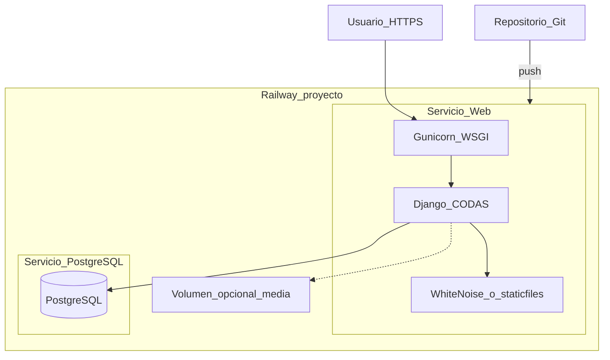

# Despliegue CODAS en Railway (Git)

Documento de **control operativo** para publicar el panel CODAS en [Railway](https://railway.app) mediante **despliegue desde repositorio Git** (recomendado) o CLI de Railway. Incluye PostgreSQL gestionado en el mismo proyecto.

**Relacionado:** [CODAS_DEPLOYMENT.md](CODAS_DEPLOYMENT.md) (visión de proveedores), [CODAS_DATABASE.md](CODAS_DATABASE.md) § 6, [CODAS_CONTEXTO.md](CODAS_CONTEXTO.md) § 6.1.

**Nota:** este archivo es solo documentación en el repositorio. No sustituye los pasos manuales en el panel de Railway ni implica un «build» automático desde el IDE.

**Checklist operativo (paso a paso):** [CODAS_DEPLOYMENT_RAILWAY_CHECKLIST.md](CODAS_DEPLOYMENT_RAILWAY_CHECKLIST.md) — actualizaciones en el repo, variables Railway y despliegue.

**Contraste con PythonAnywhere:** Railway despliega por **Git push** (no ZIP), usa **Gunicorn** como servidor WSGI y suele inyectar `DATABASE_URL` al añadir el plugin PostgreSQL. Guía PA: [CODAS_DEPLOYMENT_PYTHONANYWHERE.md](CODAS_DEPLOYMENT_PYTHONANYWHERE.md).

---

## Decisión de entorno

| Tema | Valor acordado |
|------|----------------|
| Hosting web | Railway — servicio **Web** (Nixpacks o Dockerfile) |
| Entrega de código | **Repositorio Git** conectado a Railway (push → deploy) |
| Base de datos | **PostgreSQL** (plugin Railway en el mismo proyecto) |
| Settings Django | `codas.settings.production` ([`codas/wsgi.py`](../codas/wsgi.py)) |
| Servidor WSGI | **Gunicorn** (obligatorio en Railway; no gestiona WSGI la plataforma) |

Sustituir `tu-proyecto.up.railway.app` por el dominio público real que asigne Railway.

---

## Arquitectura en Railway



| Pieza CODAS | En Railway |
|-------------|------------|
| App Django | Servicio Web; entrada [`codas/wsgi.py`](../codas/wsgi.py) vía Gunicorn |
| Dependencias | `pip install -r requirements.txt` en fase de build |
| PostgreSQL | Plugin **PostgreSQL** → variable `DATABASE_URL` (referencia al servicio web) |
| CSS Tailwind | Build: `npm run build:css:min` antes de arrancar (o CSS ya versionado en Git) |
| Logos (`media/`) | Disco **efímero** por defecto; usar **volumen Railway** o S3 si necesitas persistencia |
| Correo | SMTP obligatorio en producción ([`codas/settings/production.py`](../codas/settings/production.py)) |
| HTTPS | Automático en `*.up.railway.app`; configurar `DJANGO_ALLOWED_HOSTS` y `CSRF_TRUSTED_ORIGINS` |

---

## Registro de despliegue (rellenar al ejecutar)

| Campo | Valor |
|-------|--------|
| Cuenta Railway | |
| Proyecto Railway | |
| URL pública | `https://tu-proyecto.up.railway.app` |
| Repositorio Git | |
| Rama de deploy | `main` (o la acordada) |
| Servicio Web (nombre) | |
| Servicio PostgreSQL (nombre) | |
| `DATABASE_URL` | (referenciada; no copiar en documentación pública) |
| Volumen `media/` (si aplica) | Montaje en `/app/media` |
| Fecha primer despliegue | |
| Último deploy (commit) | |

---

## Fase 0 — Requisitos previos

1. Cuenta **Railway** (crédito de prueba orientativo ~5 USD/mes; luego facturación por consumo).
2. Repositorio **Git** con el código CODAS (GitHub, GitLab, etc.).
3. En local: Python 3.12+, Node (para compilar CSS si no se versiona el bundle).
4. SMTP configurado (Gmail con contraseña de aplicación, SendGrid, etc.) — sin SMTP la app **no arranca** en producción.

### Variables obligatorias

Ver [`.env.example`](../.env.example) y [CODAS_CONTEXTO.md](CODAS_CONTEXTO.md) § 6.1.

| Variable | Ejemplo / nota |
|----------|----------------|
| `DJANGO_SETTINGS_MODULE` | `codas.settings.production` |
| `DJANGO_SECRET_KEY` | Clave larga aleatoria |
| `DJANGO_ALLOWED_HOSTS` | `tu-proyecto.up.railway.app` (sin `https://`) |
| `LICENSE_SECRET_KEY` | Clave para HMAC de suscripciones |
| `DATABASE_URL` | Inyectada por Railway al vincular PostgreSQL |
| `DB_SSLMODE` | `require` si la conexión externa lo exige (Neon/Supabase); el Postgres interno de Railway suele bastar sin SSL extra |
| `EMAIL_DELIVERY` | `smtp` |
| `EMAIL_HOST`, `EMAIL_PORT`, `EMAIL_USE_TLS`, `EMAIL_HOST_USER`, `EMAIL_HOST_PASSWORD`, `DEFAULT_FROM_EMAIL` | Según proveedor |
| `PORT` | La asigna Railway; Gunicorn debe enlazar `0.0.0.0:$PORT` |

**Pendiente en código (recomendado antes del primer go-live):**

| Cambio | Motivo en Railway | Hecho |
|--------|-------------------|-------|
| `gunicorn` en [`requirements.txt`](../requirements.txt) | Servidor WSGI | [x] |
| `whitenoise` en [`requirements.txt`](../requirements.txt) | Paquete instalado (middleware en A.2) | [x] |
| `STATIC_ROOT` + middleware **WhiteNoise** en settings | `collectstatic` + servir `/static/` sin CDN aparte | [x] |
| `CSRF_TRUSTED_ORIGINS` desde env | POST con HTTPS en dominio Railway | [x] |
| `SECURE_PROXY_SSL_HEADER` + cookies secure | Cookies tras proxy TLS de Railway | [x] |
| [`railway.toml`](../railway.toml) | Build CSS + migrate + start | [x] |

---

## Fase 1 — Preparar el repositorio

### 1.1 Compilar CSS

Opción A — **versionar** el CSS compilado (mínimo esfuerzo en Railway):

```powershell
cd c:\IACursor\Codas
npm run build:css:min
git add static/css/tailwind.css
git commit -m "build: tailwind para deploy"
```

Opción B — compilar en **build** de Railway (requiere Node en Nixpacks; ver Fase 5).

Comprobar que [`static/css/tailwind.css`](../static/css/tailwind.css) está actualizado.

### 1.2 Dependencias de producción

Añadir a [`requirements.txt`](../requirements.txt) (si aún no están):

```text
gunicorn>=22.0,<24
whitenoise>=6.6,<7
```

En `production.py` (o `base.py` condicionado), patrón orientativo:

```python
STATIC_ROOT = BASE_DIR / "staticfiles"
MIDDLEWARE = [
    "django.middleware.security.SecurityMiddleware",
    "whitenoise.middleware.WhiteNoiseMiddleware",
    # ... resto
]
```

### 1.3 Archivo `railway.toml` (recomendado)

Crear en la raíz del repo [`railway.toml`](../railway.toml):

```toml
[build]
builder = "nixpacks"
buildCommand = "pip install -r requirements.txt && npm ci && npm run build:css:min && python manage.py collectstatic --noinput"

[deploy]
startCommand = "python manage.py migrate --noinput && gunicorn codas.wsgi:application --bind 0.0.0.0:$PORT"
restartPolicyType = "on_failure"
```

Si el CSS ya está en Git y no quieres Node en el build:

```toml
[build]
buildCommand = "pip install -r requirements.txt && python manage.py collectstatic --noinput"
```

### 1.4 Qué no subir a Git

Igual que en desarrollo: **nunca** commitear `.env`. Railway usa variables en el panel (o `railway variables`).

---

## Fase 2 — Proyecto y servicios en Railway

| Paso | Acción | OK |
|------|--------|-----|
| 1 | [railway.app](https://railway.app) → **New Project** | [ ] |
| 2 | **Deploy from GitHub repo** (o GitLab) y autorizar acceso | [ ] |
| 3 | Seleccionar repo CODAS y rama (`main`) | [ ] |
| 4 | **Add service** → **Database** → **PostgreSQL** | [ ] |
| 5 | En el servicio Web → **Variables** → **Add reference** → `DATABASE_URL` del Postgres | [ ] |
| 6 | Generar dominio público: servicio Web → **Settings** → **Networking** → **Generate domain** | [ ] |

Railway crea un despliegue inicial; puede fallar hasta configurar variables y comandos — es normal.

---

## Fase 3 — Variables de entorno (servicio Web)

En el servicio Web → **Variables** (no usar el `.env` local):

| Variable | Valor |
|----------|--------|
| `DJANGO_SETTINGS_MODULE` | `codas.settings.production` |
| `DJANGO_SECRET_KEY` | (generar clave segura) |
| `DJANGO_ALLOWED_HOSTS` | `tu-proyecto.up.railway.app` |
| `LICENSE_SECRET_KEY` | (generar clave segura) |
| `DATABASE_URL` | Referencia `${{Postgres.DATABASE_URL}}` (nombre según servicio) |
| `EMAIL_DELIVERY` | `smtp` |
| `EMAIL_HOST` | p. ej. `smtp.gmail.com` |
| `EMAIL_PORT` | `587` |
| `EMAIL_USE_TLS` | `True` |
| `EMAIL_HOST_USER` | … |
| `EMAIL_HOST_PASSWORD` | … |
| `DEFAULT_FROM_EMAIL` | … |
| `CSRF_TRUSTED_ORIGINS` | `https://tu-proyecto.up.railway.app` (cuando esté en settings) |

| Paso | OK |
|------|-----|
| Todas las variables obligatorias definidas | [ ] |
| `DATABASE_URL` referenciada al Postgres | [ ] |
| Dominio público generado y copiado a `DJANGO_ALLOWED_HOSTS` | [ ] |

---

## Fase 4 — Build y arranque

### 4.1 Comandos (panel o `railway.toml`)

| Fase | Comando orientativo |
|------|---------------------|
| **Build** | `pip install -r requirements.txt && npm ci && npm run build:css:min && python manage.py collectstatic --noinput` |
| **Start** | `python manage.py migrate --noinput && gunicorn codas.wsgi:application --bind 0.0.0.0:$PORT` |

| Paso | OK |
|------|-----|
| `buildCommand` configurado | [ ] |
| `startCommand` con `migrate` + Gunicorn | [ ] |
| Logs de build sin error en `collectstatic` | [ ] |

### 4.2 Root directory

Si el Django project no está en la raíz del repo, en **Settings** del servicio Web definir **Root Directory** (p. ej. vacío si `manage.py` está en la raíz).

---

## Fase 5 — Archivos estáticos

Con **WhiteNoise** + `STATIC_ROOT`:

1. Build ejecuta `collectstatic --noinput`.
2. WhiteNoise sirve `/static/` desde la misma app (sin CDN obligatorio).

| Paso | OK |
|------|-----|
| `STATIC_ROOT` definido en settings | [ ] |
| WhiteNoise en `MIDDLEWARE` (tras `SecurityMiddleware`) | [ ] |
| Build log muestra archivos copiados a `staticfiles/` | [ ] |
| Navegador carga Tailwind en `/panel/` | [ ] |

**Sin WhiteNoise:** los estáticos no se servirán correctamente en Railway (a diferencia de PA, no hay mapeo manual `/static/` en el panel).

---

## Fase 6 — Media (logos de compañía)

Por defecto el filesystem del contenedor es **efímero**: los uploads en `media/` se pierden al **redeploy**.

| Estrategia | Cuándo | OK |
|------------|--------|-----|
| **Prueba sin logos** | Demo / smoke test | [ ] |
| **Volumen Railway** montado en `/app/media` (o `MEDIA_ROOT`) | Piloto con logos | [ ] |
| **S3-compatible** (futuro) | Producción seria | [ ] |

Para volumen: servicio Web → **Volumes** → crear volumen → montar en la ruta de `MEDIA_ROOT` ([`codas/settings/base.py`](../codas/settings/base.py): `BASE_DIR / "media"` → `/app/media` en contenedor).

---

## Fase 7 — Base de datos

| Paso | OK |
|------|-----|
| Servicio PostgreSQL en estado activo | [ ] |
| `migrate` en `startCommand` o ejecutado manualmente | [ ] |
| `createsuperuser` (una vez) | [ ] |

**Superusuario (una vez)** — Railway CLI o shell del servicio:

```bash
railway run python manage.py createsuperuser
```

O desde el panel: servicio Web → **Shell** (si está disponible en tu plan).

Si `migrate` falla: revisar que `DATABASE_URL` apunta al Postgres del mismo proyecto y que el servicio Web tiene la referencia correcta.

---

## Fase 8 — Activar y probar

| Paso | OK |
|------|-----|
| Deploy en verde (último commit) | [ ] |
| Revisar **Deploy Logs** y **HTTP Logs** | [ ] |
| `https://tu-proyecto.up.railway.app/ingresar/` | [ ] |
| Panel `/panel/` | [ ] |
| CSS (Tailwind) visible | [ ] |
| Flujo de prueba (table-design o sp-asistido) | [ ] |
| Admin `/admin/` | [ ] |
| POST / formularios sin error CSRF | [ ] |

Errores frecuentes:

| Síntoma | Causa probable |
|---------|----------------|
| `DisallowedHost` | Falta dominio en `DJANGO_ALLOWED_HOSTS` |
| CSRF 403 en POST | Falta `CSRF_TRUSTED_ORIGINS` con `https://...` |
| `ImproperlyConfigured` SMTP | Variables `EMAIL_*` incompletas |
| Estáticos 404 | Sin WhiteNoise / sin `collectstatic` |
| BD no conecta | `DATABASE_URL` no referenciada al servicio Postgres |

---

## Fase 9 — Actualizaciones posteriores (Git)

1. Local: cambios + `npm run build:css:min` si hay estilos (o dejar que el build de Railway lo haga).
2. `git commit` + `git push` a la rama conectada.
3. Railway redeploy automático.
4. Verificar logs: `migrate` en start aplica migraciones nuevas.
5. Si cambió `requirements.txt`, el build reinstala dependencias.

**No** sobrescribir secretos en Railway al redeploy (las variables persisten en el proyecto).

---

## Limitaciones y costes

| Tema | Detalle |
|------|---------|
| **Crédito trial** | Consumo por CPU/RAM/tráfico; vigilar panel **Usage** |
| **Postgres** | Incluido como servicio; cuenta en el mismo proyecto |
| **Media efímera** | Sin volumen, logos se pierden al redeploy |
| **Sleep** | A diferencia de Render free, Railway no “duerme” la app por inactividad de la misma forma; el coste es por uso |
| **Dominio propio** | Settings → Custom Domain; actualizar `DJANGO_ALLOWED_HOSTS` y `CSRF_TRUSTED_ORIGINS` |

---

## Checklist global

| # | Tarea | OK |
|---|--------|-----|
| 1 | Repo Git con CODAS; Railway conectado | [ ] |
| 2 | Servicio PostgreSQL + `DATABASE_URL` referenciada | [ ] |
| 3 | `gunicorn` + (recomendado) WhiteNoise + `STATIC_ROOT` | [ ] |
| 4 | `build:css:min` + `collectstatic` en build | [ ] |
| 5 | Variables: secretos, hosts, SMTP | [ ] |
| 6 | `migrate` en start + `createsuperuser` | [ ] |
| 7 | Dominio público HTTPS + smoke test | [ ] |
| 8 | (Opcional) Volumen para `media/` | [ ] |

---

## Comparativa rápida: Railway vs PythonAnywhere (CODAS)

| Aspecto | Railway | PythonAnywhere (ZIP) |
|---------|---------|----------------------|
| Código | Git push | ZIP manual |
| WSGI | Gunicorn (tú) | Plataforma |
| PostgreSQL | Plugin mismo proyecto | Addon PA |
| Estáticos | WhiteNoise / collectstatic | Mapeo `/static/` en panel |
| Media | Volumen o efímero | Mapeo `/media/` en panel |
| HTTPS | Automático `*.up.railway.app` | `*.pythonanywhere.com` |

---

## Mejoras opcionales en el repositorio (no bloquean leer esta guía)

- [`railway.toml`](../railway.toml) versionado con build/start acordados.
- `Dockerfile` multi-stage (Python + Node) si Nixpacks no detecta bien el stack.
- GitHub Action que ejecute `build:css:min` y tests antes del push a `main`.
- Almacenamiento S3 para `MEDIA_ROOT` en producción.

---

*Última revisión: may/2026 — despliegue por Git, PostgreSQL Railway, Gunicorn.*
