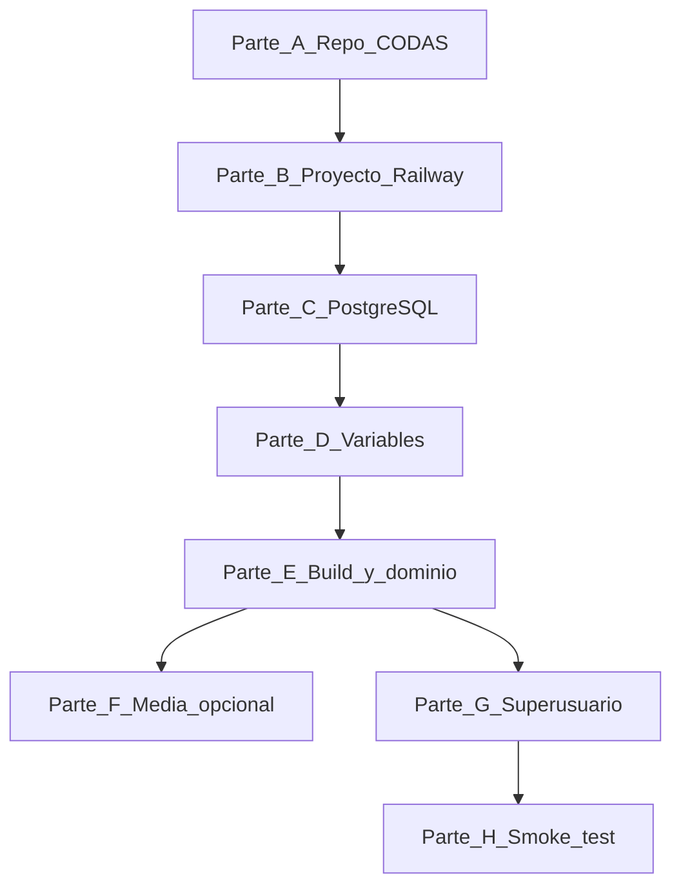

# Checklist CODAS en Railway

Control operativo paso a paso para desplegar CODAS en [Railway](https://railway.app), alineado con la [documentación oficial de Railway](https://docs.railway.com/) y el estado actual del repositorio.

**Guía ampliada:** [CODAS_DEPLOYMENT_RAILWAY.md](CODAS_DEPLOYMENT_RAILWAY.md)  
**Relacionado:** [CODAS_DEPLOYMENT.md](CODAS_DEPLOYMENT.md), [CODAS_DATABASE.md](CODAS_DATABASE.md) § 6, [`.env.example`](../.env.example)

**Referencias Railway usadas:**

| Tema | Documento Railway |
|------|-------------------|
| Django + Gunicorn + WhiteNoise | [guides/django](https://docs.railway.com/guides/django) |
| PostgreSQL | [guides/postgresql](https://docs.railway.com/guides/postgresql) |
| Variables y referencias `${{...}}` | [guides/variables](https://docs.railway.com/guides/variables) |
| `railway.toml` (build, start, pre-deploy) | [reference/config-as-code](https://docs.railway.com/reference/config-as-code) |
| Dominio público HTTPS | [guides/public-networking](https://docs.railway.com/guides/public-networking) |
| Volúmenes (`media/`) | [guides/volumes](https://docs.railway.com/guides/volumes) |

---

## Registro de despliegue

| Campo | Valor |
|-------|--------|
| Cuenta Railway | |
| Proyecto | |
| Servicio Web | |
| Servicio PostgreSQL | |
| URL pública | `https://____________.up.railway.app` |
| Repositorio / rama | |
| Commit desplegado | |
| Fecha primer deploy | |
| Volumen `media/` (sí/no) | |

---

## Parte A — Actualizar el sistema CODAS (repositorio)

Completar **antes** del primer deploy. **A.1–A.5** completados en repo; pendiente push (A.7.3) y pasos Railway (B–H).

### A.1 Dependencias Python

| # | Tarea | Archivo | OK |
|---|--------|---------|-----|
| A.1.1 | Añadir `gunicorn>=22.0,<24` | [`requirements.txt`](../requirements.txt) | [x] |
| A.1.2 | Añadir `whitenoise>=6.6,<7` | [`requirements.txt`](../requirements.txt) | [x] |
| A.1.3 | Confirmar `psycopg[binary]` (ya está) | [`requirements.txt`](../requirements.txt) | [x] |

### A.2 Estáticos (WhiteNoise)

Según [guía Django de Railway](https://docs.railway.com/guides/django): `STATIC_ROOT` + middleware WhiteNoise tras `SecurityMiddleware`.

| # | Tarea | Archivo | OK |
|---|--------|---------|-----|
| A.2.1 | Definir `STATIC_ROOT = BASE_DIR / "staticfiles"` | [`codas/settings/production.py`](../codas/settings/production.py) | [x] |
| A.2.2 | Insertar `whitenoise.middleware.WhiteNoiseMiddleware` justo después de `SecurityMiddleware` | [`codas/settings/production.py`](../codas/settings/production.py) | [x] |
| A.2.3 | Añadir `staticfiles/` a `.gitignore` (generado en build) | [`.gitignore`](../.gitignore) | [x] |

### A.3 HTTPS y CSRF (dominio Railway)

| # | Tarea | Archivo | OK |
|---|--------|---------|-----|
| A.3.1 | `CSRF_TRUSTED_ORIGINS` desde env (lista separada por comas, con `https://`) | [`codas/settings/production.py`](../codas/settings/production.py) | [x] |
| A.3.2 | `SECURE_PROXY_SSL_HEADER = ("HTTP_X_FORWARDED_PROTO", "https")` | [`codas/settings/production.py`](../codas/settings/production.py) | [x] |
| A.3.3 | `SESSION_COOKIE_SECURE = True`, `CSRF_COOKIE_SECURE = True` | [`codas/settings/production.py`](../codas/settings/production.py) | [x] |

### A.4 Tailwind (CSS)

Estrategia **A (Git)**: CSS compilado en local y versionado; el build de Railway **no** usa npm (Railpack Python no trae Node por defecto).

| # | Tarea | Comando / archivo | OK |
|---|--------|-------------------|-----|
| A.4.1 | Compilar CSS antes del deploy | `npm run build:css:min` | [x] |
| A.4.2 | **Opción A:** versionar [`static/css/tailwind.css`](../static/css/tailwind.css) en Git | commit | [x] |
| A.4.3 | **Opción B:** compilar en build Railway (requiere Node; no usado) | — | N/A |

### A.5 Configuración Railway en el repo

[`railway.toml`](../railway.toml) en la raíz ([config as code](https://docs.railway.com/reference/config-as-code)):

| # | Tarea | OK |
|---|--------|-----|
| A.5.1 | `buildCommand`: pip + `collectstatic --noinput` (sin npm) | [x] |
| A.5.2 | `preDeployCommand`: `python manage.py migrate --noinput` | [x] |
| A.5.3 | `startCommand`: `gunicorn codas.wsgi:application --bind 0.0.0.0:$PORT` | [x] |

Plantilla orientativa:

```toml
[build]
buildCommand = "pip install -r requirements.txt && DJANGO_SETTINGS_MODULE=codas.settings.collectstatic_build python manage.py collectstatic --noinput"

[deploy]
preDeployCommand = "DJANGO_SETTINGS_MODULE=codas.settings.production python manage.py migrate --noinput"
startCommand = "gunicorn codas.wsgi:application --bind 0.0.0.0:$PORT"
restartPolicyType = "ON_FAILURE"
```

> Railway ejecuta `preDeployCommand` **antes** del arranque; no tiene acceso a volúmenes en esa fase ([volumes](https://docs.railway.com/guides/volumes)). Las migraciones van ahí; `createsuperuser` es manual (CLI).

### A.6 Lo que **no** cambiar / no commitear

| # | Regla | OK |
|---|--------|-----|
| A.6.1 | **No** commitear `.env` con secretos | [ ] |
| A.6.2 | **No** definir `EMAIL_BACKEND` en producción (lo asigna [`codas/settings/_email.py`](../codas/settings/_email.py)) | [ ] |
| A.6.3 | Mantener `DJANGO_SETTINGS_MODULE=codas.settings.production` en Railway, no en código | [ ] |
| A.6.4 | PostgreSQL obligatorio; **no** usar SQLite | [ ] |

### A.7 Verificación local antes de push

| # | Tarea | Comando | OK |
|---|--------|---------|-----|
| A.7.1 | Tests de email/settings | `python manage.py test apps.core.tests.test_email_settings apps.core.tests.test_production_settings` | [x] |
| A.7.2 | `collectstatic` local de prueba | variables producción + `python manage.py collectstatic --noinput --settings=codas.settings.production` | [x] |
| A.7.3 | Commit + push a la rama que desplegará Railway | `git push` | [ ] |

---

## Parte B — Cuenta y proyecto Railway

| # | Paso (panel [railway.app](https://railway.app)) | Doc Railway | OK |
|---|------------------------------------------------|-------------|-----|
| B.1 | Crear cuenta / iniciar sesión | [Quick start](https://docs.railway.com/) | [ ] |
| B.2 | **New Project** | | [ ] |
| B.3 | **Deploy from GitHub repo** → autorizar GitHub → elegir repo CODAS | [guides/django](https://docs.railway.com/guides/django) | [ ] |
| B.4 | Seleccionar rama de deploy (`main`) | | [ ] |
| B.5 | Renombrar servicio a `codas-web` (opcional, claridad) | | [ ] |

---

## Parte C — PostgreSQL en Railway

| # | Paso | Doc Railway | OK |
|---|------|-------------|-----|
| C.1 | En el canvas: **Create** → **Database** → **Add PostgreSQL** | [guides/postgresql](https://docs.railway.com/guides/postgresql) | [ ] |
| C.2 | Esperar deploy del servicio Postgres (estado activo) | | [ ] |
| C.3 | En servicio **Web** → **Variables** → referenciar `DATABASE_URL` | [guides/variables](https://docs.railway.com/guides/variables) | [ ] |

Valor de referencia (ajustar nombre del servicio Postgres):

```ini
DATABASE_URL=${{Postgres.DATABASE_URL}}
```

> CODAS usa `DATABASE_URL` vía [`codas/settings/_database.py`](../codas/settings/_database.py). Railway también expone `PGHOST`, `PGUSER`, etc.; no son necesarios si usas `DATABASE_URL`.

| # | Paso | OK |
|---|------|-----|
| C.4 | (Opcional) Activar backups del Postgres en producción | [ ] |

---

## Parte D — Variables de entorno (servicio Web)

En **Variables** del servicio Web. Usar **Raw Editor** o **New Variable**. Los cambios quedan en staging hasta **Deploy** ([variables](https://docs.railway.com/guides/variables)).

### D.1 Django y secretos

| Variable | Valor | Sellada | OK |
|----------|--------|---------|-----|
| `DJANGO_SETTINGS_MODULE` | `codas.settings.production` | No | [ ] |
| `DJANGO_SECRET_KEY` | Clave aleatoria larga | **Sí** | [ ] |
| `LICENSE_SECRET_KEY` | Clave HMAC suscripciones | **Sí** | [ ] |
| `DJANGO_ALLOWED_HOSTS` | `${{RAILWAY_PUBLIC_DOMAIN}}` o dominio fijo sin `https://` | No | [ ] |
| `CSRF_TRUSTED_ORIGINS` | `https://${{RAILWAY_PUBLIC_DOMAIN}}` (cuando esté en settings) | No | [ ] |

### D.2 Base de datos

| Variable | Valor | OK |
|----------|--------|-----|
| `DATABASE_URL` | `${{Postgres.DATABASE_URL}}` | [ ] |

### D.3 Correo SMTP (obligatorio en producción)

| Variable | Valor ejemplo | Sellada | OK |
|----------|---------------|---------|-----|
| `EMAIL_DELIVERY` | `smtp` | No | [ ] |
| `EMAIL_HOST` | `smtp.gmail.com` | No | [ ] |
| `EMAIL_PORT` | `587` | No | [ ] |
| `EMAIL_USE_TLS` | `True` | No | [ ] |
| `EMAIL_HOST_USER` | cuenta Gmail | No | [ ] |
| `EMAIL_HOST_PASSWORD` | contraseña de aplicación (sin espacios) | **Sí** | [ ] |
| `DEFAULT_FROM_EMAIL` | mismo que `EMAIL_HOST_USER` | No | [ ] |

**No** definir `EMAIL_BACKEND` — lo asigna `_email.py`.

### D.4 Aplicar variables

| # | Paso | OK |
|---|------|-----|
| D.4.1 | Revisar diff de variables staged | [ ] |
| D.4.2 | **Deploy** del servicio Web para aplicar variables | [ ] |

---

## Parte E — Build, dominio y networking

| # | Paso | Doc Railway | OK |
|---|------|-------------|-----|
| E.1 | Confirmar `railway.toml` en repo (o comandos en Settings → Deploy) | [config-as-code](https://docs.railway.com/reference/config-as-code) | [ ] |
| E.2 | **Settings** → comprobar **Root Directory** (vacío si `manage.py` está en raíz) | | [ ] |
| E.3 | **Settings** → **Networking** → **Generate Domain** | [public-networking](https://docs.railway.com/guides/public-networking) | [ ] |
| E.4 | Copiar URL `https://….up.railway.app` al registro de despliegue | | [ ] |
| E.5 | Si `DJANGO_ALLOWED_HOSTS` era fijo, actualizarlo con el dominio generado | | [ ] |
| E.6 | **Deploy** (o push a Git si CI conectado) | | [ ] |

### E.1 Revisar logs de build

| # | Comprobar en Deploy Logs | OK |
|---|------------------------|-----|
| E.1.1 | `pip install -r requirements.txt` sin error | [ ] |
| E.1.2 | `npm run build:css:min` (si aplica) | [ ] |
| E.1.3 | `collectstatic` copió archivos a `staticfiles/` | [ ] |
| E.1.4 | `preDeployCommand`: migraciones aplicadas | [ ] |
| E.1.5 | Gunicorn enlazado a `$PORT` | [ ] |

---

## Parte F — Media / logos (opcional)

Por defecto el disco del contenedor es **efímero**; `media/` se pierde al redeploy.

| # | Estrategia | Paso | OK |
|---|------------|------|-----|
| F.1 | **Demo sin logos** | No hacer nada | [ ] |
| F.2 | **Persistir logos** | Servicio Web → **Volumes** → montar en `/app/media` | [guides/volumes](https://docs.railway.com/guides/volumes) | [ ] |
| F.3 | Si imagen no-root | `RAILWAY_RUN_UID=0` (Railway lo indica para permisos de volumen) | [ ] |

`MEDIA_ROOT` en CODAS = `BASE_DIR / "media"` → en contenedor suele ser `/app/media`.

---

## Parte G — Datos iniciales (una vez)

| # | Paso | Comando / acción | OK |
|---|------|------------------|-----|
| G.1 | Crear superusuario | `railway link` + `railway run python manage.py createsuperuser` | [ ] |
| G.2 | (Opcional) Cargar compañías / datos piloto | según checklist piloto | [ ] |

---

## Parte H — Smoke test post-deploy

| # | Prueba | URL / acción | OK |
|---|--------|--------------|-----|
| H.1 | App en verde | Deploy Logs sin traceback | [ ] |
| H.2 | Login | `/ingresar/` | [ ] |
| H.3 | Panel | `/panel/` | [ ] |
| H.4 | Tailwind cargado | CSS visible, no HTML crudo | [ ] |
| H.5 | Admin | `/admin/` | [ ] |
| H.6 | POST sin CSRF 403 | Crear/editar registro en un flujo | [ ] |
| H.7 | Correo (si aplica) | Confirmación / reset password | [ ] |
| H.8 | Flujo dominio | table-design o sp-asistido | [ ] |

### Errores frecuentes

| Síntoma | Revisar |
|---------|---------|
| `DisallowedHost` | `DJANGO_ALLOWED_HOSTS` = dominio Railway exacto |
| CSRF 403 | `CSRF_TRUSTED_ORIGINS=https://…` en settings + variable |
| `ImproperlyConfigured` al arrancar | SMTP incompleto o `EMAIL_BACKEND` en env |
| Estáticos 404 | WhiteNoise + `collectstatic` en build |
| BD no conecta | `DATABASE_URL=${{Postgres.DATABASE_URL}}` + Deploy aplicado |
| Build falla en `collectstatic` / PostgreSQL no configurada | Usar `codas.settings.collectstatic_build` en build (ver [`collectstatic_build.py`](../codas/settings/collectstatic_build.py)); `production` solo en migrate/runtime |

---

## Parte I — Actualizaciones posteriores

| # | Paso | OK |
|---|------|-----|
| I.1 | Desarrollo local + tests | [ ] |
| I.2 | `npm run build:css:min` si hubo cambios CSS | [ ] |
| I.3 | `git commit` + `git push` a rama conectada | [ ] |
| I.4 | Railway redeploy automático | [ ] |
| I.5 | Verificar logs: `migrate` en pre-deploy | [ ] |
| I.6 | Smoke test rápido en producción | [ ] |

---

## Resumen ejecutivo (orden recomendado)



| Fase | Bloque | Ítems críticos |
|------|--------|----------------|
| 1 | **A** — Repo | gunicorn, whitenoise, STATIC_ROOT, railway.toml, CSS |
| 2 | **B–C** — Railway | GitHub, Postgres, `DATABASE_URL` referenciada |
| 3 | **D** — Variables | Secretos, SMTP, hosts, CSRF |
| 4 | **E** — Deploy | Dominio público, logs verdes |
| 5 | **G–H** — Go-live | superuser, smoke test |

---

## Checklist global (una página)

| # | Tarea | OK |
|---|--------|-----|
| 1 | Repo: A.1–A.5 ✓ — falta `git push` (A.7.3) | [ ] |
| 2 | Repo: CSS compilado + push Git (A.7.3) | [ ] |
| 3 | Railway: proyecto + repo conectado | [ ] |
| 4 | Railway: PostgreSQL + `DATABASE_URL` referenciada | [ ] |
| 5 | Railway: variables Django, secretos, SMTP (sin EMAIL_BACKEND) | [ ] |
| 6 | Railway: dominio público generado | [ ] |
| 7 | Deploy verde: build + migrate + gunicorn | [ ] |
| 8 | `createsuperuser` + smoke test | [ ] |
| 9 | (Opcional) volumen `/app/media` | [ ] |

---

*Última revisión: jun/2026 — A.1–A.5 aplicados (`railway.toml`, Tailwind build, empaquetado deploy).*
