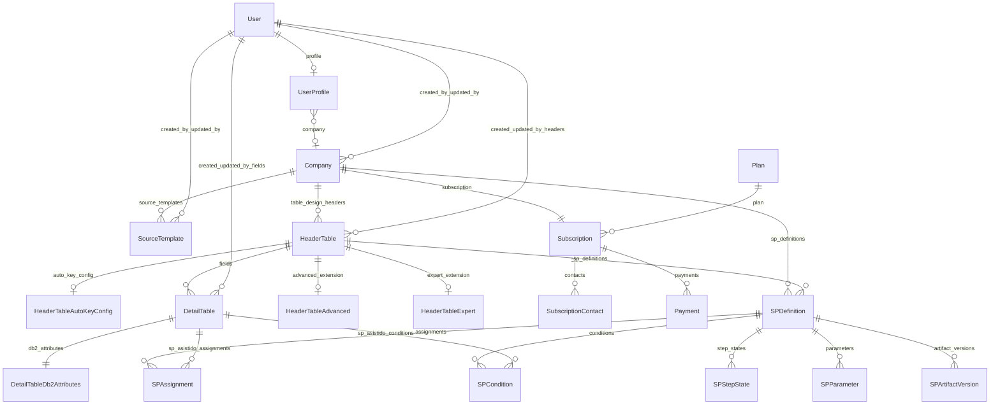
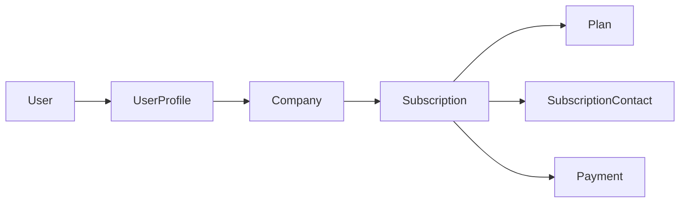

# CODAS — Inventario de modelos

Documento de referencia para **centralizar modelos Django**, la **app** a la que pertenecen y las **relaciones** entre ellos. Actualizar este archivo cuando se añadan o modifiquen modelos en el código.

**Fuente de verdad del código:** los archivos `models.py` de cada app bajo `apps/`.

**Persistencia:** todas las tablas viven en **PostgreSQL** (local y producción). Configuración y operativa: [`CODAS_DATABASE.md`](CODAS_DATABASE.md). SQLite no forma parte del stack CODAS.

**Flujos de seguridad (onboarding, validaciones):** [`CODAS_SECURITY.md`](CODAS_SECURITY.md).

---

## Convención

| Campo en este doc | Significado |
|-------------------|-------------|
| **App** | Ruta Python del paquete Django (`INSTALLED_APPS`), p. ej. `apps.company`. |
| **Modelo** | Nombre de la clase en `models.py`. |
| **Tabla BD** | Por defecto `app_label_modelname` en minúsculas (p. ej. `company_company`). |

---

## Diagrama de relaciones (evolutivo)



*Ampliar este diagrama cuando existan más FK/M2M entre apps.*

---

## App `apps.billing`

**Etiqueta Django:** `billing`  
**Módulo:** [`apps/billing/models.py`](../apps/billing/models.py)  
**Panel web (CRUD):** [`CODAS_BILLING_PANEL.md`](CODAS_BILLING_PANEL.md) — rutas bajo `/panel/billing/`.  
**Diseño, amenazas y huella HMAC:** [`CODAS_SUSCRIPCIONES_VALIDACION.md`](CODAS_SUSCRIPCIONES_VALIDACION.md)  
**Servicio de acceso (prioridad firma → vencimiento → estado activo):** [`apps/billing/services/license.py`](../apps/billing/services/license.py) — `evaluate_subscription_access()`.

| Tabla BD (por defecto) | Modelo |
|------------------------|--------|
| `billing_plan` | `Plan` |
| `billing_subscription` | `Subscription` |
| `billing_subscriptioncontact` | `SubscriptionContact` |
| `billing_payment` | `Payment` |

### Integración con `Company` y `UserProfile`

- **Núcleo:** `Subscription` enlaza **exactamente una** suscripción por compañía (`OneToOneField` → `Company`, `related_name="subscription"`).
- **Desde código:** `company.subscription` devuelve la `Subscription` o lanza `Subscription.DoesNotExist` si la compañía aún no tiene fila de suscripción.
- **Flujo típico de licencia (usuario autenticado):** `request.user` → `user.profile` (`UserProfile`, opcional) → `profile.company` (`Company`, opcional) → `company.subscription` → validar con `validate_license()` o `evaluate_subscription_access(subscription)`.
- **Planes:** `Subscription.plan` → `Plan` (`on_delete=PROTECT`: no se puede borrar un plan referenciado).
- **Contactos y pagos:** `subscription.contacts` (máx. 3 recomendados por negocio / validación en `clean()`), `subscription.payments` (historial).



### `Plan`

Catálogo de planes contratables. Identificador estable para reportes e integraciones: `code` (`SlugField`, único).

**Relaciones (salientes):** ninguna FK; inversa `plan.subscriptions` → conjunto de `Subscription`.

**Valores de `billing_period` (`Plan.BillingPeriod`):** `monthly` (Mensual), `annual` (Anual), `enterprise` (Enterprise).

---

### `Subscription`

Licencia de la compañía: fechas de vigencia, estado, renovación automática y huella `integrity_signature` (HMAC-SHA256 sobre fechas ISO; se recalcula en `save()`). No actualizar fechas con `QuerySet.update()` sin recalcular la firma (usar `save()` o `refresh_integrity_signature()` en memoria antes de persistir).

**Relaciones:**

| Campo | Tipo | Destino | `on_delete` | `related_name` / acceso inverso |
|-------|------|---------|-------------|----------------------------------|
| `company` | `OneToOneField` | `Company` | `CASCADE` | `company.subscription` |
| `plan` | `ForeignKey` | `Plan` | `PROTECT` | `plan.subscriptions` |
| `created_by` | `ForeignKey` | `settings.AUTH_USER_MODEL` | `SET_NULL` | `user.subscriptions_created` |
| `updated_by` | `ForeignKey` | `settings.AUTH_USER_MODEL` | `SET_NULL` | `user.subscriptions_updated` |

**Valores de `status` (`Subscription.Status`):** `active` (Activa), `expired` (Expirada), `canceled` (Cancelada), `pending` (Pendiente de pago). En cada `save()`, si `end_date` es anterior a la fecha actual y el estado era `active`, pasa a `expired`.

**API útil para vistas / middleware:** `generate_signature()`, `is_signature_valid()`, `validate_license()` → dict con `signature_valid`, `is_expired`, `status`, `contacts` (hasta 3 instancias).

---

### `SubscriptionContact`

Contactos de soporte ligados a una suscripción (pantallas de error, fraude, renovación). Máximo **3** por suscripción validado en `clean()`; restricción BD parcial: correo único por suscripción cuando `email` no es nulo (`UniqueConstraint` con `condition`).

**Relaciones:**

| Campo | Tipo | Destino | `on_delete` | `related_name` |
|-------|------|---------|-------------|----------------|
| `subscription` | `ForeignKey` | `Subscription` | `CASCADE` | `subscription.contacts` |

---

### `Payment`

Auditoría de cobros asociados a una suscripción. `amount` con `MinValueValidator(0.01)`. En `clean()`, la suscripción debe estar en estado `active` o `pending`.

**Relaciones:**

| Campo | Tipo | Destino | `on_delete` | `related_name` |
|-------|------|---------|-------------|----------------|
| `subscription` | `ForeignKey` | `Subscription` | `CASCADE` | `subscription.payments` |
| `created_by` | `ForeignKey` | `settings.AUTH_USER_MODEL` | `SET_NULL` | `user.payments_created` |

**Valores de `method` (`Payment.Method`):** `manual`, `card`, `transfer`, `stripe`, `paypal`.

---

### Configuración

- **`LICENSE_SECRET_KEY`** (settings / entorno): secreto del HMAC; obligatorio en producción (`validate_production()`). En `DEBUG=True` puede omitirse y usarse `SECRET_KEY` como respaldo de desarrollo (ver código en `apps/billing/models.py`).

---

## App `apps.company`

**Etiqueta Django:** `company`  
**Módulo:** [`apps/company/models.py`](../apps/company/models.py)

### `Company`

Perfil de compañía: datos básicos, logo, auditoría y vínculo opcional al usuario que crea o actualiza el registro.

Incluye configuración de proyecto para SQL asistido:
`sql_max_line_length` (entero, default `78`, rango `40–180`) para controlar
el máximo de caracteres por línea en scripts generados por `sp_asistido`.

**Relaciones:**

| Campo | Tipo | Destino | `on_delete` | Notas |
|-------|------|---------|-------------|--------|
| `created_by` | `ForeignKey` | `settings.AUTH_USER_MODEL` (`auth.User` por defecto) | `SET_NULL` | `related_name="companies_created"` |
| `updated_by` | `ForeignKey` | `settings.AUTH_USER_MODEL` | `SET_NULL` | `related_name="companies_updated"` |

**Integración con facturación:** como máximo una fila de `Subscription` por compañía (`OneToOne` desde `apps.billing`); acceso inverso `company.subscription` (puede no existir). Relaciones y flujo en la sección *App `apps.billing`*.

**Código (referencia; mantener alineado con el repositorio):**

```python
from django.conf import settings
from django.db import models


class Company(models.Model):
    """Datos básicos de una compañía en CODAS."""

    name_short = models.CharField(
        max_length=15,
        unique=True,
        verbose_name="Nombre corto",
        help_text="Código o sigla única de la compañía.",
    )
    name_long = models.CharField(max_length=150, verbose_name="Nombre largo")
    tax_id = models.CharField(
        max_length=50,
        blank=True,
        null=True,
        verbose_name="Identificación tributaria",
    )
    address = models.CharField(
        max_length=255,
        blank=True,
        null=True,
        verbose_name="Dirección",
    )
    phone = models.CharField(
        max_length=50,
        blank=True,
        null=True,
        verbose_name="Teléfono",
    )
    email = models.EmailField(
        blank=True,
        null=True,
        verbose_name="Correo electrónico",
    )
    logo = models.ImageField(
        upload_to="company_logos/",
        blank=True,
        null=True,
        verbose_name="Logo",
    )
    is_active = models.BooleanField(default=True, verbose_name="Activo")

    created_at = models.DateTimeField(auto_now_add=True, verbose_name="Creado el")
    updated_at = models.DateTimeField(auto_now=True, verbose_name="Actualizado el")
    created_by = models.ForeignKey(
        settings.AUTH_USER_MODEL,
        null=True,
        blank=True,
        on_delete=models.SET_NULL,
        related_name="companies_created",
        verbose_name="Creado por",
    )
    updated_by = models.ForeignKey(
        settings.AUTH_USER_MODEL,
        null=True,
        blank=True,
        on_delete=models.SET_NULL,
        related_name="companies_updated",
        verbose_name="Actualizado por",
    )

    class Meta:
        verbose_name = "Compañía"
        verbose_name_plural = "Compañías"
        ordering = ["name_short"]

    def __str__(self) -> str:
        return self.name_short
```

---

## App `apps.userprofile`

**Etiqueta Django:** `userprofile`  
**Módulo:** [`apps/userprofile/models.py`](../apps/userprofile/models.py)

### `UserProfile`

Extensión del usuario Django: compañía opcional, tipo de usuario (menú / reglas de negocio), estado, 2FA/email y auditoría. Autorización por **tipo de usuario** y opciones de menú se implementará en vistas/servicios, no vía permisos por modelo.

**Relaciones:**

| Campo | Tipo | Destino | `on_delete` | Notas |
|-------|------|---------|-------------|--------|
| `user` | `OneToOneField` | `settings.AUTH_USER_MODEL` | `CASCADE` | `related_name="profile"` → acceso `user.profile` |
| `company` | `ForeignKey` | `Company` | `SET_NULL` | `related_name="user_profiles"` |
| `created_by` | `ForeignKey` | `settings.AUTH_USER_MODEL` | `SET_NULL` | `related_name="created_profiles"` |
| `updated_by` | `ForeignKey` | `settings.AUTH_USER_MODEL` | `SET_NULL` | `related_name="updated_profiles"` |

**Valores de `user_type` (`UserType`):** `SU`, `AC`, `AS`, `US` (ver `TextChoices` en código).  
**Valores de `status` (`Status`):** `A` activo, `I` inactivo.

**Código (referencia; mantener alineado con el repositorio):**

```python
from django.conf import settings
from django.db import models

from apps.company.models import Company


class UserProfile(models.Model):
    """Perfil extendido: compañía, tipo de usuario, seguridad y auditoría."""

    class UserType(models.TextChoices):
        SUPERUSER = "SU", "Super usuario"
        ADMIN_COMPANY = "AC", "Administrador de compañía"
        ADMIN_SYSTEM = "AS", "Administrador de sistema"
        USER = "US", "Usuario"

    class Status(models.TextChoices):
        ACTIVE = "A", "Activo"
        INACTIVE = "I", "Inactivo"

    user = models.OneToOneField(
        settings.AUTH_USER_MODEL,
        on_delete=models.CASCADE,
        related_name="profile",
        verbose_name="Usuario",
    )
    company = models.ForeignKey(
        Company,
        null=True,
        blank=True,
        on_delete=models.SET_NULL,
        related_name="user_profiles",
        verbose_name="Compañía",
    )
    phone = models.CharField(
        max_length=20,
        null=True,
        blank=True,
        verbose_name="Teléfono",
    )
    document_id = models.CharField(
        max_length=50,
        null=True,
        blank=True,
        verbose_name="Documento de identidad",
    )
    address = models.CharField(
        max_length=255,
        null=True,
        blank=True,
        verbose_name="Dirección",
    )
    user_type = models.CharField(
        max_length=2,
        choices=UserType.choices,
        default=UserType.USER,
        verbose_name="Tipo de usuario",
    )
    status = models.CharField(
        max_length=1,
        choices=Status.choices,
        default=Status.ACTIVE,
        verbose_name="Estado",
    )
    totp_secret = models.CharField(
        max_length=64,
        null=True,
        blank=True,
        verbose_name="Secreto TOTP",
    )
    tfa_verified = models.BooleanField(
        default=False,
        verbose_name="2FA verificado",
    )
    email_confirmed = models.BooleanField(
        default=False,
        verbose_name="Email confirmado",
    )
    email_confirm_code = models.CharField(
        max_length=6,
        null=True,
        blank=True,
        verbose_name="Código de confirmación",
    )
    email_confirm_exp = models.DateTimeField(
        null=True,
        blank=True,
        verbose_name="Expiración del código",
    )
    last_totp_reset = models.DateTimeField(
        null=True,
        blank=True,
        verbose_name="Último reset de TOTP",
    )
    last_password_change = models.DateTimeField(
        null=True,
        blank=True,
        verbose_name="Último cambio de contraseña",
    )
    created_at = models.DateTimeField(auto_now_add=True, verbose_name="Creado el")
    updated_at = models.DateTimeField(auto_now=True, verbose_name="Actualizado el")
    created_by = models.ForeignKey(
        settings.AUTH_USER_MODEL,
        null=True,
        blank=True,
        related_name="created_profiles",
        on_delete=models.SET_NULL,
        verbose_name="Creado por",
    )
    updated_by = models.ForeignKey(
        settings.AUTH_USER_MODEL,
        null=True,
        blank=True,
        related_name="updated_profiles",
        on_delete=models.SET_NULL,
        verbose_name="Actualizado por",
    )
    locked_until = models.DateTimeField(
        null=True,
        blank=True,
        verbose_name="Bloqueado hasta",
    )

    class Meta:
        verbose_name = "Perfil de usuario"
        verbose_name_plural = "Perfiles de usuario"
        ordering = ["user__username"]

    def __str__(self) -> str:
        return self.user.get_username()
```

---

## App `apps.sources`

**Etiqueta Django:** `sources`  
**Módulo:** [`apps/sources/models.py`](../apps/sources/models.py)

### `SourceTemplate`

Plantillas base de código fuente para generación de programas, con tipología de fuente, versionado y auditoría.
Panel CRUD/listado bajo `/panel/sources/` (app `sources`, `urls.py` con `list/create/detail/update/delete`).

**Relaciones:**

| Campo | Tipo | Destino | `on_delete` | Notas |
|-------|------|---------|-------------|--------|
| `company` | `ForeignKey` | `Company` | `SET_NULL` | `related_name="source_templates"`; en el flujo del panel se fija desde el usuario conectado |
| `created_by` | `ForeignKey` | `settings.AUTH_USER_MODEL` | `SET_NULL` | `related_name="source_templates_created"` |
| `updated_by` | `ForeignKey` | `settings.AUTH_USER_MODEL` | `SET_NULL` | `related_name="source_templates_updated"` |

**Valores de `source_type` (`SourceType`):** `DSPF`, `SQLRPGLE`, `RPGLE`, `CLLE`.  
**Valores de `status` (`Status`):** `A` activo, `I` inactivo.

**Restricciones de unicidad:**

- `company + name + version`
- `company + filename + version` (solo cuando `filename` tiene valor)

**Índices:**

- `company + source_type + status`
- `name + version`

**Regla de acceso implementada (servicio):**

- El listado/detalle/edición/borrado se limita a `request.user.profile.company`.
- Si el usuario no tiene compañía asociada, no hay acceso al módulo (`queryset` vacío y redirección en vistas).

---

## App `apps.table_design`

**Etiqueta Django:** `table_design`  
**Módulo:** [`apps/table_design/models.py`](../apps/table_design/models.py)  
**Panel web:** listado, alta, detalle (solo lectura), edición de cabeceras, gestión de campos (flujo en dos pasos) y emisión de script DDL bajo `/panel/table-design/` (`table_design:header_list`, `header_create`, `header_detail`, `header_update`, `field_list`, `field_create`, `field_update`, `field_db2_attributes`, `header_script`).  
**Reglas de negocio y acceso:** [`CODAS_TABLE_DESIGN.md`](CODAS_TABLE_DESIGN.md).

Diseño de tablas IBM i / DB2 for i: cabecera por tabla física o lógica, detalle de campos (`DetailTable`) y atributos DB2 por columna (`DetailTableDb2Attributes`, 1:1). Extensiones opcionales 1:1 para modo de tabla Avanzado o Experto.

| Tabla BD (por defecto) | Modelo |
|------------------------|--------|
| `table_design_headertable` | `HeaderTable` |
| `table_design_headertableautokeyconfig` | `HeaderTableAutoKeyConfig` |
| `table_design_detailtable` | `DetailTable` |
| `table_design_detailtabledb2attributes` | `DetailTableDb2Attributes` |
| `table_design_headertableadvanced` | `HeaderTableAdvanced` |
| `table_design_headertableexpert` | `HeaderTableExpert` |

### Integración con `Company` y `User`

**`Company` → borrado:** la FK desde `HeaderTable.company` usa `on_delete=PROTECT`: no se puede eliminar una `Company` mientras existan cabeceras de diseño asociadas (comprobación también en [`apps/company/services/deletion.py`](../apps/company/services/deletion.py) antes del `delete()`).

---

### `HeaderTable`

Cabecera de diseño de tabla (nombre corto/largo, librería, modelo S/A/E, tipo físico/lógico, flags de llave, estado y auditoría).

**Relaciones:**

| Campo | Tipo | Destino | `on_delete` | Notas |
|-------|------|---------|-------------|--------|
| `company` | `ForeignKey` | `Company` | `PROTECT` | `related_name="table_design_headers"` |
| `created_by` | `ForeignKey` | `settings.AUTH_USER_MODEL` | `SET_NULL` | `related_name="table_design_headers_created"` |
| `updated_by` | `ForeignKey` | `settings.AUTH_USER_MODEL` | `SET_NULL` | `related_name="table_design_headers_updated"` |

**Valores de `table_model` (`TableModel`):** `S` Simple, `A` Avanzado, `E` Experto.  
**Valores de `status` (`Status`):** `A` activo, `I` inactivo, `P` proceso.  
**Valores de `table_type` (`TableKind`):** `PHYSICAL` Física, `LOGICAL` Lógica.

**Campos orientados a generación DDL (SIMPLE, evolutivo):**

| Campo | Rol |
|-------|-----|
| `pk_constraint_name` | Nombre opcional del `CONSTRAINT` de PK (máx. 30; patrón A-Z0-9_; unicidad global si tiene valor). |
| `record_format_name` | Nombre opcional para emitir `RCDFMT` en el script. |

Los parámetros globales de IDENTITY (`identity_start`, `identity_increment`, `identity_cache`, `identity_cycle`) viven en **`HeaderTableAutoKeyConfig`** (relación 1:1, `related_name="auto_key_config"`).

**Restricciones de unicidad:**

- `company + table_name_short` (`uq_table_design_header_company_table_short`)
- `pk_constraint_name` único entre filas con valor no nulo (`uq_table_design_header_pk_constraint_name`)

**Índices:**

- `company + status`
- `company + table_name_short`

**Validación (`clean`):** si `is_auto_key` es verdadero, debe estarlo también `is_field_key`.

**`schema` (librería / esquema):** en BD es obligatorio (`CharField` sin `null=True`; migración `0004_headertable_schema_required` rellena `LEGACY_LIB` donde faltaba valor).

**Proceso de emisión de script en cabecera (`header_script`):**

- GET: vista previa del SQL generado para modelo `SIMPLE`.
- GET `?download=1`: descarga `.sql`.
- POST: confirma emisión y actualiza `script_generated=True`, `script_date=<hoy>`, `updated_by=<usuario>`.
- Bloqueos: no confirma si `status='I'` o si ya estaba `script_generated=True`.

**Indicadores de artefactos asociados (migración `0013`):**

| Campo | Tipo | Default | Quién lo actualiza | Significado |
|-------|------|---------|-------------------|-------------|
| `sp_associated` | `BooleanField` | `False` | **`apps.sp_asistido`** (u otra app de SP; no `table_design`) | Existe al menos un procedimiento almacenado asociado a esta cabecera de diseño. |
| `mt_associated` | `BooleanField` | `False` | **`apps.maintenance_builder`** (u otra app de mantenimiento; no `table_design`) | Existe al menos un mantenimiento asociado a esta cabecera. |

- No forman parte de `HeaderTableCreateForm` ni `HeaderTableUpdateForm`; no se muestran en el panel de diseño de tablas en la fase actual.
- Misma semántica que `script_generated`: bandera de negocio a nivel cabecera; la lógica de cuándo pasar a `True`/`False` vive en la app que persiste el artefacto hijo.

---

### `HeaderTableAutoKeyConfig`

Parámetros globales de `GENERATED AS IDENTITY` para una cabecera (relación 1:1).

**Relaciones:**

| Campo | Tipo | Destino | `on_delete` | Notas |
|-------|------|---------|-------------|--------|
| `header` | `OneToOneField` (PK) | `HeaderTable` | `CASCADE` | `related_name="auto_key_config"` |
| `created_by` | `ForeignKey` | `settings.AUTH_USER_MODEL` | `SET_NULL` | `related_name="table_design_auto_key_configs_created"` |
| `updated_by` | `ForeignKey` | `settings.AUTH_USER_MODEL` | `SET_NULL` | `related_name="table_design_auto_key_configs_updated"` |

**Campos:** `identity_start`, `identity_increment`, `identity_cache`, `identity_cycle` (mismos significados que en DDL SIMPLE §9.11).

**Persistencia:** alta/edición de cabecera vía `services/auto_key_config.persist_auto_key_config`; formularios de cabecera mantienen los campos IDENTITY en pantalla pero no en `HeaderTable`.

**Validación (`clean()`):** valores numéricos ≥ 1 cuando no son nulos.

---

### `DetailTable`

Columnas asociadas a una cabecera: núcleo estructural (nombres, tipo DB2, longitud, ALLOCATE, labels, llave, estado CODAS). Los atributos de columna para DDL (nullable, defaults, IDENTITY flag, CCSID, hidden, signo, único, índice) están en **`DetailTableDb2Attributes`** (1:1).

**Relaciones:**

| Campo | Tipo | Destino | `on_delete` | Notas |
|-------|------|---------|-------------|--------|
| `header` | `ForeignKey` | `HeaderTable` | `CASCADE` | `related_name="fields"` |
| `created_by` | `ForeignKey` | `settings.AUTH_USER_MODEL` | `SET_NULL` | `related_name="table_design_fields_created"` |
| `updated_by` | `ForeignKey` | `settings.AUTH_USER_MODEL` | `SET_NULL` | `related_name="table_design_fields_updated"` |
| — | OneToOne inverso | `DetailTableDb2Attributes` | — | `related_name="db2_attributes"` |

**Valores de `status`:** igual criterio A/I/P que la cabecera (`DetailTable.Status`).

**Campos en `DetailTable` (núcleo):**

| Campo | Rol |
|-------|-----|
| `field_type`, `field_length`, `decimal_places` | Definición de tipo DB2 |
| `allocate_length` | `ALLOCATE(n)` opcional en VARCHAR/VARGRAPHIC |
| `column_label` | `LABEL ON COLUMN … IS` (máx. 20) |
| `column_text` | `LABEL ON COLUMN … TEXT IS` (máx. 50) |
| `is_key`, `order_key` | PK compuesta |

**Atributos movidos a `DetailTableDb2Attributes`:** `is_identity`, `ccsid`, `is_hidden`, `default_value`, `default_sql_expression`, `nullable`, `signed`, `is_unique`, `is_indexed`.

**Restricciones de unicidad:**

- `header + order_reg`
- `header + field_name_short`

**Índices:**

- `header + order_reg`
- `header + field_name_short`

**Validación (`clean`):** DECIMAL/NUMERIC exigen `decimal_places`; si `is_key`, debe informarse `order_key`.

**Reglas de negocio en servicio (`validate_field_payload`):** validación del núcleo en paso 1 (nombres, tipos, ALLOCATE, llave, labels). Atributos DB2 (nullable, defaults, IDENTITY, CCSID, etc.) se validan en paso 2 (`DetailTableDb2AttributesForm`) y en `DetailTableDb2Attributes.clean()`.

**Formularios de campos:** paso 1 — `DetailTableForm` (`field_create` / `field_update`); paso 2 — `DetailTableDb2AttributesForm` (`field_db2_attributes`). Ver [`CODAS_TABLE_DESIGN.md`](CODAS_TABLE_DESIGN.md) § 9.2.1.

**Generación DDL (`services/sql_script.py`, modelo SIMPLE):** consume `detail.db2_attributes` vía helpers para nullable, defaults, IDENTITY, CCSID, hidden; parámetros START/INC desde `header.auto_key_config`. Extensiones PDF (CHECK, FIELDPROC, masking…) **pendientes** en el generador.

---

### `DetailTableDb2Attributes`

Atributos DB2 por columna (1:1 con `DetailTable`, `detail` como PK).

**Relaciones:**

| Campo | Tipo | Destino | `on_delete` | Notas |
|-------|------|---------|-------------|--------|
| `detail` | `OneToOneField` (PK) | `DetailTable` | `CASCADE` | `related_name="db2_attributes"` |
| `created_by` / `updated_by` | `ForeignKey` | `User` | `SET_NULL` | auditoría extensión |

**Campos — atributos DDL SIMPLE (desde may/2026 en fuente):**

| Campo | Rol |
|-------|-----|
| `is_identity` | Flag columna `GENERATED AS IDENTITY` |
| `ccsid` | CCSID en tipos texto |
| `is_hidden` | `IMPLICITLY HIDDEN` |
| `default_value`, `default_sql_expression` | DEFAULT literal / expresión |
| `nullable` | NULL / NOT NULL |
| `signed`, `is_unique`, `is_indexed` | Signo, unicidad, índice |

**Campos — extensión PDF (`db2_column_attributes.pdf`):**

| Grupo | Campos |
|-------|--------|
| Validación | `check_constraint_sql` |
| Columna generada | `generated_kind`, `generated_expression`, `is_row_change_timestamp` |
| Protección | `fieldproc_program`, `for_bit_data`, `compress_mode` |
| IDENTITY variante | `identity_generation` |
| Seguridad | `mask_function`, `security_label` |
| Extensión CODAS | `user_defined_field` |
| Especiales | `is_generated_rowid`, `temporal_role`, `associated_trigger_name` |

| Campo | Rol |
|-------|-----|
| `user_defined_field` | Metadato extensible por columna (máx. 255; opcional; p. ej. «Definido por el usuario») |

**Enums:** `IdentityGeneration`, `GeneratedKind`, `CompressMode`, `TemporalRole`.

**Validación (`clean()`):** conflictos IDENTITY vs generada, ROW CHANGE TIMESTAMP, ROWID, FOR BIT DATA. `mask_function` es metadato libre (sin flag `is_masked` en fuente). Nota: `clean()` en código puede seguir referenciando `is_masked` hasta alinearlo con el modelo.

**Desfase BD vs fuente:** migración `0007` creó `is_masked` en BD; la fuente ya no lo define. `user_defined_field` existe en fuente y aún no tiene migración.

**Documento detallado:** [`CODAS_TABLE_DESIGN_DB2_ATTRIBUTES.md`](CODAS_TABLE_DESIGN_DB2_ATTRIBUTES.md).

---

### `HeaderTableAdvanced` y `HeaderTableExpert`

Extensiones 1:1 con cabecera (`JSONField` `params`) para parametrización adicional cuando `table_model` sea Avanzado o Experto.

**Relaciones:**

| Campo | Tipo | Destino | `on_delete` | Notas |
|-------|------|---------|-------------|--------|
| `header` | `OneToOneField` | `HeaderTable` | `CASCADE` | `related_name="advanced_extension"` / `related_name="expert_extension"` |

---

### Acceso en panel (implementado para listado)

- **`apps/table_design/services/access.py`:** `header_table_queryset_for_user()` filtra solo cabeceras con `company_id` igual al perfil del usuario conectado.
- **Tipos de usuario permitidos para el listado:** `ADMIN_SYSTEM` (**AS**) y `USER` (**US**) con perfil ligado a una compañía; otros tipos redirigen al panel con mensaje de error.
- El mismo ámbito y control se aplica a `field_list`/mutaciones de campo y `header_script`.

---

### Glosario rápido (`table_design`)

- **Script DDL**: SQL estructural generado desde `HeaderTable` + `DetailTable` + `DetailTableDb2Attributes` para DB2 for i.
- **Emisión de script DDL**: flujo de `header_script` (preview, descarga y confirmación).
- **Llave**: nomenclatura funcional para PK y campos `is_key`/`order_key`.
- **Llave incremental**: columna con `db2_attributes.is_identity` en `table_model='S'`.
- **Librería / esquema**: equivalentes de `schema` en contexto IBM i / DB2.

---

## Otras apps

### App `apps.sp_asistido`

**Etiqueta Django:** `sp_asistido`  
**Módulo:** [`apps/sp_asistido/models.py`](../apps/sp_asistido/models.py)  
**Panel web:** ruta `/panel/sp-asistido/` → `sp_asistido:list` (listado + **export/csv**), `sp_asistido:detail`, **`sp_asistido:add_step1` / `add_step2` / `add_step`** (asistente **ADD**); `sp_asistido:wizard_start` → prototipo HTML READ/UPD/DLT. `include` en [`codas/urls.py`](../codas/urls.py). Menú lateral: **SP Asistido** (incl. SU); acceso según `has_sp_asistido_list_access` en [`apps/sp_asistido/services/access.py`](../apps/sp_asistido/services/access.py) (AS, US o AC con `company_id`).

**Integración con `Company`, `HeaderTable`, `DetailTable` y `User`:**

- **`SPDefinition`:** FK `company` → `Company` (`PROTECT`); FK `header_table` → `HeaderTable` (`PROTECT`); operación `READ` / `ADD` / `UPD` / `DLT`; identificación de rutina; `script_generated` / `script_date` (misma idea que cabecera en table design); auditoría estándar.
- **Hijas** (todas con `CASCADE` desde cabecera salvo FK a `DetailTable` en `PROTECT`): `SPStepState`, `SPParameter`, `SPAssignment`, `SPCondition`, `SPArtifactVersion`.
- **`SPECIFIC` SQL:** no se persiste; se deriva de `procedure_name_short` en generación (ver [`CODAS_SP_ASISTIDO.md`](CODAS_SP_ASISTIDO.md) §7.1).

| Tabla BD (por defecto) | Modelo |
|------------------------|--------|
| `sp_asistido_spdefinition` | `SPDefinition` |
| `sp_asistido_spstepstate` | `SPStepState` |
| `sp_asistido_spparameter` | `SPParameter` |
| `sp_asistido_spassignment` | `SPAssignment` |
| `sp_asistido_spcondition` | `SPCondition` |
| `sp_asistido_spartifactversion` | `SPArtifactVersion` |

**Migraciones:** [`apps/sp_asistido/migrations/`](../apps/sp_asistido/migrations/) (`0001_initial`).

**Referencia visual (wireframe de tablas):** [`static/prototypes/sp-asistido/sp-asistido-modelo-tablas-demo.html`](../static/prototypes/sp-asistido/sp-asistido-modelo-tablas-demo.html)

---

### App `apps.dashboard`

**Etiqueta Django:** `dashboard`  
**Rol:** panel post-login (`/panel/`, nombre de URL `dashboard:home`). No define modelos de dominio propios; orquesta vistas y plantillas según `UserProfile.user_type` (p. ej. **SU** → `home_superuser.html`). Flujo de acceso previo: [`CODAS_SECURITY.md`](CODAS_SECURITY.md).

---

*Última revisión: jun/2026 — `HeaderTable.sp_associated` y `HeaderTable.mt_associated` (migración `0013`); `DetailTableDb2Attributes` con `user_defined_field`; `HeaderTable.status` default `P` (migración `0012`); `HeaderTableAutoKeyConfig`; `Company`, `UserProfile`, `SourceTemplate`, billing, panel `dashboard` e `apps.sp_asistido`.*
