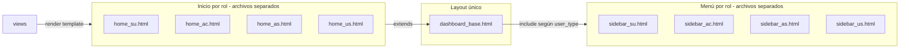

# CODAS — Panel por tipo de usuario (plantillas separadas)

**Propósito:** describir cómo separar el menú lateral y las pantallas de inicio del panel por `UserProfile.user_type` (SU, AC, AS, US), evitando un único HTML con bloques `if/elif` extensos en [`dashboard_base.html`](../apps/dashboard/templates/dashboard/dashboard_base.html).

**Contexto:** [`apps/userprofile/models.py`](../apps/userprofile/models.py) (`UserType`), vista de entrada [`apps/dashboard/views.py`](../apps/dashboard/views.py) (`dashboard_home`).

---

## Situación actual

- Tras login, **solo SU** usa [`home_superuser.html`](../apps/dashboard/templates/dashboard/home_superuser.html); **AC, AS y US** comparten [`dashboard.html`](../apps/dashboard/templates/dashboard/dashboard.html).
- El menú lateral se resuelve con **includes** por rol (`dashboard/includes/sidebar_*.html`) vía context processor `apps.dashboard.context_processors.dashboard_sidebar`; ya no hay un bloque largo `if/elif` por tipo en [`dashboard_base.html`](../apps/dashboard/templates/dashboard/dashboard_base.html).
- Las demás apps (compañías, facturación, usuarios) extienden el mismo `dashboard_base.html`; el menú “correcto” depende de esos condicionales internos.

---

## Limitación de Django

En plantillas clásicas, `` debe usar un **nombre literal** de plantilla padre; no es viable un `extends` dinámico por variable sin mecanismos avanzados (loader propio).

**Consecuencia práctica:**

- **Encaja bien:** varios **parciales** (``) para el menú por rol + **varias** plantillas de inicio que siguen extendiendo el **mismo** `dashboard_base.html`.
- **Opcional y más costoso:** duplicar por completo una pantalla (p. ej. dos `company_list_*.html`) si la vista elige `template_name` según el rol.

---

## Enfoque recomendado (plantillas separadas por rol)

1. **Cuatro parciales de navegación** bajo `templates/dashboard/includes/` (nombres orientativos):
   - `sidebar_superuser.html` — ítems actuales SU (Administración, Compañías, Facturación, Usuarios, Django admin, Auditoría placeholder).
   - `sidebar_admin_company.html` — ítems AC.
   - `sidebar_admin_system.html` — ítems AS.
   - `sidebar_user.html` — ítems US (placeholders de dominio).

2. **Contexto global del include:** un **context processor** (registrado en `TEMPLATES` → `OPTIONS` → `context_processors`) que, según `request.user.profile.user_type`, asigne por ejemplo `dashboard_sidebar_include = "dashboard/includes/sidebar_superuser.html"` (mapeo explícito SU / AC / AS / US y valor por defecto seguro).

3. **Simplificar `dashboard_base.html`:** mantener cabecera, modal de mensajes y ``; sustituir el `if/elif` del `<nav>` por ``; conservar `` solo si alguna vista necesita un ítem extra puntual.

4. **Cuatro plantillas de inicio** al entrar a `/panel/`:
   - Convención clara: `home_superuser.html` para SU (reemplaza el antiguo `dashboard_superuser.html`).
   - Añadir `home_admin_company.html`, `home_admin_system.html`, `home_user.html` con contenido acorde a cada rol (hoy un solo `dashboard.html` sirve a no-SU; conviene **separar** AC/AS/US).
   - En `dashboard_home`, ramificar con `if/elif` o `match` sobre `UserProfile.UserType` y `render(..., template_name=...)` con el contexto adecuado (métricas solo para SU, etc.).

5. **Pruebas:** sesión por cada `user_type` y comprobación de menú + home + al menos una pantalla de app (p. ej. compañías).

6. **Documentación de mantenimiento:** tabla “tipo → plantilla de inicio → include del sidebar”; los nuevos enlaces de menú se añaden **solo** en el `sidebar_*.html` del rol correspondiente.

---

## Qué no duplicar (por defecto)

Los listados y formularios que ya filtran por permisos (`can_crud`, querysets por compañía) pueden seguir en **una** plantilla por entidad. Si el HTML diverge mucho entre roles, valorar dos plantillas y selección en la vista.

---

## Riesgos y cuidados

- El **context processor** debe tolerar ausencia de `UserProfile` en rutas excepcionales (evitar 500).
- Tests que rendericen plantillas del panel deben inyectar `user`/`profile` coherentes con el processor.

---

## Nemotécnico del nombre de archivo

- **PANEL** — área `/panel/` (dashboard).
- **ROL** — `user_type` (SU, AC, AS, US).
- **PLANTILLAS** — HTML separados por rol (includes + homes).

---

*Documento de diseño; la implementación en código puede seguir estos pasos cuando se priorice en el repositorio.*
