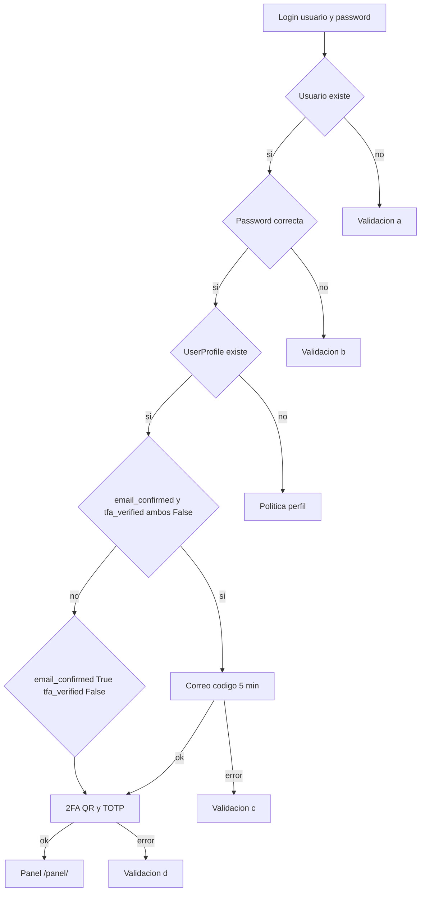
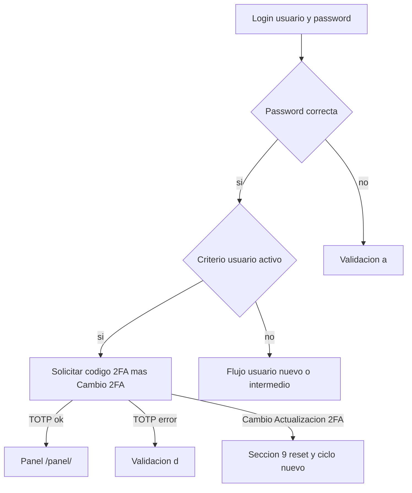

# CODAS — Flujos de seguridad y accesos

Documento de **diseño funcional** alineado con la app **`apps.security`** (login, correo, TOTP) y el destino **`apps.dashboard`** (`/panel/`). Describe tres líneas de acceso: **usuario nuevo** (onboarding con correo y 2FA), **usuario activo** (login recurrente con solo TOTP tras contraseña) y **cambio / actualización 2FA** (re-enrolamiento forzando el ciclo completo tras contraseña correcta), con validaciones acordadas.

**Modelos y campos:** ver inventario en [`CODAS_MODELS.md`](CODAS_MODELS.md) (`User` en `auth`, `UserProfile` en `apps.userprofile`).

**Entrada autenticada al producto:** tras completar credenciales y segundo factor según aplique, la redirección va a **`/panel/`** (nombre de URL Django **`dashboard:home`**, app **`apps.dashboard`**). La plantilla depende de `UserProfile.user_type` (p. ej. superusuario **SU** → `home_superuser.html`; otros tipos → `dashboard.html` hasta completar sus módulos).

---

## 1. Alcance

- **Usuario nuevo:** acceso inicial (correo + alta 2FA) hasta el **panel** (`/panel/`, `dashboard:home`).
- **Usuario activo:** usuario que ya generó y confirmó accesos; login con contraseña + código 2FA y redirección al **panel** (`/panel/`, `dashboard:home`).
- **Cambio / actualización 2FA:** usuario activo que perdió el factor TOTP (cambio de teléfono, app eliminada o reinstalada, etc.); desde la pantalla de TOTP del activo puede solicitar reset y repetir el ciclo como **usuario nuevo** (sección **9**).
- La **implementación** (vistas, plantillas, servicios, envío SMTP, librería TOTP) queda fuera de este archivo; aquí solo el **contrato** del flujo y mensajes.

---

## 2. Criterio “Usuario nuevo”

Se considera que el usuario **aún no completó** el alta de seguridad cuando:

- `UserProfile.email_confirmed` **es `False`**, **y**
- `UserProfile.tfa_verified` **es `False`**.

Tras completar el flujo, ambos deben quedar en **`True`** para tratar el acceso como plenamente habilitado (y redirigir al **panel** `/panel/`, `dashboard:home`).

### 2.1 Rama intermedia (usuario a mitad de flujo)

Si **`email_confirmed = True`** y **`tfa_verified = False`** (confirmó correo pero no terminó 2FA):

- **No** repetir los pasos 2.1–2.3 (correo ya validado).
- Entrar directamente en el **paso 3** (pantalla 2FA / QR).

---

## 3. Flujo principal (usuario nuevo)

### Paso 1 — Credenciales

1. El usuario ingresa **usuario** y **contraseña**.
2. Se valida contra **`auth_user`** (Django `authenticate`) y debe existir **`userprofile_userprofile`** enlazado al usuario (`User.profile` / OneToOne).

### Paso 2 — Validación por correo (caducidad 5 minutos)

**Condición de entrada:** `email_confirmed = False` (típicamente junto con `tfa_verified = False` en usuario nuevo).

| Subpaso | Comportamiento |
|---------|------------------|
| **2.1** | Pantalla informando que se envió un correo con un **número validador** que **vence en 5 minutos**. |
| **2.2** | El usuario ingresa el código recibido por correo. |
| **2.3** | Si el código es correcto y no ha vencido, pasar al **paso 3 (2FA)**. |

**Campos `UserProfile` usados:** `email_confirm_code`, `email_confirm_exp` (ventana 5 minutos desde generación), y tras éxito `email_confirmed = True` (y conviene limpiar código/expiración).

**Origen del correo:** dirección en **`User.email`** (`auth_user`). Si está vacío, el flujo debe bloquearse con mensaje de negocio (definir texto en implementación).

### Paso 3 — 2FA (TOTP + autenticador)

1. Pantalla con breve explicación de **primer ingreso**, indicación de instalar app **Autenticador**, y **código QR** para registro en la app.
2. Botón: **“Presionar si ya se registró”**.
3. **3.1** Tras el botón: pantalla que solicita el **código validador 2FA**; al validar correctamente se actualiza **`UserProfile`** (`totp_secret` ya generado previamente para el QR; **`tfa_verified = True`**).

**Campos `UserProfile` usados:** `totp_secret`, `tfa_verified`; opcional `last_totp_reset` según política.

### Paso 4 — Fin de flujo (entrada al producto)

Si todo es correcto, **`login()`** completo y redirección al **panel** (`/panel/`, `dashboard:home`, app `apps.dashboard`; plantilla según tipo de usuario).

---

## 4. Validaciones y mensajes (usuario nuevo)

| Id | Condición | Mensaje / acción en pantalla |
|----|-----------|------------------------------|
| **a** | El usuario **no existe** en el sistema | *«Error usuario no Existe en sistema»* |
| **b** | Usuario existe pero la **contraseña** es incorrecta | *«Error en contraseña, si requiere solicitar un cambio contacte al administrador de sistemas»* |
| **c** | El **número validador de correo** no es correcto (o caducado) | *«Error en validación»* + opciones **«Reenvío código validador»** y **«Cancelar»** |
| **d** | El **código 2FA** es incorrecto | *«Error en validación»* + opciones **«Ingrese el código Correcto»** y **«Cancelar»** |

### 4.1 Notas de comportamiento

- **Reenvío código (c):** generar nuevo código, nueva expiración (`email_confirm_exp`), nuevo envío; aplicar **límite de frecuencia** (anti-abuso).
- **Cancelar (c) y (d):** cerrar flujo de onboarding (limpiar estado de sesión / paso); no marcar pasos como completados hasta éxito. Definir si “Cancelar” devuelve al login o a paso anterior.
- **“Ingrese el código Correcto” (d):** reintento en la misma pantalla o recarga del paso 3.1 sin regenerar QR si el secreto ya está en perfil.
- Intentos fallidos repetidos: valorar uso de **`UserProfile.locked_until`** y/o **`status`** (ver [CODAS_MODELS.md](CODAS_MODELS.md)).

---

## 5. Referencia rápida de campos (`UserProfile`)

| Campo | Uso en este flujo |
|-------|-------------------|
| `email_confirmed` | `False` hasta validar correo; `True` tras paso 2.3 |
| `email_confirm_code` | Código de 6 caracteres enviado por correo |
| `email_confirm_exp` | Momento de caducidad del código (p. ej. +5 min) |
| `totp_secret` | Secreto para generar QR / validar TOTP |
| `tfa_verified` | `False` hasta TOTP correcto en 3.1; `True` al completar |
| `last_totp_reset` | Opcional: auditoría al forzar **cambio / actualización 2FA** (sección **9**) |
| `locked_until` | Opcional: bloqueo tras N fallos |
| `status` | Opcional: desactivar cuenta (`I`) por política |

El modelo **`Company`** no participa en este flujo salvo reglas futuras.

---

## 6. Decisiones técnicas a fijar en implementación

1. **`UserProfile` obligatorio** al existir el `User`: si no hay fila OneToOne, definir creación automática (señal `post_save`) o error explícito distinto del (a).
2. **Sesión entre pasos:** mantener identidad del usuario tras contraseña correcta (y estado del wizard) sin repetir login; invalidar al cancelar o por tiempo.
3. **Seguridad del código de correo:** valorar almacenar **hash** del código en lugar de texto plano (ajuste de modelo o campo semántico).
4. **Envío de correo:** configuración SMTP (o proveedor) en settings; lógica en `services/` de la app de seguridad.

---

## 7. Diagrama de flujo (resumen)

---

## 8. Usuario activo

Usuario que **en su momento ya generó y confirmó** los accesos (onboarding completado). El login habitual **no** repite correo ni QR: solo contraseña y **código TOTP**.

### 8.1 Criterio para tratar al usuario como “activo” (entrada a este flujo)

Condiciones mínimas acordadas por negocio:

1. **`UserProfile.totp_secret`** no está vacío (existe secreto para TOTP).
2. **`User.email`** (`auth_user`) no está vacío.

**Criterio recomendado adicional** (coherente con el flujo “usuario nuevo” y con [`CODAS_MODELS.md`](CODAS_MODELS.md)):

- **`UserProfile.email_confirmed = True`** y **`UserProfile.tfa_verified = True`**, además de `totp_secret` relleno y `User.email` no vacío.

Así se evita tratar como “activo” a quien tenga secreto generado pero **nunca** verificó el 2FA (`tfa_verified = False`). Si un usuario **no** cumple el criterio de activo, debe enrutarse al flujo de **sección 2–7** (usuario nuevo o rama intermedia).

### 8.2 Flujo principal (usuario activo)

| Paso | Descripción | Tablas / campos |
|------|-------------|-----------------|
| **1** | Usuario ingresa **usuario** y **contraseña**. | `auth_user` + existencia de **`userprofile_userprofile`** (misma política que usuario nuevo). |
| **2** | Si el usuario existe, la contraseña es correcta y cumple el **criterio activo** (8.1), continuar. | `authenticate`; comprobar `UserProfile` y campos de 8.1. |
| **3** | Pantalla que solicita el **código validador 2FA** (TOTP) y, como segunda opción, el enlace o botón **«Cambio / Actualización 2FA»** (ver sección **9**). | Validación contra **`UserProfile.totp_secret`** (sin regenerar QR en cada login) si el usuario introduce código; la opción de cambio no exige TOTP previo (riesgo documentado en **9.4**). |
| **4** | Si el TOTP es correcto, redirigir al **panel** (`/panel/`, `dashboard:home`). | Sesión iniciada (`login()`); fin del flujo de seguridad. |

No se usan en este flujo mientras no se elija cambio de 2FA, salvo política excepcional: `email_confirm_code`, `email_confirm_exp`.

### 8.3 Validaciones y mensajes (usuario activo)

| Id | Condición | Mensaje / acción en pantalla |
|----|-----------|------------------------------|
| **a** | La **contraseña** es incorrecta | *«Error en contraseña, si requiere solicitar un cambio contacte al administrador de sistemas»* |
| **d** | El **código 2FA** es incorrecto | *«Error en validación»* + **«Ingrese el código Correcto»** y **«Cancelar»** |

**Notas:**

- **“Ingrese el código Correcto”:** nuevo intento en la misma pantalla (o recarga del paso 3) **sin** cambiar `totp_secret`.
- **“Cancelar”:** definir si cierra el intento de login y vuelve al paso 1 o abandona la sesión parcial.
- Tras varios fallos en (a) o (d), valorar **`locked_until`** / **`status`** en `UserProfile` ([`CODAS_MODELS.md`](CODAS_MODELS.md)).

### 8.4 Campos involucrados (referencia)

| Origen | Campos relevantes |
|--------|-------------------|
| `auth_user` | `username`, `password`, `email` (no vacío para criterio activo) |
| `UserProfile` | `totp_secret` (no vacío), `tfa_verified`, `email_confirmed` (recomendado `True` para activo), `locked_until`, `status` (opcional) |

### 8.5 Contraste con usuario nuevo

| Aspecto | Usuario nuevo | Usuario activo |
|--------|----------------|----------------|
| Objetivo | Primera confirmación de correo y registro 2FA | Autenticación recurrente |
| Tras password correcta | Correo (si aplica) y/o QR + primer TOTP | Solo pantalla TOTP |
| Campos protagonistas | `email_confirm_*`, `email_confirmed`, `totp_secret`, `tfa_verified` | `totp_secret` + flags ya en `True` si se adopta 8.1 recomendado |

### 8.6 Diagrama de flujo (usuario activo)

---

## 9. Cambio / actualización 2FA

Caso de uso: el usuario **ya era “activo”** (criterio sección **8.1**) pero **cambió de teléfono**, **desinstaló** o **reinstaló** la app autenticadora y ya no dispone del TOTP válido. Tras validar **usuario y contraseña** y mostrar la pantalla del paso **3** del usuario activo, puede optar por reconfigurar el 2FA en lugar de introducir el código antiguo.

### 9.1 Criterio de entrada (mismo contexto que usuario activo)

Condiciones alineadas con el acceso a la pantalla TOTP del **usuario activo**:

1. **`UserProfile.totp_secret`** no está vacío (había un secreto previo).
2. **`User.email`** (`auth_user`) no está vacío.

Si además se adopta el criterio recomendado de **8.1**, el usuario suele tener **`email_confirmed = True`** y **`tfa_verified = True`** antes del reset; tras el reset ambos pasan a **`False`** y deja de considerarse “activo” hasta completar de nuevo el onboarding.

### 9.2 Flujo (pasos)

| Paso | Descripción | Tablas / campos |
|------|-------------|-----------------|
| **1** | Igual que usuario activo: **usuario** y **contraseña** validados contra **`auth_user`** y existencia de **`userprofile_userprofile`**. | Misma política que secciones **3** y **8**. |
| **2** | Contraseña correcta y cumple **criterio activo** (8.1). | Continuar al paso **3** de usuario activo. |
| **3** | Pantalla TOTP del activo con **dos caminos**: (A) introducir **código TOTP** → si es correcto, **8.2 paso 4** (panel `/panel/`, `dashboard:home`); (B) acción **«Cambio / Actualización 2FA»** → ejecutar **9.3** y enseguida **9.4**. |
| **3.1** | **Reset de 2FA** persistido en **`UserProfile`** (ver **9.3**). | Servicio en `services/`; no en plantillas. |
| **3.2** | **Repetir el ciclo como usuario nuevo:** secciones **2–4** de este documento (paso **2** correo con código, paso **3** QR y nuevo `totp_secret`, verificación TOTP, hasta el **panel** `/panel/`). | Tras **9.3**, `email_confirmed` y `tfa_verified` quedan en `False` → corresponde el **paso 2** completo; la rama intermedia **2.1** (solo 2FA sin repetir correo) **no** aplica hasta que el usuario vuelva a confirmar correo. |

### 9.3 Efectos del reset en `UserProfile`

Al confirmar la acción **«Cambio / Actualización 2FA»** (tras contraseña correcta y estando en el paso 3 del activo):

| Campo | Efecto |
|-------|--------|
| `totp_secret` | **Eliminar el valor** almacenado (`NULL` o cadena vacía según convención del proyecto); el siguiente ciclo debe **generar un secreto nuevo** para el QR (como en paso **3** del usuario nuevo). |
| `tfa_verified` | Establecer en **`False`**. |
| `email_confirmed` | Establecer en **`False`** para forzar la **validación completa** (correo + nuevo 2FA). |

**Recomendaciones de implementación:**

- Limpiar **`email_confirm_code`** y **`email_confirm_exp`** al resetear (o regenerarlos al entrar al paso **2** del onboarding) para no reutilizar códigos obsoletos.
- Actualizar **`last_totp_reset`** con la fecha/hora del reset si se usa para auditoría o políticas ([`CODAS_MODELS.md`](CODAS_MODELS.md)).

### 9.4 Riesgo y decisiones de producto

Con este diseño, **quien posea la contraseña** puede solicitar el reset **sin demostrar posesión del TOTP anterior**. El correo del paso **2** (usuario nuevo) actúa como segundo factor al re-enrolar. Si el negocio exige más control, valorar: código al correo **antes** de borrar `totp_secret`, límites de frecuencia, o flujo asistido por **administrador de sistemas**.

**Sesión:** mantener la misma política que en el resto del wizard (sección **6**): identidad tras contraseña correcta en sesión o estado de paso, sin **`login()`** completo hasta criterios acordados de fin de flujo; al **Cancelar**, limpiar estado según política común con **4.1**.

### 9.5 Referencia cruzada

| Documento | Relación |
|-----------|----------|
| [`CODAS_MODELS.md`](CODAS_MODELS.md) | Campos `UserProfile`: `totp_secret`, `tfa_verified`, `email_confirmed`, `email_confirm_*`, `last_totp_reset` |
| Secciones **2–4** | Ciclo “usuario nuevo” al que se enruta tras **9.3** |
| Sección **8** | Origen de la pantalla paso **3** donde aparece la opción de cambio |

---

## 10. Mantenimiento de este documento

Al cambiar mensajes, pasos o campos del modelo, actualizar **este archivo** y **[`CODAS_MODELS.md`](CODAS_MODELS.md)** para que sigan alineados.

---

*Documento de flujo de seguridad CODAS — usuario nuevo, usuario activo, cambio de 2FA y validaciones acordadas.*
