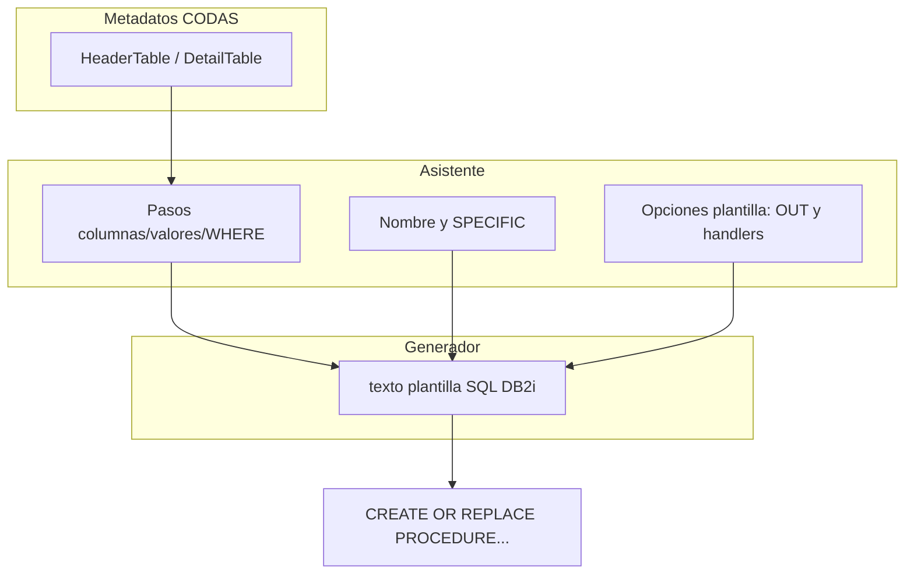

# CODAS — Store Procedure Asistido (SP Asistido)

Documento de **contexto y diseño** para el módulo **Store Procedure Asistido**: generación guiada de procedimientos almacenados IBM i / DB2 for i a partir de metadatos ya definidos en el diseño de tablas. Es **fuente de contexto** para el equipo y para asistentes en chats nuevos (junto con [`CODAS_CONTEXTO.md`](CODAS_CONTEXTO.md) y [`CODAS_MODELS.md`](CODAS_MODELS.md)).

**Evolución documental (abr. 2026):** existió un **checklist** operativo de tareas de implementación; el contenido útil (criterios de aceptación, trazas a archivos, inventario de prototipos) quedó **fusionado** en las secciones 5–7 y 9.11 y en **el inventario de la sección 7.4** de este documento. Ese checklist ya no se mantiene como fichero separado; la **norma** del módulo es **este** documento.

**Plantilla de procedimiento (IBM i / DB2 for i, referencia a producción):** **§9** — `OUT` estándar (`P_ERROR_CODE`, `P_ERROR_MSG`), `SPECIFIC`, manejadores `23505` y `SQLEXCEPTION`, catálogo de códigos, contrato **READ** (result set + `OUT` de error), y coherencia de parámetros `IN` con el `DML` generado.

**Prototipos HTML (navegación en el navegador, sin app Django):** carpeta [`static/prototypes/sp-asistido/`](../static/prototypes/sp-asistido/) — listado con datos (`sp-asistido-list-demo.html`), listado vacío (`sp-asistido-list-empty-demo.html`), **asistente READ (SELECT)** reordenado en **7 pasos**: `sp-asistido-read-01-name-sp.html` … `sp-asistido-read-07-vista-previa.html` (F.1–F.7), y **asistente ADD** en **7 pasos**: `sp-asistido-add-01-name-sp.html` … `sp-asistido-add-07-Sql.html` (1 identificación, 2 tabla, 3 columnas, 4 orígenes, 5 revisión, 6 firma/resumen, 7 SQL final). **Estándar transversal acordado para ADD/UPD/DLT/READ:** todos los flujos inician con la misma estructura funcional: **Paso 1 = Identificación** (definición de esquema/librería, nombre corto del SP, nombre largo y comentario descriptivo; referencia visual de demo: `sp-asistido-add-01-name-sp.html`) y **Paso 2 = Tabla** (elección de `HeaderTable` por radio con nota de ámbito por compañía; referencia visual de demo: `sp-asistido-add-02-tabla.html`). Además, **todas las pantallas de todos los procesos** deben mostrar en la parte superior el **stepper** de progreso indicando el paso actual. Validaciones clave: ADD paso 3 requiere al menos una columna; READ paso 1 requiere esquema/nombre corto/largo; READ paso 4 requiere al menos un campo WHERE. **Para los cuatro flujos (ADD/DLT/UPD/READ), paso 1 valida unicidad por compañía de `procedure_name_short` y `procedure_name_long`; si existe, se bloquea el avance y se notifica error en modal.** En producto, siempre revalidar en servidor.

---

## 1. Relación con el resto de CODAS

| Documento / código | Rol |
|--------------------|-----|
| [`CODAS_CONTEXTO.md`](CODAS_CONTEXTO.md) | Visión de producto; roadmap Fases **6 (SP dinámico)** y **7 (SP asistido)**. |
| [`CODAS_MODELS.md`](CODAS_MODELS.md) | Inventario de modelos; `Company`, `UserProfile`, `HeaderTable`, `DetailTable`. |
| [`CODAS_TABLE_DESIGN.md`](CODAS_TABLE_DESIGN.md) | Reglas de acceso por compañía y patrones de panel (`/panel/table-design/`). |
| [`apps/table_design/`](../apps/table_design/) | Metadatos de tabla (esquema, columnas, tipos, PK, nulls, etc.). |
| [`apps/table_design/services/sql_script.py`](../apps/table_design/services/sql_script.py) | Referencia de convenciones de salida SQL (calificación, `SET CURRENT SCHEMA`, defaults). |

**Módulo hermano (fuera de este documento como alcance de implementación, no de producto):** **SP Dinámico** — misma plataforma, flujo más corto y generación más automática; se documentará aparte cuando exista `CODAS_SP_DINAMICO.md` o sección equivalente.

---

## 2. Objetivo del módulo

- Guiar al usuario en la creación de **stored procedures** coherentes con el modelo de datos corporativo definido en **Table Design**.
- Cubrir operaciones típicas: **READ** (SELECT), **ADD** (INSERT), **UPD** (UPDATE), **DLT** (DELETE), con **validación por paso** y **vista previa** del script antes de despliegue en IBM i.
- Mantener **trazabilidad** (quién definió qué) vía modelos y auditoría en `apps.sp_asistido` (y versionado de `SPArtifactVersion`).

---

## 3. Principio no negociable: compañía (`Company`)

- Toda **definición persistida** de un SP asistido debe estar asociada a una **`Company`** (`ForeignKey`, preferencia `on_delete=PROTECT` salvo decisión explícita distinta).
- Toda **tabla origen** debe ser un **`HeaderTable`** cuyo `company_id` coincida con la compañía de la definición y con el **ámbito del usuario** en panel (mismo criterio que table design: filtrar por `request.user.profile.company_id` cuando aplique).
- **`DetailTable`** no lleva `company` en modelo; la compañía se **hereda** siempre vía `header.company`. Cualquier pantalla que cargue campos debe comprobar que el `header` pertenece a la compañía permitida.

---

## 4. Convención de operaciones

| Código | Significado | SQL orientativo |
|--------|-------------|-----------------|
| **READ** | Consulta | `SELECT` |
| **ADD** | Alta | `INSERT` |
| **UPD** | Cambio | `UPDATE` |
| **DLT** | Baja | `DELETE` |

**Leyenda UI (panel, coherente con asistente):** **Leer / Añadir / Cambiar / Borrar**; colores de acento (referencia) **READ** cielo · **ADD** esmeralda · **UPD** ámbar · **DLT** rosa/rose.

---

## 5. Flujos funcionales (asistido)

Resumen alineado al diseño acordado; nombres de URL y servicios: **§7.2** y `apps/sp_asistido/`.

### 5.0 Estándar común de inicio (ADD / UPD / DLT / READ)

Para mantener consistencia funcional y visual entre operaciones:

1. **Paso 1 — Identificación (obligatorio en todos los modos):**  
   - Campos: **Esquema / librería**, **Nombre corto del SP**, **Nombre largo**, **Comentario descriptivo**.  
   - Referencia de diseño demo: `sp-asistido-add-01-name-sp.html`.
2. **Paso 2 — Tabla (obligatorio en todos los modos):**  
   - Elección de **`HeaderTable`** con control tipo **radio** (una tabla activa por flujo).  
   - Incluir nota explícita de **ámbito por compañía** (aislamiento por `company_id`).  
   - **Regla de diseño de listado (ADD/READ y futuros UPD/DLT):** presentar las **últimas 25** tablas creadas en orden **descendente por fecha de creación** y exponer un campo de **búsqueda por nombre** en la misma pantalla.  
   - En producto (Django), el límite/orden/filtro se resuelven en servidor (queryset), no solo en cliente.
   - Referencia de diseño demo: `sp-asistido-add-02-tabla.html`.
3. **Stepper superior visible:**  
   - Todas las pantallas de todos los asistentes (**ADD/UPD/DLT/READ**) deben mostrar en la franja superior el progreso completo y el paso activo (como estándar visual corporativo del asistente).
4. **Producto (Django):**  
   - Aunque la demo refleje controles en cliente, la validación de estos pasos se **repite en servidor** (wizard/forms/services).

### 5.1 READ

1. Definir **identificación** de la rutina (estándar común §5.0).
2. Elegir **tabla** (`HeaderTable` en ámbito de compañía; estándar común §5.0).
3. Elegir **columnas** del resultado (desde `DetailTable`).
4. Definir **al menos un filtro** (condición `WHERE`): columna, operador, origen literal o parámetro `IN` del SP. **No** se avanza sin criterio de búsqueda (regla de producto: consulta acotada; detalle en **5.1.1** y demo `sp-asistido-read-04-filtros.html`).
5. Elegir **modalidad READ**:
   - **READ-C**: consulta por **cursor/result set** (permite `ORDER BY` y `FETCH`).
   - **READ-R**: consulta de **registro único** por parámetros `OUT` (sin cursor; `ORDER/FETCH` no aplican).
   - En READ-R se define política de múltiples filas: **error controlado** o **tomar primer registro**.
6. Definir **firma técnica** del procedimiento (parámetros `IN`/`OUT` y contrato). El generador añade `IN` según filtros; en **READ-C** persisten `P_ERROR_CODE` y `P_ERROR_MSG`; en **READ-R** se añaden además `OUT` por cada columna de proyección (`O_<campo>`), manteniendo también el par estándar de control.
7. **Vista previa** del script + bloque de documentación. El cuerpo debe ajustarse a la **plantilla** **§9**: cursor en READ-C, o `SELECT ... INTO` con `OUT` en READ-R.

**5.1.1 — Validación READ (paso 4 — filtros)**

- **Obligatoriedad de condición de búsqueda:** el usuario debe **seleccionar al menos un campo** de `DetailTable` para construir el predicado `WHERE` (en el prototipo: un único criterio por asistente; se elige fila y se completan operador, origen y valor / nombre de `IN`). **No** se genera en este flujo un procedimiento de lectura **sin** cláusula `WHERE` (equivalente a devolver toda la tabla sin criterio de búsqueda).
- **Dónde implementarlo:** en **Django** — `Form` o paso de wizard, `clean()`, y/o **servicio de validación**; nunca depender solo del cliente.
- **Demo HTML** (`sp-asistido-read-04-filtros.html`): al pulsar “Siguiente” se comprueba con **JavaScript** que exista un campo de filtro seleccionado; además, según operador y origen: **Literal** con texto no vacío; **Parámetro IN** con nombre no vacío y patrón acordado (p. ej. `P_…`); operador **`IS NULL`**: sin requisito de valor. Mensaje de error bajo el pie vía `#read04-error`. En **producto** (`read_validation` + wizard) el servidor **revalida** siempre.

**5.1.2 — Validación READ (paso 1 — identificación de la rutina)**

- **Campos obligatorios** en el asistente: **esquema / librería**, **nombre corto** del procedimiento, **nombre largo** (descriptivo, ≤50 caracteres según convención). Deben rellenarse en producto; **no** se avanza a la vista previa si falta alguno. Atributos de referencia en el prototipo: `procedure_schema`, `procedure_name_short`, `procedure_name_long` (alineados al paso 3 de ADD).
- **Unicidad (producto, validación servidor):** en paso 1 se rechaza continuar si ya existe en la misma compañía una definición con el mismo `procedure_name_short` o con el mismo `procedure_name_long` (comparación case-insensitive); además se muestra mensaje de error en modal.
- **Demo HTML** (`sp-asistido-read-01-name-sp.html`): al pulsar “Siguiente” se aplica `trim` y, si falta un campo o falla la restricción HTML5, se muestra mensaje de error y/o `reportValidity()`. **Producto:** validación en paso 1 vía `read_validation` / wizard.

### 5.2 ADD

1. Definir **identificación** de la rutina (esquema/librería, nombre corto, nombre largo, comentario).
2. Elegir **tabla destino**.
3. Elegir **columnas a insertar** (excluir identidad / generadas según reglas de negocio).
4. Definir **origen del valor** por columna (parámetro IN, literal, `NULL`, expresión SQL permitida).
5. Ejecutar checklist de **obligatoriedad** vs **nullable**.
6. Revisar **firma/resumen** (identificación + IN previstos).
7. Ver **vista previa SQL final** (`INSERT` + bloques fijos de plantilla §9).

**5.2.1 — Validación ADD (mínima acordada)**

- **Paso 3 (columnas):** debe haber **al menos una** columna seleccionada para el `INSERT` entre las permitidas (p. ej. excluidas identidad o generadas, según C.3). Un `INSERT` sin columna de destino no es admisible. **Dónde implementarlo:** en **Django** — en el `Form` del paso, `clean()` o wizard (equivalente), y/o en un **servicio** de validación reutilizable por pruebas unitarias. En la **demo HTML** (`sp-asistido-add-03-columnas.html`) la regla se refleja con **control en cliente (JavaScript)**: el botón “Siguiente · Orígenes” no navega si no hay ninguna casilla de columna (no deshabilitada) marcada; se muestra mensaje de error en la página. El servidor debe **revalidar** siempre en producto.
- **Paso 4 (orígenes):** regla mínima acordada (criterio C.4 del diseño):  
  - si el origen es **`NULL`**, el campo **detalle** debe permanecer **vacío**;  
  - si el origen es **Parámetro IN**, **Literal** o **Expresión SQL**, el campo **detalle** es **obligatorio** (no vacío).  
  En la demo HTML (`sp-asistido-add-04-valores.html`) se valida en JavaScript; en producto Django se **revalida en servidor**.

### 5.3 UPD

1. Identificación (estándar común §5.0).
2. Tabla (estándar común §5.0).
3. Columnas a **modificar** y valores nuevos (parámetro / literal).
4. **WHERE obligatorio** — mínimo predicado seguro (idealmente PK o clave aprobada); prohibido `UPDATE` sin criterio de fila.
5. Opcional: **concurrencia** (p. ej. comparación de valores o timestamp de fila) si el producto lo incorpora.
6. Firma del SP y vista previa — en estándar CODAS, el script incluye el mismo par **§9.2** (`P_ERROR_CODE`, `P_ERROR_MSG`) y manejadores del **§9.5**; se pueden añadir handlers de negocio o `SQLSTATE` adicionales (p. ej. fila no afectada) acordado en equipo (ver **§9.6** y **§9.8**).

**Prototipos UPD (demo HTML):**

- `sp-asistido-upd-01-name-sp.html` (identificación).
- `sp-asistido-upd-02-tabla.html` (tabla con regla de últimas 25 + buscador por nombre).
- `sp-asistido-upd-03-set.html` (columnas SET + origen/valor con validación mínima).
- `sp-asistido-upd-04-where.html` (predicado WHERE obligatorio).
- `sp-asistido-upd-05-concurrencia.html` (control opcional de concurrencia).
- `sp-asistido-upd-06-firma-vista-previa.html` (firma técnica + SQL de referencia).

### 5.4 DLT

1. Identificación (estándar común §5.0).
2. Tabla (estándar común §5.0).
3. **WHERE obligatorio** (misma filosofía que UPD).
4. Modo **físico** vs **lógico** (si el dominio CODAS define baja lógica en metadatos).
5. **Confirmación de riesgo** en UI antes de generar script final.
6. Firma del SP y vista previa — mismo patrón **§9.2** / **§9.5** / **§9.8** que UPD.

**Prototipos DLT (demo HTML):**

- `sp-asistido-dlt-01-name-sp.html` (identificación).
- `sp-asistido-dlt-02-tabla.html` (tabla con regla de últimas 25 + buscador por nombre).
- `sp-asistido-dlt-03-where.html` (predicado WHERE obligatorio).
- `sp-asistido-dlt-04-modo.html` (baja física vs lógica).
- `sp-asistido-dlt-05-confirmacion.html` (doble confirmación de riesgo).
- `sp-asistido-dlt-06-firma-vista-previa.html` (firma técnica + SQL de referencia).

---

## 6. Acceso, perfiles y mensajes (producto)

- **Ámbito por compañía:** listados, detalle, edición, reabrir asistente y pasos de wizards usan un **`queryset` acotado** a la compañía del `UserProfile` (misma idea que Table Design), vía `apps/sp_asistido/services/access.py` (`sp_definition_queryset_for_user`, `get_sp_definition_or_404`).
- **ID y responsable de producto (AC, etc.):** el panel SP puede mostrar perfiles en cabecera (demo/UX); la **autorización** concreta se apoya en la misma política de acceso al listado que el resto del módulo.
- **Recursos ajenos a la compañía (IDOR):** se devuelve **HTTP 404** (no 403) para un `id` de `SPDefinition` que no pertenece a la compañía del usuario — decisión **única y documentada**; reduce filtrado de existencia de PK entre tenants.
- **Mensajes al usuario:** se estandarizan con `apps/sp_asistido/services/ui_messages.py` (`notify_success`, `notify_error`, `notify_warning`, `notify_info`, `extra_tags="sp_asistido"`) para alinearse al patrón de alertas del dashboard.
- **Mutaciones sensibles** (p. ej. reabrir asistente) solo vía **POST** con **CSRF**; no exponer enlace GET a operaciones con efecto. Pruebas de referencia: `SpAsistidoSecurityTests` en `apps/sp_asistido/tests.py`.

---

## 7. Arquitectura técnica (producto)

- **App Django:** **`apps.sp_asistido`** — en `INSTALLED_APPS`, rutas panel **`/panel/sp-asistido/`** (entradas `sp_asistido:list`, wizards ADD/READ/UPD/DLT, detalle, edición, export). Código: [`apps/sp_asistido/`](../apps/sp_asistido/).
- **Vistas** server-rendered (HTML), **wizards** con **estado en sesión** (`apps/sp_asistido/services/wizard_session.py` — **TTL 4h**, claves por flujo; ruta `sp_asistido:wizard_cancel` en **POST** y botón “Cancelar y limpiar” en el paso 1 de cada flujo).
- **Lógica SQL** solo en **`services/`**; plantillas sin lógica de negocio pesada.
- **Tests:** fragmentos fijos y longitud de línea en `apps/sp_asistido/tests.py` (`Generate*SqlTests`, `SqlMaxLineLengthTests`, `SpAsistidoSecurityTests`, `SqlQualificationTests`, sesión).

### 7.1 Modelo de persistencia

En Django (`apps.sp_asistido`) el asistente se persiste con estas tablas (migración inicial aplicada; ampliaciones futuras con nuevas migraciones):

1. **`SPDefinition`** (cabecera del artefacto): compañía, `HeaderTable`, operación, identificación de rutina, estado, paso actual, **`script_generated`** / **`script_date`**, modalidad READ (`read_mode`: `C` cursor / `R` registro único), política READ-R para múltiples filas (`read_row_policy`: `E` error / `F` first), y **auditoría** (`created_at`, `updated_at`, `created_by`, `updated_by`).
2. **`SPStepState`** (snapshot por paso): `payload_json` por número de paso para reanudar wizard y trazabilidad funcional; **auditoría** en cada fila.
3. **`SPParameter`** (firma IN/OUT): nombre, dirección, tipo DB2 y orden; **auditoría**.
4. **`SPAssignment`** (ADD/UPD): mapeo columna destino ↔ origen (`IN`/literal/`NULL`/expresión) y detalle; **auditoría**.
5. **`SPCondition`** (WHERE/ORDER/FETCH): predicados y metadatos de construcción SQL; **auditoría**.
6. **`SPArtifactVersion`** (versionado SQL): script generado, versión, hash, marca de vigente y **auditoría** (el instante de creación de la fila sustituye a un `generated_at` separado).

**Regla de simplificación aplicada:** no se persiste `specific_name`; la cláusula `SPECIFIC` se deriva de `procedure_name_short` según convención de generación.

**Enlace con diseño de tabla:** al persistir con éxito un `SPDefinition` vinculado a una cabecera, la app debe marcar **`HeaderTable.sp_associated=True`** en el `HeaderTable` referenciado (y revertir o recalcular si desaparece el último SP asociado, cuando se defina). Campo en cabecera desde migración `0013`; no lo actualiza `apps.table_design` — ver [`CODAS_MODELS.md`](CODAS_MODELS.md) y [`CODAS_TABLE_DESIGN.md`](CODAS_TABLE_DESIGN.md) § 7.11.

**Auditoría:** en implementación Django, reutilizar el mismo patrón que `apps.table_design.models.HeaderTable` (`auto_now_add` / `auto_now`, `ForeignKey` a `AUTH_USER_MODEL` con `on_delete=SET_NULL`, `related_name` únicos por modelo).

Referencia visual de diseño (demo de tablas): `static/prototypes/sp-asistido/sp-asistido-modelo-tablas-demo.html`. **Implementación:** [`apps/sp_asistido/models.py`](../apps/sp_asistido/models.py).

### 7.2 Nombres de URL Django (`sp_asistido`)

`app_name = "sp_asistido"`. Prefijo HTTP acordado: **`/panel/sp-asistido/`** (ver [`codas/urls.py`](../codas/urls.py)).

| Nombre | Ruta relativa | Vista | Notas |
|--------|----------------|-------|--------|
| `sp_asistido:list` | `""` | `definition_list` | Listado principal: filtros, paginación, export CSV, ámbito `company_id`. |
| `sp_asistido:list_export_csv` | `export/csv/` | `definition_list_export_csv` | CSV con el **mismo criterio de filtros** que el listado (`q`, `operation`, `header_table`, `ordering`); sin paginar (todas las filas filtradas). |
| `sp_asistido:detail` | `<id>/` | `definition_detail` | Ficha de definición en ámbito compañía. |
| `sp_asistido:edit` | `<id>/editar/` | `definition_edit` | Editar identificación (esquema, nombres, comentario) y estado. |
| `sp_asistido:wizard_start` | `nuevo/<operation>/` | `wizard_redirect` | **ADD** / **READ** / **DLT** / **UPD** → wizards en panel. |
| `sp_asistido:add_step1` | `nuevo/add/` | `add_wizard_step1` | ADD paso 1 (identificación, sesión). |
| `sp_asistido:add_step2` | `nuevo/add/tabla/` | `add_wizard_step2` | ADD paso 2 (cabecera; crea `SPDefinition`). |
| `sp_asistido:add_step` | `nuevo/add/<id>/paso/<3–7>/` | `add_wizard_step_detail` | ADD pasos 3–7 (columnas, orígenes, revisión, firma, SQL). |
| `sp_asistido:dlt_step1` | `nuevo/dlt/` | `dlt_wizard_step1` | DLT paso 1 (identificación, sesión). |
| `sp_asistido:dlt_step2` | `nuevo/dlt/tabla/` | `dlt_wizard_step2` | DLT paso 2 (cabecera; crea `SPDefinition` DLT). |
| `sp_asistido:dlt_step` | `nuevo/dlt/<id>/paso/<3–6>/` | `dlt_wizard_step_detail` | DLT pasos 3–6 (WHERE, modo, confirmación, SQL). |
| `sp_asistido:upd_step1` | `nuevo/upd/` | `upd_wizard_step1` | UPD paso 1 (identificación, sesión). |
| `sp_asistido:upd_step2` | `nuevo/upd/tabla/` | `upd_wizard_step2` | UPD paso 2 (cabecera; crea `SPDefinition` UPD). |
| `sp_asistido:upd_step` | `nuevo/upd/<id>/paso/<3–6>/` | `upd_wizard_step_detail` | UPD pasos 3–6 (SET+orígenes, WHERE, concurrencia, SQL). |
| `sp_asistido:read_step1` | `nuevo/read/` | `read_wizard_step1` | READ paso 1 (identificación, sesión). |
| `sp_asistido:read_step2` | `nuevo/read/tabla/` | `read_wizard_step2` | READ paso 2 (cabecera; crea `SPDefinition` READ). |
| `sp_asistido:read_step` | `nuevo/read/<id>/paso/<3–7>/` | `read_wizard_step_detail` | READ pasos 3–7 (columnas, WHERE, selección READ-C/READ-R, firma, vista previa SQL). |
| `sp_asistido:reopen` | `<id>/reabrir/` | `definition_reopen_wizard` | Reabrir asistente a partir de definición con script generado — **solo POST** (y CSRF). |
| `sp_asistido:wizard_cancel` | `wizard/cancel/<flow>/` | `wizard_cancel` | Cancela sesión de wizard: `flow` ∈ `add` \| `dlt` \| `upd` \| `read` — **POST**. |

---

### 7.3 — Generación, calificación y presentación al usuario

- **Procedimientos y tablas en DML** — calificación reutilizable y alineable a `table_design` (convención de separadores **dot** / **slash** / **mixed**; en cuerpos SQL de SP, **mixed** = mismo separador que **punto**; ver `CODAS_TABLE_DESIGN` §9.11): lógica en `apps/sp_asistido/services/sql_qualification.py`, usada en `generate_insert_script` / `generate_delete_script` / `generate_update_script` / `generate_read_script`.
- **Longitud de línea** — `Company.sql_max_line_length` (rango 40–180, fallback 78) aplicado en `script_formatting.enforce_max_line_length` (§9.12).
- **Vista previa SQL (último paso de cada wizard) y ficha** — el usuario puede **copiar** el texto y **descargar** un fichero `*.sql` (Blob en cliente); parcial `sp_asistido/includes/sql_preview_toolbar.html` (soporta `textarea` y `pre#id_artifact_sql` con inicialización al **DOM listo**).

### 7.4 — Inventario de prototipos estáticos (`static/prototypes/sp-asistido/`)

Los HTML bajo `static/prototypes/sp-asistido/` son **referencia de wireframe**; el **producto** se entrega con templates Django. No se embeben demos en el runtime del panel. Archivos con numeración **antigua** de READ (`sp-asistido-read-01-tabla` …) se conservan como histórico; el flujo vigente de demostración y producto pasa por identificación + tabla en pasos 1–2 (`read-01-name-sp` … `read-07-vista-previa`).

| Área | Archivos (referencia) |
|------|------------------------|
| Listado / vacío / modelo datos | `sp-asistido-list-demo.html`, `sp-asistido-list-empty-demo.html`, `sp-asistido-modelo-tablas-demo.html` |
| ADD (7) | `sp-asistido-add-01-name-sp.html` … `sp-asistido-add-07-Sql.html` |
| READ (7) | `sp-asistido-read-01-name-sp.html` … `sp-asistido-read-07-vista-previa.html` |
| DLT (6) | `sp-asistido-dlt-01-name-sp.html` … `sp-asistido-dlt-06-firma-vista-previa.html` |
| UPD (6) | `sp-asistido-upd-01-name-sp.html` … `sp-asistido-upd-06-firma-vista-previa.html` |

---

## 8. Fases del trabajo

| Fase | Descripción |
|------|-------------|
| **Análisis / diseño** | Este documento + prototipos en `static/prototypes/sp-asistido/`. |
| **Implementación** | Modelos, migraciones, vistas, servicios, tests (incl. **§9.11**). |
| **Evolución** | Nuevas reglas de negocio, plantillas, integración con **Fase 8** (generador avanzado) si aplica. |

---

## 9. Plantilla SQL corporativa (IBM i / DB2 for i) — patrón CODAS

Sección alineada a **procedimientos reales** de alta en el negocio: contrato fijo hacia el llamador (C#, RPG, servicios, etc.) y cuerpo repetible para **ADD**, **UPD**, **DLT** y **READ** (o vistas materializadas en SP de solo lectura). Cualquier **excepción** a esta plantilla (quitar un `OUT`, otra clave de duplicado) debe quedar **documentada por compañía o por proyecto** y, si aplica, como opción en el asistente.

### 9.1 — Objetivo

- Garantizar que toda generación o revisión de SP tenga: (1) **respuesta estructurada** de fin de ejecución; (2) **nombres** externos e internos coherentes; (3) **reacción** predecible a clave duplicada y a errores SQL; (4) en **READ**, separación clara entre **resultado de datos** y **código/mensaje de error**.

### 9.2 — Parámetros de salida obligatorios (todos los modos)

- **OBLIG (estándar CODAS):** en la lista de parámetros del `CREATE OR REPLACE PROCEDURE` deben existir, en este orden o al final (según convención fijada con el equipo, pero con **mismos nombres y tipos** de referencia):
  - `OUT P_ERROR_CODE INTEGER`
  - `OUT P_ERROR_MSG VARCHAR(200)` (o longitud mínima acordada, p. ej. 200/500)
- **Camino de éxito lógico** al completar el DML o el `SELECT` bajo el cursor sin excepción: `SET P_ERROR_CODE = 0;` y `SET P_ERROR_MSG = 'OK';` (u otro literal acordado).
- **Revalidación en servidor (Django / servicio):** no depender del cliente: el módulo que persista o genere el SP puede validar que el fragmento de firma contiene al menos esos `OUT` cuando la plantilla “CODAS estricta” esté activa.

### 9.3 — Nombre de procedimiento y cláusula `SPECIFIC`

- **Regla general de naming en producto (ADD/DLT/UPD/READ):**
  - `CREATE OR REPLACE PROCEDURE <schema>.<procedure_name_long>`
  - `LANGUAGE SQL`
  - `SPECIFIC <procedure_name_short>`
- **Nombre externo**: corresponde a `procedure_name_long` (identificador invocable en catálogo).
- **Cláusula** `SPECIFIC` **<nombre interno>**: corresponde a `procedure_name_short` y se declara inmediatamente después de `LANGUAGE SQL`.
- En IBM i el límite de longitud de identificadores ha variado (**18 a 128** según versión); en CODAS el límite efectivo y validaciones deben fijarse por entorno. Si una sede requiere convención distinta, documentarla explícitamente como excepción.
- Añadir, si el compilador/estándar lo pide, `LANGUAGE SQL` y, para lecturas, `DYNAMIC RESULT SETS` según **§9.7**.

### 9.4 — Orden lógico del cuerpo (recomendado)

1. **Variables internas** para diagnóstico, p. ej. `v_sqlstate CHAR(5) DEFAULT '00000'`, `v_msg VARCHAR(200) DEFAULT ''` (nombres podrán convencionarse, pero el patrón de **GET DIAGNOSTICS** se mantiene).  
2. **Handlers** (orden **específico** antes que **general**; ver **§9.5**).  
3. Sección de **validaciones lógicas** (opcionales) — comprobaciones con `IF` / `SIGNAL` antes del DML; puede quedar **vacía** y delegar en aplicación, pero su presencia fija dónde inserta el generador.  
4. **DML** o **SELECT** bajo **cursor** (ADD/UPD/DLT/READ).  
5. Asignación **OK** (`P_ERROR` = 0) cuando el flujo llega al final del camino feliz.  

Si el handler hace `EXIT` por excepción, no hace falta alcanzar el tramo 5; el handler debe **setear** `P_ERROR_CODE` / `P_ERROR_MSG` según el caso.

### 9.5 — Manejadores (handlers) fijos mínimos

- **Manejador 1 (clave duplicada):** `DECLARE EXIT HANDLER FOR SQLSTATE '23505' …` con asignación de código y mensaje de producto, p. ej. `P_ERROR_CODE = 100;` y un texto fijo (`'El registro ya existe.'` o el acordado). Colocar **antes** del manejador ampliado de excepciones, para no ser absorbido de forma inadecuada por el manejador general.  
- **Manejador 2 (general):** `DECLARE EXIT HANDLER FOR SQLEXCEPTION …` usando `GET DIAGNOSTICS CONDITION 1` hacia `RETURNED_SQLSTATE` y `MESSAGE_TEXT`, p. ej. asignar `P_ERROR_CODE = -1;` y concatenar `SQLSTATE` y mensaje en `P_ERROR_MSG` con un prefijo reconocible (`'Error SQLSTATE=…'` en el patrón de referencia).  

*(Variantes: handlers `CONTINUE` para trazas o reintentos — solo si se documentan aparte; no entran en el mínimo corporativo).*

### 9.6 — Catálogo mínimo de códigos de error (extensible)

| Código   | Uso (referencia) |
|----------|------------------|
| **0**    | Ejecución correcta (normalizar mensaje, p. ej. `'OK'`). |
| **100**  | Infracción de **unicidad** (clave duplicada, `SQLSTATE 23505`). |
| **-1**   | Cualquier **otro error** SQL manejado por el handler `SQLEXCEPTION` (y opcionalmente texto con `GET DIAGNOSTICS`). |

- **Extensión:** códigos de **negocio** (p. ej. 101 = “no se encontró fila”, 102 = validación de dominio) o **SIGNAL** explícitos, acordar tabla por proyecto. El asistente puede añadir una tabla editable de “código → mensaje” o generar bloques comentados.

### 9.7 — Operación **READ** (READ-C y READ-R)

- **READ-C (cursor/result set):**
  1) Usa **`DYNAMIC RESULT SETS 1`**, `DECLARE ... CURSOR WITH RETURN`, `OPEN c_read`.
  2) Permite `ORDER BY` y `FETCH FIRST N ROWS ONLY` (opcional).
  3) Mantiene `OUT P_ERROR_CODE` y `OUT P_ERROR_MSG` para estado de ejecución.
- **READ-R (registro único por OUT):**
  1) No usa cursor ni `DYNAMIC RESULT SETS`.
  2) Ejecuta `SELECT <columnas> INTO <OUTs>` sobre columnas seleccionadas.
  3) Agrega `OUT` por columna de proyección (`O_<FIELD_SHORT>`) y mantiene `P_ERROR_CODE` / `P_ERROR_MSG`.
  4) Política de múltiples filas configurable en wizard:
     - `E` (**error**): handler `SQLSTATE '21000'` con código de negocio (referencia actual: `102`).
     - `F` (**first**): aplica `FETCH FIRST 1 ROW ONLY`.
  5) `NOT FOUND` retorna código de negocio (referencia actual: `101`).
- En ambos modos, `SQLEXCEPTION` mantiene manejo diagnóstico (`GET DIAGNOSTICS`) y retorno de error controlado.

### 9.8 — **UPD** y **DLT** (mismo `OUT` y manejadores base)

- Misma **firma** mínima **§9.2** y **manejadores §9.5**; añadir según riesgo: comprobación de `SQLSTATE` / filas afectadas (`GET DIAGNOSTICS` `ROW_COUNT`) o handler para **‘02000’** (no data) si el diseño hace búsqueda previa o exige afectar exactamente una fila. Documentar códigos extra en el catálogo **§9.6**.

### 9.9 — Coherencia de parámetros **IN** y cuerpo **DML** (en especial **ADD**)

- Cada `IN` debe o bien **alimentar** el `INSERT` / `UPDATE` (lista de columnas/values), o bien quedar justificado: **valor por `DEFAULT` en la tabla**, **trigger** `BEFORE INSERT`, **columna generada**, o **no usada** (código a limpiar).  
- El generador a partir de **Table Design** debe: **(a)** mapear solo columnas y parámetros elegidos en el asistente; **(b)** no emitir `IN` huérfanos sin comentario `/* auditado por trigger */` o análogo; **(c)** si el `INSERT` omite columnas de **auditoría/fcha**, alinear con metadatos (`default`, `GENERATED`, trigger). Eso evita scripts como la discrepancia frecuente entre lista de `IN` y columnas reales en `INSERT`.

### 9.10 — Mensajes y idioma

- Los textos fijos (duplicado, `OK`, prefijo de error) pueden dejarse en **español** como estándar CODAS o en **códigos numéricos** + diccionario en app; fijar política por compañía. Documentar en la definición persistida si se opta por mensajes en **un solo idioma** o solo por `P_ERROR_CODE`.

### 9.11 — Generación y pruebas (criterio de aceptación del script)

- **Implementado en producto:** los servicios `generate_insert_script`, `generate_delete_script`, `generate_update_script` y `generate_read_script` emiten cuerpos conformes a **§9**; las pruebas en `apps/sp_asistido/tests.py` verifican fragmentos fijos (p. ej. `P_ERROR_CODE` / `P_ERROR_MSG`, `SQLSTATE '23505'`, `GET DIAGNOSTICS`, `INSERT` / `UPDATE` / `DELETE` / `SELECT`) y ambos contratos READ: **READ-C** (cursor + `DYNAMIC RESULT SETS`) y **READ-R** (`SELECT ... INTO`, política `21000` o `FETCH FIRST 1 ROW ONLY`).
- **Criterio I (matriz de aceptación heredada del plan de módulo):** mismo `OUT` de control y manejadores base en ADD/UPD/DLT/READ; READ soporta modalidad **cursor** y **registro único por OUT**; coherencia **IN** ↔ DML (**§9.9**); naming `CREATE` + `SPECIFIC` (**§9.3**); longitud de línea (**§9.12**).

### 9.12 — Límite de longitud por línea en scripts

- **Regla general transversal (ADD/DLT/UPD/READ):** ninguna línea del script
  generado puede superar **78 caracteres**.
- **Configuración por compañía/proyecto:** el límite se toma desde
  `Company.sql_max_line_length`; si no existe valor válido, se usa `78`.
  Rango permitido en producto: **40–180**.
- El formateo de saltos debe aplicarse en el servicio de generación, manteniendo la
  estructura SQL y la legibilidad (sangría y bloques principales).
- Esta regla se valida con pruebas automatizadas en `apps/sp_asistido/tests.py`.

### Diagrama de enlace (metadatos → plantilla)

---

## 10. Mantenimiento del documento

- Actualizar **§5–9** cuando cambien flujos, permisos, convenciones de nombres de SP en IBM i, o el catálogo de códigos de la plantilla corporativa.
- **Fuente de rutas y vistas:** [`apps/sp_asistido/urls.py`](../apps/sp_asistido/urls.py), [`views.py`](../apps/sp_asistido/views.py) y módulos `views_*_wizard.py`.
- Mantener alineado [`CODAS_MODELS.md`](CODAS_MODELS.md) (modelos) y, para decisiones de producto global, [`CODAS_CONTEXTO.md`](CODAS_CONTEXTO.md).

---

*Última revisión (abr. 2026): **READ** y `wizard_cancel` en **§7.2**; acceso, mensajes y seguridad en **§6**; sesión, calificación, export y prototipos en **§7.3–7.4**; **§9.11** actualizado a pruebas en `apps/sp_asistido/tests.py`.*
