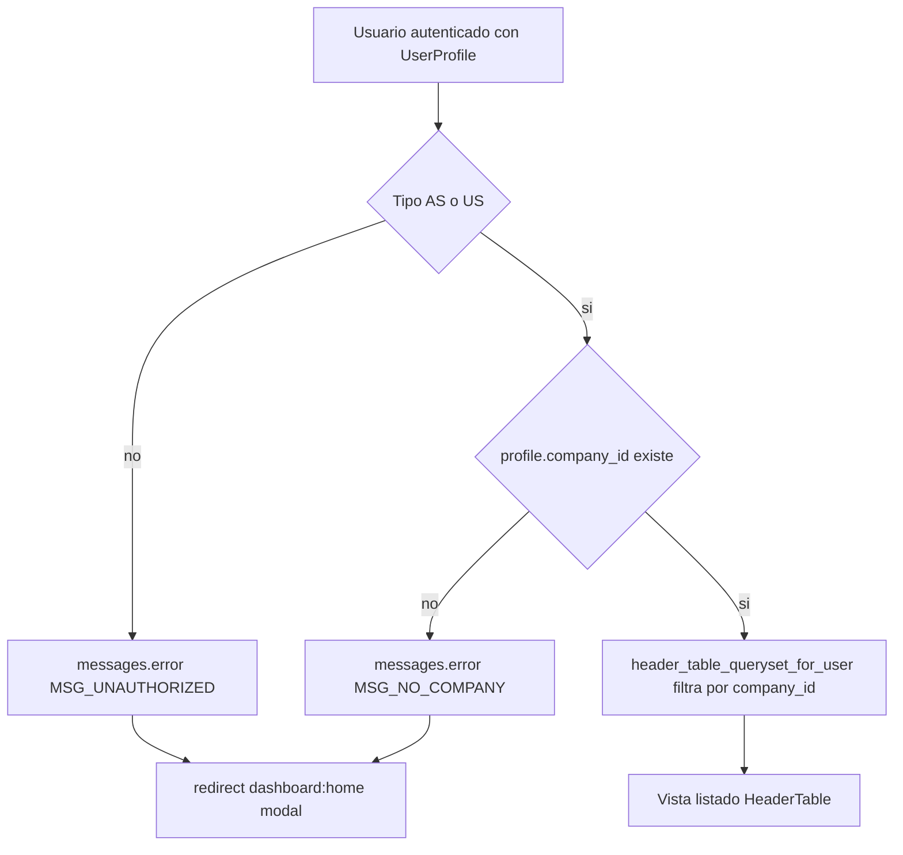
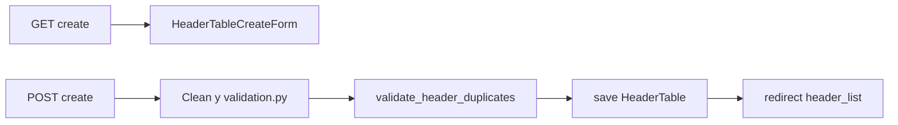
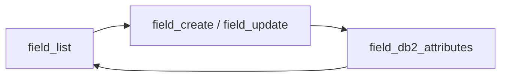
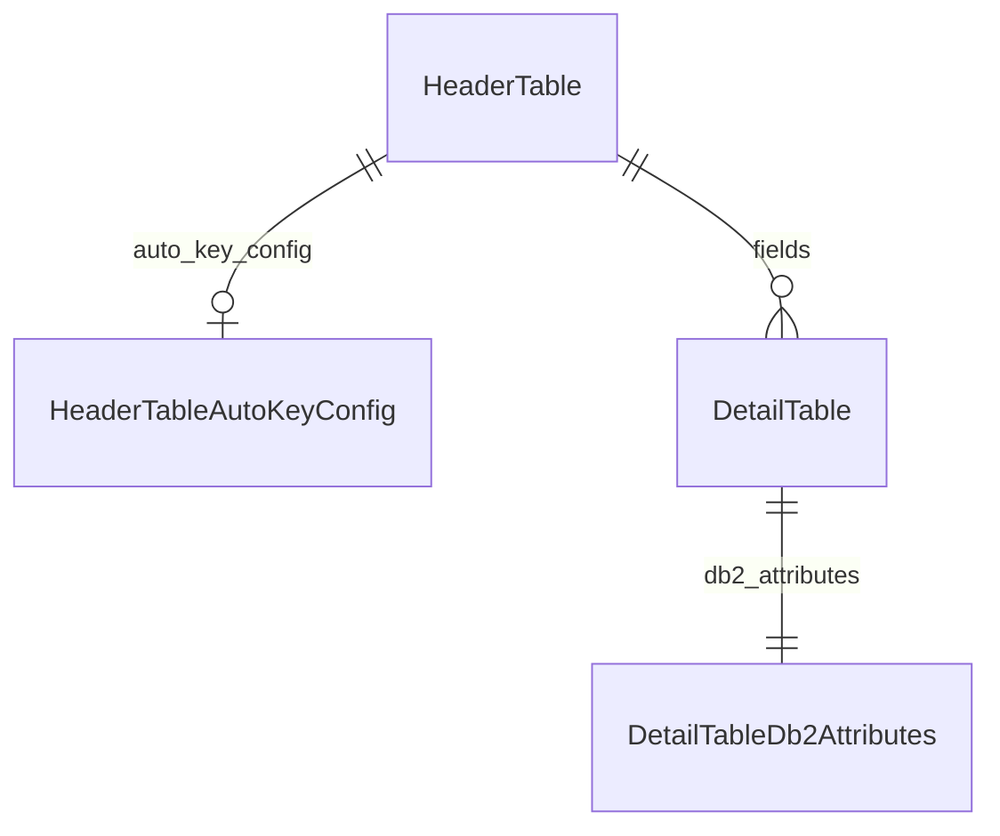

# CODAS — Diseño de tablas (TableDesign)

Documento de **reglas de negocio y acceso** para la app **`apps.table_design`**: cabeceras de diseño IBM i / DB2 (`HeaderTable`), campos (`DetailTable`) y extensiones opcionales Avanzado / Experto. Se irá ampliando con nuevas reglas (generación de script DDL, validaciones por tipo de columna, etc.).

**Modelos y tablas BD:** inventario técnico en [`CODAS_MODELS.md`](CODAS_MODELS.md) (sección **App `apps.table_design`**).

**Entrada autenticada:** pantallas del panel bajo **`/panel/table-design/`** (nombre de URL Django **`table_design:header_list`**). La plantilla base es **`dashboard/dashboard_base.html`**; los mensajes de error del framework de mensajes pueden mostrarse como **modal** según la etiqueta (`messages.error` → modal de error).

**Hilo de trabajo en chats nuevos:** usar este mismo documento (`CODAS_TABLE_DESIGN.md`) como fuente de verdad para contexto funcional/técnico de `HeaderTable`, `DetailTable` y generación DDL.

---

## 1. Alcance

- **En este documento:** contrato de **ámbito por compañía**, **quién puede acceder** al listado y a las pantallas de **campos** del mismo módulo, mensajes esperados y referencias a código (`services/`, vistas).
- **Fuera de alcance actual:** `header_detail_with_script` (si se decide UX adicional), integración con Store Procedure / mantenimientos (se documentan cuando existan implementaciones).
- **Alta de cabecera:** flujo y reglas en **§ 7**; checklist alineado al código.
- **Edición de cabecera:** reglas y comportamiento en **§ 8** (implementado).
- **Campos (`DetailTable`):** reglas, rutas, servicios y plantilla en **§ 9** (implementado; evolutivo solo para DDL y reglas opcionales por campo).

---

## 2. Reglas de acceso al listado de cabeceras

### 2.1 Ámbito por compañía del usuario

Todos los registros que se listen deben pertenecer **únicamente** a la compañía asociada al perfil del usuario conectado.

| Elemento | Comportamiento |
|----------|----------------|
| **Servicio** | [`apps/table_design/services/access.py`](../apps/table_design/services/access.py) |
| **Función** | `header_table_queryset_for_user(user)` |
| **Filtro** | Solo filas `HeaderTable` con **`company_id`** igual a **`request.user.profile.company_id`**. |
| **Optimización** | `annotate(field_count=Count("fields", distinct=True))` para el conteo de campos (`DetailTable`) por cabecera. |
| **Consulta** | `select_related("company")` para evitar consultas N+1 si la vista usa datos de compañía. |

Si el queryset base devuelve vacío por política de acceso (sin compañía o tipo no permitido), el listado mostrará **cero filas** o el usuario será redirigido antes de llegar a la vista, según la regla **2.2**.

---

### 2.2 Solo perfiles AS o US (con compañía asignada)

El listado de cabeceras está restringido a usuarios cuyo **`UserProfile.user_type`** sea uno de:

| Código | Constante Django | Etiqueta en modelo |
|--------|------------------|---------------------|
| **AS** | `UserProfile.UserType.ADMIN_SYSTEM` | Administrador de sistema |
| **US** | `UserProfile.UserType.USER` | Usuario |

**Condición adicional:** debe existir **`profile.company_id`** (perfil ligado a una `Company`). Sin compañía, no hay acceso al módulo con el mensaje correspondiente.

| Elemento | Comportamiento |
|----------|----------------|
| **Servicio** | `has_table_design_list_access(profile)` en el mismo [`access.py`](../apps/table_design/services/access.py). |
| **Comprueba** | `company_id` no nulo **y** `user_type` en **(AS, US)**. |
| **Vista** | Decorador `_require_table_design_list_access` en [`apps/table_design/views.py`](../apps/table_design/views.py) sobre el listado de cabeceras, el detalle/edición de cabecera y **todas las vistas de campos** (`field_list`, `field_create`, `field_update`, `field_db2_attributes`, `field_delete`, `field_move_up`, `field_move_down`). |

**Si el tipo de usuario no es AS ni US:**

1. Se llama a **`messages.error`** con el texto acordado (usuario no autorizado al módulo).
2. Se hace **`redirect("dashboard:home")`**.
3. En **`dashboard_base.html`**, el script de mensajes muestra el **modal** en la rama de **error** (contenido tipo ERROR / error).

**Si el tipo es AS o US pero el perfil no tiene compañía:**

1. **`messages.error`** con mensaje distinto (perfil sin compañía asignada).
2. Mismo **`redirect("dashboard:home")`** y modal de error.

**Tipos excluidos del listado (comportamiento actual):** **SU** (superusuario), **AC** (administrador de compañía) y cualquier otro valor futuro no contemplado explícitamente en `has_table_design_list_access`. Pueden ampliarse reglas por producto en versiones posteriores de este documento y del servicio.

---

## 3. Mensajes de negocio (referencia)

| Situación | Mensaje orientativo (implementado en código) |
|-----------|-----------------------------------------------|
| Tipo de usuario no AS ni US | *No tiene permiso para acceder al diseño de tablas. Solo los perfiles Administrador de sistema o Usuario pueden usar este módulo.* (`MSG_UNAUTHORIZED_TABLE_DESIGN`) |
| AS/US sin `company_id` | *Su perfil no tiene compañía asignada; no puede consultar el diseño de tablas.* (`MSG_TABLE_DESIGN_NO_COMPANY`) |
| Mutación de campos con cabecera bloqueada (script + inactivo) | Mensaje de **advertencia** combinado (misma idea que § 8.6): *No puede modificar campos: el script ya fue generado y la cabecera está en estado Inactivo.* — implementado en `_respond_field_mutations_blocked` en [`views.py`](../apps/table_design/views.py). |
| Mutación de campos solo por script generado | *No puede modificar campos: el script para esta tabla ya fue generado.* (`messages.error`) |
| Mutación de campos solo por cabecera inactiva | *No puede modificar campos: la cabecera está en estado Inactivo.* (`messages.error`) |
| Guardado de campo con conflicto de unicidad (carrera) | *No se pudo guardar el campo (posible nombre duplicado). Revise los datos.* — `field_create` / `field_update` en [`views.py`](../apps/table_design/views.py). |
| Alta / edición / borrado / orden de campo exitoso | *Campo creado correctamente.* / *Campo actualizado correctamente.* / *Campo eliminado correctamente.* / *Orden del campo actualizado.* — mismas vistas. |

Los textos de acceso al módulo (primeras filas) deben mantenerse alineados con [`apps/table_design/services/access.py`](../apps/table_design/services/access.py). Los de bloqueo de **campos** con cabecera bloqueada están centralizados en **`_respond_field_mutations_blocked`** en [`views.py`](../apps/table_design/views.py).

---

## 4. Rutas y vistas implementadas (evolutivo)

| Ruta HTTP | Nombre URL | Vista | Notas |
|-----------|------------|-------|--------|
| `/panel/table-design/` | `table_design:header_list` | `header_table_list` | GET; filtros, ordenación, paginación, KPIs en plantilla |
| `/panel/table-design/create/` | `table_design:header_create` | `header_table_create` | GET/POST; formulario `HeaderTableCreateForm`; redirect al listado tras crear |
| `/panel/table-design/<id>/edit/` | `table_design:header_update` | `header_table_update` | GET/POST; `HeaderTableUpdateForm`; bloqueo si script generado o estado inactivo; redirect al listado |
| `/panel/table-design/<id>/` | `table_design:header_detail` | `header_table_detail` | GET; solo lectura; mismos datos que el formulario de edición + bloque script/metadatos |
| `/panel/table-design/<header_pk>/fields/` | `table_design:field_list` | `field_list` | GET; listado de campos (sin formulario embebido); solo lectura si cabecera bloqueada (§ 9.4) |
| `/panel/table-design/<header_pk>/fields/create/` | `table_design:field_create` | `field_create` | GET/POST paso 1 — `DetailTableForm`; redirect a paso 2 |
| `/panel/table-design/<header_pk>/fields/<field_pk>/edit/` | `table_design:field_update` | `field_update` | GET/POST paso 1 — edición núcleo `DetailTable`; redirect a paso 2 |
| `/panel/table-design/<header_pk>/fields/<field_pk>/db2-attributes/` | `table_design:field_db2_attributes` | `field_db2_attributes` | GET/POST paso 2 — `DetailTableDb2AttributesForm`; tabla de atributos (§ 9.2.1) |
| `/panel/table-design/<header_pk>/fields/<field_pk>/delete/` | `table_design:field_delete` | `field_delete` | POST; borrado + `normalize_order_reg` + `sync_header_is_field_key` |
| `/panel/table-design/<header_pk>/fields/<field_pk>/move-up/` | `table_design:field_move_up` | `field_move_up` | POST; intercambio atómico `order_reg` |
| `/panel/table-design/<header_pk>/fields/<field_pk>/move-down/` | `table_design:field_move_down` | `field_move_down` | POST; idem |

### 4.1 Alta de cabecera (resumen)

| Tema | Detalle |
|------|---------|
| **Plantilla** | [`apps/table_design/templates/table_design/header_table_form.html`](../apps/table_design/templates/table_design/header_table_form.html) |
| **Acceso** | Misma política que el listado: **AS** o **US** con **`profile.company_id`** (`_require_table_design_list_access`). |
| **Ámbito** | La cabecera se guarda con **`company_id`** del perfil; no se expone selector de compañía en el formulario. |
| **Auditoría** | `created_by` y `updated_by` se rellenan con el usuario de la sesión. |
| **Validación** | [`apps/table_design/services/validation.py`](../apps/table_design/services/validation.py): `validate_header_table` (formato; ver § 7.4), `validate_header_duplicates` (§ 7.5). |
| **Concurrencia** | Si dos usuarios crean el mismo **nombre corto** a la vez, la BD aplica `uq_table_design_header_company_table_short`; la vista captura **`IntegrityError`** y muestra un mensaje usable. |

### 4.2 Edición de cabecera (resumen)

| Tema | Detalle |
|------|---------|
| **Plantilla** | Misma que § 4.1; contexto `form_mode="edit"`, instancia `header`, `can_edit_identity`. |
| **Acceso y ámbito** | Igual que listado/alta; objeto con `get_object_or_404` sobre `header_table_queryset_for_user` (no cabeceras de otra compañía). |
| **Auditoría** | `updated_by` en cada guardado exitoso. |
| **Bloqueo** | Sin pantalla de formulario si `script_generated` o estado **Inactivo**; mensajes según § 8.6. |
| **Validación** | `validate_header_table` + `validate_header_duplicates_edit` en el `clean` del formulario de edición. |

El listado enlaza **Ver** a **`table_design:header_detail`**, **Editar** a **`table_design:header_update`**, **Nueva cabecera** a **`table_design:header_create`** y **Campos** a **`table_design:field_list`**. El detalle de cabecera incluye acceso **Campos de tabla** a la misma vista.

### 4.3 Campos de diseño (`DetailTable`) — resumen

| Tema | Detalle |
|------|---------|
| **Flujo** | **Dos pasos:** (1) núcleo `DetailTable` → (2) atributos `DetailTableDb2Attributes`. Ver **§ 9.2.1**. |
| **Plantillas** | [`field_list.html`](../apps/table_design/templates/table_design/field_list.html) (listado); [`field_form.html`](../apps/table_design/templates/table_design/field_form.html) + [`includes/detail_field_form.html`](../apps/table_design/templates/table_design/includes/detail_field_form.html) (paso 1); [`field_db2_attributes.html`](../apps/table_design/templates/table_design/field_db2_attributes.html) + [`includes/detail_field_db2_attributes_form.html`](../apps/table_design/templates/table_design/includes/detail_field_db2_attributes_form.html) (paso 2). |
| **Prototipos estáticos** | [`static/prototypes/detail_table/detail_field_form_demo.html`](../static/prototypes/detail_table/detail_field_form_demo.html), [`detail_field_db2_attributes_demo.html`](../static/prototypes/detail_table/detail_field_db2_attributes_demo.html). |
| **Acceso** | Misma política que el listado (**AS** / **US** + `profile.company_id`); decoradores `@login_required`, `@_require_profile`, `@_require_table_design_list_access`. |
| **Ámbito** | Cabecera con `get_object_or_404(header_table_queryset_for_user(request.user), pk=header_pk)`; campos con `header.fields.select_related("db2_attributes")` ordenados por `order_reg`. |
| **Paso 1** | `DetailTableForm` en [`forms.py`](../apps/table_design/forms.py); GET/POST en `field_create` o `field_update`; tras éxito → redirect a `field_db2_attributes`. |
| **Paso 2** | `DetailTableDb2AttributesForm` en [`forms_db2_attributes.py`](../apps/table_design/forms_db2_attributes.py); persistencia en [`field_db2_attributes.py`](../apps/table_design/services/field_db2_attributes.py) (`persist_field_db2_attributes_from_form`). |
| **Validación paso 1** | [`field_validation.py`](../apps/table_design/services/field_validation.py): `validate_field_payload` (solo núcleo; atributos DB2 en paso 2). |
| **Bloqueo** | Si `script_generated` o estado inactivo en cabecera: ver § 9.4 (`_header_fields_mutations_blocked` / `_respond_field_mutations_blocked`). |
| **Auditoría** | `created_by` / `updated_by` en paso 1 (campo) y paso 2 (atributos DB2). |

---

## 5. Integración con borrado de compañía

La FK **`HeaderTable.company`** usa **`on_delete=PROTECT`** respecto a **`Company`**: no se puede borrar una compañía mientras existan cabeceras de diseño asociadas.

La app **`apps.company`** valida dependencias antes del borrado (ver [`apps/company/services/deletion.py`](../apps/company/services/deletion.py) y [`CODAS_MODELS.md`](CODAS_MODELS.md)).

---

## 6. Diagrama de decisión de acceso (listado)



---

## 7. Creación de cabecera (`HeaderTable`)

Esta sección describe las **reglas de negocio** del alta y el **mapeo a código** (servicios, formulario, vista). Mantenerla alineada con los mensajes y validaciones reales.

### 7.1 Objetivo

Permitir **crear** un registro `HeaderTable` desde el panel, acotado a la **compañía del perfil**, con validaciones de formato y duplicados alineadas al modelo CODAS y a las reglas heredadas del diseño previo (IBM i / DB2).

### 7.2 Acceso y política de permisos

| Decisión | Detalle |
|----------|---------|
| Perfil autorizado | **Misma política que el listado:** `UserProfile.user_type` **AS** o **US** y **`profile.company_id`** definido (servicio `has_table_design_list_access`). Decorador equivalente al del listado (`_require_table_design_list_access` o variante que reutilice la misma función). |
| Perfil del código legacy | El prototipo histórico restringía a un tipo `"U"`; en CODAS los códigos son **`US`** / **`AS`**. El acceso al perfil es **`request.user.profile`** (no `userprofile`). |
| Si no autorizado | `messages.error` + `redirect("dashboard:home")` (mismos mensajes que § 2–3 cuando aplique). |

Si en el futuro el negocio exige **solo US** para crear (no AS), documentar aquí el cambio y el punto de código único donde se comprueba.

### 7.3 Modelo y restricciones persistidas

- **`HeaderTable`** — ver [`CODAS_MODELS.md`](CODAS_MODELS.md) y [`apps/table_design/models.py`](../apps/table_design/models.py).
- **Unicidad en BD:** `UniqueConstraint` sobre **`(company, table_name_short)`** (`uq_table_design_header_company_table_short`). El **nombre largo** no tiene índice único en BD; la unicidad por compañía es **regla de aplicación** (ver § 7.5).
- **Campos previstos en el alta:** `company`, `table_model` (S/A/E), `table_name_long`, `table_name_short`, **`schema` (obligatorio en formularios y en BD desde migración `0004_headertable_schema_required`)**, `table_type` (recomendado en formulario; default del modelo suele ser tabla física), `status`, `notes`, `created_by`, `updated_by`. Resto en defaults del modelo sin formulario en `table_design`: `script_generated`, `script_date`, **`sp_associated`**, **`mt_associated`** (migración `0013`). Fila sin esquema previo a `0004`: relleno automático con el literal **`LEGACY_LIB`** (revisar en datos reales).

### 7.4 Validaciones de formato (`validate_header_table`)

Función prevista en **`apps/table_design/services/validation.py`** (nombre estable; importaciones desde formulario/vista). Comportamiento de negocio heredado:

| Campo | Regla |
|-------|--------|
| **Nombre largo** (`table_name_long`) | Longitud entre **10 y 50** caracteres. Solo **letras ASCII y guion bajo** (`[A-Za-z_]+`). |
| **Nombre corto** (`table_name_short`) | Longitud entre **8 y 10** caracteres. **Letras mayúsculas y dígitos** (`[A-Z0-9]+`); en formulario se normaliza a mayúsculas antes de validar. |
| **Esquema / librería** (`schema`) | **Obligatorio** tras `strip` (no vacío). **Máximo 10** caracteres (coherente con `max_length=10`). Mensajes de error sin typo (“schema”, no “shema”). |
| **Notas** (`notes`) | Opcional; el modelo admite texto largo; si más adelante hay límite de negocio, documentarlo aquí y en la función. |

**Nota:** El `CharField` de nombre largo en modelo permite hasta **128** caracteres; la regla **10–50** es **más estricta** que la BD y debe mantenerse explícita en validación de aplicación.

### 7.5 Duplicados (`validate_header_duplicates`)

Misma compañía (`company`):

- No debe existir otra cabecera con el mismo **`table_name_long`** (comparación **`__iexact`**).
- No debe existir otra cabecera con el mismo **`table_name_short`** (**`__iexact`**). Coincide con la garantía del constraint único; la comprobación en aplicación da mensajes claros antes del `IntegrityError`.

En **edición** se usa **`validate_header_duplicates_edit`** en [`validation.py`](../apps/table_design/services/validation.py): misma regla de unicidad excluyendo el **`pk`** de la cabecera que se guarda.

### 7.6 Alcance del formulario de alta de cabecera

El formulario de **solo crear cabecera** no incluye filas `DetailTable`. La UI de campos usa el flujo en dos pasos (**§ 9.2.1**): `field_form` (paso 1) y `field_db2_attributes` (paso 2); el listado está en **`field_list`**.

### 7.7 Artefactos de código (alta de cabecera)

| Pieza | Ubicación |
|-------|-----------|
| Validaciones | [`apps/table_design/services/validation.py`](../apps/table_design/services/validation.py) |
| Formulario creación | [`apps/table_design/forms.py`](../apps/table_design/forms.py) — `HeaderTableCreateForm`; `company_id` en `__init__` (patrón Sources) |
| Vista | [`apps/table_design/views.py`](../apps/table_design/views.py) — `header_table_create`; GET/POST; captura **`IntegrityError`** por carrera en nombre corto |
| URL | [`apps/table_design/urls.py`](../apps/table_design/urls.py) — `path("create/", …, name="header_create")` antes del listado |
| Plantilla | [`apps/table_design/templates/table_design/header_table_form.html`](../apps/table_design/templates/table_design/header_table_form.html) — extiende `dashboard/dashboard_base.html` |
| Listado | [`header_table_list.html`](../apps/table_design/templates/table_design/header_table_list.html) — enlace **Nueva cabecera** → `` |

### 7.8 Flujo resumido (diagrama)



### 7.9 Tabla de rutas (alta)

| Ruta HTTP | Nombre URL | Vista | Estado |
|-----------|------------|-------|--------|
| `/panel/table-design/create/` | `table_design:header_create` | `header_table_create` | Hecho |

### 7.10 Checklist de implementación (incremento alta)

- [x] `services/validation.py`: `validate_header_table`, `validate_header_duplicates`
- [x] `forms.py`: formulario de alta con widgets alineados al panel
- [x] Vista `header_table_create` + decoradores de acceso + `IntegrityError`
- [x] URL `create/` y nombre `header_create`
- [x] Plantilla de formulario + navegación Cancelar → listado
- [x] Botón/enlace «Nueva cabecera» activo en listado
- [x] § 4 de este documento actualizado con la ruta y resumen § 4.1

### 7.11 Indicadores de artefactos asociados (`sp_associated`, `mt_associated`)

Campos booleanos en **`HeaderTable`** (después de `script_generated` en el modelo), migración **`0013_headertable_mt_associated_headertable_sp_associated`**.

| Campo | Default | Actualización en panel `table_design` | App responsable (prevista) |
|-------|---------|--------------------------------------|----------------------------|
| `sp_associated` | `False` | **No** — solo lectura indirecta vía listados/reportes futuros | `apps.sp_asistido` al persistir un `SPDefinition` ligado a la cabecera |
| `mt_associated` | `False` | **No** | `apps.maintenance_builder` al cerrar un mantenimiento sobre la cabecera |

**Criterio:** indicar que la cabecera de diseño ya tiene SP y/o mantenimiento generado, de forma análoga a `script_generated` (DDL). No bloquean por sí solos la edición de cabecera o campos en la fase actual; las reglas de bloqueo siguen en **§ 8** y **§ 9.4** (`script_generated`, `status`).

Detalle de tipos y auditoría: [`CODAS_MODELS.md`](CODAS_MODELS.md) — sección `HeaderTable`.

---

## 8. Edición de cabecera (`HeaderTable`)

Criterio de producto e **implementación** alineada con el alta (misma plantilla base de formulario, distinto contexto). La vista **`header_table_update`** y el formulario **`HeaderTableUpdateForm`** están implementados en el repositorio.

### 8.1 Mensajes vs registro en log

Cuando la edición **no está permitida** (cabecera bloqueada), el comportamiento acordado es usar el **framework de mensajes de Django** (`django.contrib.messages`: p. ej. `messages.warning`, `messages.info`, `messages.error` según el caso), **redirigir al listado** y mostrar el texto en el **modal** de `dashboard_base.html` según la etiqueta del mensaje.

**No** forma parte del requisito emitir líneas al **log de aplicación** (`logging`) solo por entrar a editar o por un rechazo de edición; la trazabilidad en pantalla es el **mensaje** al usuario.

### 8.2 GET bloqueado (sin formulario de edición)

Si `script_generated=True` y/o `status='I'` (reglas ya definidas con producto):

1. Asignar el **mensaje** correspondiente (si ambas condiciones aplican, un único mensaje tipo **advertencia**, alineado a lo acordado para no duplicar errores).
2. **`redirect`** al listado de cabeceras.

*(Opcional recomendable: si un **POST** llega con el mismo bloqueo por cambio concurrente de estado entre el GET del formulario y el envío, aplicar el mismo criterio: **mensaje** + redirect, sin depender de log de servidor.)*

### 8.3 Resumen de campos editables (recordatorio)

| Siempre que la edición esté permitida | `table_model`, `table_type`, `status`, `notes` |
| Además si `script_generated=False` | `table_name_long`, `table_name_short`, `schema` |

Con `status='I'` no se abre la edición (reactivación fuera de esta vista). Con `script_generated=True` no se abre la edición.

### 8.4 Tras guardado exitoso

Redirigir al listado con **mensaje de éxito** (`messages.success`), coherente con el alta.

### 8.5 Validación y duplicados

- **`validate_header_table`:** mismas reglas de formato que en el alta (nombres y schema efectivos; si los nombres van en campos `disabled`, se validan los valores persistidos en instancia).
- **`validate_header_duplicates_edit`:** unicidad por compañía excluyendo el registro editado.

### 8.6 Bloqueo de acceso a la pantalla (GET y POST)

Si **`script_generated=True`** o **`status=I`** (inactivo):

- **Ambos:** `messages.warning` con texto combinado (script generado y estado inactivo).
- **Solo script generado:** `messages.error`.
- **Solo inactivo:** `messages.error` (sin reactivación en esta vista).

Lógica centralizada en **`_respond_header_edit_blocked`** en [`views.py`](../apps/table_design/views.py). En **POST** se vuelve a cargar la cabecera y se repite la comprobación por **cambio concurrente** (estado o flag de script) antes de validar el formulario.

### 8.7 Campos en formulario (`HeaderTableUpdateForm`)

| Situación | Comportamiento |
|-----------|------------------|
| Edición permitida (`script_generated=False`, estado no inactivo) | Todos los campos del formulario son editables; `can_edit_identity=True` (nombres y schema pueden cambiar). |
| Si en el futuro se permitiera abrir la edición con script ya generado | Los campos `table_name_long`, `table_name_short` y `schema` irían con **`disabled=True`** en Django (`can_edit_identity=False`); hoy la vista **redirige** antes y esa rama no se usa en GET. |

### 8.8 Artefactos de código (edición)

| Pieza | Ubicación |
|-------|-----------|
| Duplicados edición | [`apps/table_design/services/validation.py`](../apps/table_design/services/validation.py) — `validate_header_duplicates_edit` |
| Formulario | [`apps/table_design/forms.py`](../apps/table_design/forms.py) — `HeaderTableUpdateForm` |
| Vista | [`apps/table_design/views.py`](../apps/table_design/views.py) — `header_table_update`; **`IntegrityError`** en guardado |
| URL | [`apps/table_design/urls.py`](../apps/table_design/urls.py) — `path("<int:pk>/edit/", …, name="header_update")` |
| Plantilla | Misma que el alta: [`header_table_form.html`](../apps/table_design/templates/table_design/header_table_form.html) con `form_mode="edit"`, `header`, `can_edit_identity` |
| Listado | Enlace **Editar** por fila → `` |

### 8.9 Tabla de rutas (edición)

| Ruta HTTP | Nombre URL | Vista | Estado |
|-----------|------------|-------|--------|
| `/panel/table-design/<id>/edit/` | `table_design:header_update` | `header_table_update` | Hecho |

### 8.10 Checklist de implementación (edición)

- [x] `validate_header_duplicates_edit` en `validation.py`
- [x] `HeaderTableUpdateForm` con `can_edit_identity` / campos `disabled` cuando corresponda
- [x] Vista `header_table_update` + bloqueo GET/POST + `_respond_header_edit_blocked`
- [x] URL `header_update`
- [x] Plantilla compartida (títulos modo edición)
- [x] Enlace Editar en listado
- [x] § 4 actualizado

---

## 9. Gestión de campos (`DetailTable`)

Esta sección describe el **diseño y la implementación** de la gestión de campos de una cabecera (herencia funcional del material en [`static/prototypes/DetailTables/`](../static/prototypes/DetailTables/), del listado [`static/prototypes/detail_table/field_list_demo.html`](../static/prototypes/detail_table/field_list_demo.html) y del flujo en dos pasos en [`detail_field_form_demo.html`](../static/prototypes/detail_table/detail_field_form_demo.html) / [`detail_field_db2_attributes_demo.html`](../static/prototypes/detail_table/detail_field_db2_attributes_demo.html)). Las rutas y vistas enlazadas aquí corresponden al código en **`apps.table_design`**. Cada **`DetailTable`** puede tener atributos DB2 en **`DetailTableDb2Attributes`** (relación 1:1); ver **§ 9.12**.

### 9.1 Objetivo y referencia de prototipo

| Tema | Detalle |
|------|---------|
| **Objetivo** | Alta, edición, borrado y reordenamiento de filas **`DetailTable`** asociadas a una **`HeaderTable`**, con validaciones por tipo DB2, duplicados de nombre y coherencia de llaves (`is_key`, `order_key`), y sincronización del indicador de cabecera **`is_field_key`**. |
| **Prototipo** | Textos y fragmentos en `static/prototypes/DetailTables/` (`URL…`, vistas, `validateEntry.py`, `validateData.py`, `defDetTables.py`, HTML). Sirven como **especificación funcional**, no como copia literal de URLs, permisos ni Bootstrap. |
| **Modelo** | [`apps/table_design/models.py`](../apps/table_design/models.py) — `DetailTable`; tipos de columna: enum **`FieldDB2Type`** (no el nombre `FIELD_TYPES` del legado). |
| **Atributos DB2 por columna** | Modelo **`DetailTableDb2Attributes`** (1:1, `related_name="db2_attributes"`): atributos DDL SIMPLE (`is_identity`, `nullable`, defaults, etc.) + extensiones PDF. Diseño: [`CODAS_TABLE_DESIGN_DB2_ATTRIBUTES.md`](CODAS_TABLE_DESIGN_DB2_ATTRIBUTES.md). Reglas en **§ 9.12**. |
| **UI** | Panel CODAS: **`dashboard/dashboard_base.html`** y **Tailwind**; misma **estructura de bloques** que el prototipo (cabecera en lectura, formulario, tabla de filas, mensajes vía `messages`). |

### 9.2 Rutas HTTP y nombres URL

Todas bajo el prefijo **`/panel/table-design/`** (ver [`codas/urls.py`](../codas/urls.py)). Las rutas de campos se **anidan bajo `header_pk`** y se declaran **antes** de `<int:pk>/edit/` y `<int:pk>/` en [`apps/table_design/urls.py`](../apps/table_design/urls.py) para no colisionar con el detalle de cabecera. La cabecera se resuelve siempre con **`header_table_queryset_for_user`** (404 si no pertenece a la compañía del usuario).

| Ruta HTTP | Nombre URL | Vista | Estado |
|-----------|------------|-------|--------|
| `/panel/table-design/<header_pk>/fields/` | `table_design:field_list` | `field_list` | **Hecho** — GET; listado + enlace **Nuevo campo**; acciones Editar / DB2 / Eliminar / orden. |
| `/panel/table-design/<header_pk>/fields/create/` | `table_design:field_create` | `field_create` | **Hecho** — GET/POST paso 1 (`DetailTableForm`); redirect a `field_db2_attributes`. |
| `/panel/table-design/<header_pk>/fields/<field_pk>/edit/` | `table_design:field_update` | `field_update` | **Hecho** — GET/POST paso 1; redirect a `field_db2_attributes`. |
| `/panel/table-design/<header_pk>/fields/<field_pk>/db2-attributes/` | `table_design:field_db2_attributes` | `field_db2_attributes` | **Hecho** — GET/POST paso 2 (`DetailTableDb2AttributesForm`). |
| `/panel/table-design/<header_pk>/fields/<field_pk>/delete/` | `table_design:field_delete` | `field_delete` | **Hecho** — POST; borrado (**no** GET). |
| `/panel/table-design/<header_pk>/fields/<field_pk>/move-up/` | `table_design:field_move_up` | `field_move_up` | **Hecho** — POST; swap atómico de `order_reg`. |
| `/panel/table-design/<header_pk>/fields/<field_pk>/move-down/` | `table_design:field_move_down` | `field_move_down` | **Hecho** — POST; idem. |
| `/panel/table-design/<header_pk>/script/` | `table_design:header_script` | `header_script` | **Hecho** — GET vista previa; `?download=1`; POST de confirmación (marca `script_generated` / `script_date`). |
| `/panel/table-design/<header_pk>/detail-with-script/` | `table_design:header_detail_with_script` | — | **No implementado por decisión de cierre** — se consolida `header_script` como flujo oficial. |

#### 9.2.1 Flujo en dos pasos (alta y edición de campo)



| Paso | Vista / URL | Modelo | Formulario | Persistencia |
|------|-------------|--------|------------|--------------|
| **0 — Listado** | `field_list` | — | — | Consulta; botón **Nuevo campo**; por fila: **Editar** (paso 1), **DB2** (paso 2), eliminar, subir/bajar. |
| **1 — Núcleo** | `field_create` o `field_update` | `DetailTable` | `DetailTableForm` | Guarda tipo, nombres, longitud, llave, labels, notas. **No** incluye nullable, IDENTITY, CCSID ni demás atributos DDL. |
| **2 — Atributos DB2** | `field_db2_attributes` | `DetailTableDb2Attributes` | `DetailTableDb2AttributesForm` | Tabla con checkbox por fila; entrada solo si «Despliega campo de entrada» = SI (ver [`db2_attributes_ui.py`](../apps/table_design/services/db2_attributes_ui.py)). Tras guardar → `field_list`. |

**Reglas de selección (paso 2):**

- Se pueden marcar **varios** atributos a la vez.
- Si se activa **`user_defined_field`**, el resto queda deshabilitado y **no se persiste** (solo la definición UDF).
- La fila `is_masked` en UI persiste en el modelo como **`mask_function`**.
- `get_or_create` de `DetailTableDb2Attributes` ocurre al **guardar el paso 2** (`persist_field_db2_attributes_from_form`), no en el paso 1.

**JS:** [`detail_field_form.js`](../static/js/table_design/detail_field_form.js) (paso 1); [`detail_field_db2_attributes.js`](../static/js/table_design/detail_field_db2_attributes.js) (habilitar entradas por fila + bloqueo UDF).

### 9.3 Acceso y ámbito

| Decisión | Detalle |
|----------|---------|
| **Perfil** | Misma política que el listado de cabeceras: **AS** o **US** con **`profile.company_id`** (`has_table_design_list_access` / decorador equivalente al de cabeceras). Acceso al perfil: **`request.user.profile`**. |
| **Cabecera** | Obtener siempre la cabecera con **`get_object_or_404(header_table_queryset_for_user(request.user), pk=header_pk)`** (o helper dedicado que encapsule lo mismo). |
| **Campos** | Queryset **`header.fields`** ordenado por **`order_reg`** (y `pk` en servicios de orden); la plantilla `field_list` itera ese orden. |
| **Script DDL** | `header_script` usa `build_simple_sql_script(header)` y el mismo ámbito por compañía (`header_table_queryset_for_user`). |

### 9.4 Bloqueo por estado de cabecera (criterio de producto)

Alineado a **§ 8**: si la cabecera tiene **`script_generated=True`** y/o **`status='I'`** (inactiva), **no** deben permitirse mutaciones sobre campos (alta, edición, borrado, subir/bajar).

| Situación | GET `field_list` | POST (create, update, delete, move) |
|-----------|------------------|-------------------------------------|
| Cabecera **editable** (sin script generado, activa) | Formulario y acciones habilitadas según reglas de validación. | Procesar con revalidación de cabecera desde BD. |
| Cabecera **bloqueada** | **Solo lectura:** mostrar cabecera y lista de campos; **sin** acciones de mutación (o deshabilitadas/ocultas). Mensaje coherente con § 8 (advertencia/error según severidad acordada para cabecera). **No** redirigir al listado de cabeceras solo por estar bloqueada, para permitir **consulta** de la definición. | Rechazar: recargar cabecera, comprobar bloqueo, **`messages`** y **redirect** al GET de `field_list` (o respuesta 403 si en el futuro se prefiere API-only). |

**Concurrencia:** en cada POST de campos, la vista vuelve a obtener la cabecera del queryset y aplica **`_header_fields_mutations_blocked`** antes de mutar; si aplica bloqueo, **`_respond_field_mutations_blocked`** (mensaje + redirect a `field_list`), análogo en espíritu a **`_respond_header_edit_blocked`** en edición de cabecera.

### 9.5 Rol de `script_generated` / `script_date` a nivel campo

El modelo **`DetailTable`** incluye flags de script a nivel de fila. **Criterio documentado (fase inicial):** la decisión de bloqueo **prioriza la cabecera** (§ 9.4). El uso de **`DetailTable.script_generated`** para impedir edición de una columna concreta mientras la cabecera siga editable queda **reservado** para una iteración de producto explícita; si se activa, documentar aquí la matriz adicional y mensajes.

### 9.6 Validación y servicios (implementados)

| Pieza | Ubicación | Responsabilidad |
|-------|-----------|-----------------|
| **Carga útil de campo** | [`field_validation.py`](../apps/table_design/services/field_validation.py) — `validate_field_payload` | **`field_name_long`** entre **10 y 30** caracteres; **`field_name_short`** entre **8 y 10**. Tipos DB2 (longitud fija, CHAR/VARCHAR/…, DECIMAL/NUMERIC, tipos sin longitud explícita), duplicados **`__iexact`** (`validate_field_duplicates`), **`order_key`** entre llaves (`validate_order_key_among_key_fields`), una sola columna `IDENTITY` activa por cabecera, validaciones `CCSID`, `ALLOCATE`, `DEFAULT` literal vs SQL, y límites `column_label`=20 / `column_text`=50. Retorno unificado `{"ok": bool, "errors": list[str], "normalized": dict \| None}`. |
| **Llave en cabecera** | Mismo archivo — `sync_header_is_field_key` | Tras crear/editar/borrar/mover (vistas), actualiza **`HeaderTable.is_field_key`** según existan campos con **`is_key=True`** y **`status=ACTIVE`**. |
| **Orden** | [`field_order.py`](../apps/table_design/services/field_order.py) | `get_next_order_reg`, `normalize_order_reg`, `swap_order_reg`, `move_field_up` / `move_field_down` (transacción atómica, sin valores negativos en `order_reg`). |
| **Formulario paso 1** | [`forms.py`](../apps/table_design/forms.py) — `DetailTableForm` | Solo campos de `DetailTable`; `clean()` → `validate_field_payload` (defaults neutros para atributos DB2 hasta el paso 2). |
| **Formulario paso 2** | [`forms_db2_attributes.py`](../apps/table_design/forms_db2_attributes.py) — `DetailTableDb2AttributesForm` | Filas definidas en `DB2_ATTRIBUTE_UI_ROWS`; validación por atributo seleccionado. |
| **Persistencia** | `field_create` / `field_update` → `field_db2_attributes` | Paso 1: `save()` de `DetailTable`; paso 2: `persist_field_db2_attributes_from_form`; **`IntegrityError`** en paso 1. |

Referencias conceptuales al legado: `static/prototypes/DetailTables/` (`validateEntry.py`, `validateData.py`, `defDetTables.py`).

### 9.7 Seguridad y UX de acciones

- Toda mutación (**crear, editar, borrar, mover**) vía **POST** con **CSRF**, no enlaces GET.
- Tras operaciones exitosas, mensajes **`messages.success`** / errores según convención del panel (modal en `dashboard_base.html`).
- Formulario paso 1 en [`detail_field_form.html`](../apps/table_design/templates/table_design/includes/detail_field_form.html) + [`detail_field_form.js`](../static/js/table_design/detail_field_form.js): habilita/oculta `ALLOCATE`, decimales y `order_key` según tipo/llave.
- Formulario paso 2 en [`detail_field_db2_attributes_form.html`](../apps/table_design/templates/table_design/includes/detail_field_db2_attributes_form.html) + [`detail_field_db2_attributes.js`](../static/js/table_design/detail_field_db2_attributes.js).

### 9.8 Sincronización `HeaderTable.is_field_key`

Implementado con **`sync_header_is_field_key(header)`** en [`field_validation.py`](../apps/table_design/services/field_validation.py). En [`views.py`](../apps/table_design/views.py) se invoca tras **crear**, **actualizar** y **borrar** un campo (no tras subir/bajar orden, porque no cambia `is_key` ni el conjunto de llaves). Cuando existan vistas de **script DDL**, conviene repetir la sincronización si el producto altera llaves fuera de estas vistas.

### 9.9 Checklist de implementación (evolutivo)

- [x] `urls.py`: rutas bajo `<header_pk>/fields/…` sin colisión con `<pk>/` de cabecera.
- [x] Vistas con decorador de acceso y queryset de cabecera acotado.
- [x] Servicios `field_validation.py` y `field_order.py` + tests: [`test_field_services.py`](../apps/table_design/tests/test_field_services.py) (validación, orden, duplicados), [`test_detail_table_views.py`](../apps/table_design/tests/test_detail_table_views.py) (404 cross-compañía, POST con cabecera bloqueada/inactiva, CRUD básico). Revalidación de cabecera con `refresh_from_db()` antes de persistir/ordenar/borrar (§9.4).
- [x] Plantilla Tailwind alineada al panel (`field_list.html`).
- [x] Listado de cabeceras: enlace **Campos** → `field_list`; detalle cabecera → **Campos de tabla**.
- [x] `header_script`: vista previa, descarga y confirmación de emisión con bloqueo por estado/script.
- [x] Actualizar tabla de **§ 4** y esta checklist.
- [x] Modelo `DetailTableDb2Attributes` en `models.py` + migración `0007_detail_table_db2_attributes`.
- [x] Backfill 1:1 (`0008_backfill_detail_table_db2_attributes`) para `DetailTable` existentes.
- [x] Migración `0010_detail_db2_attrs_column_split`: columnas DDL SIMPLE de `DetailTable` → `DetailTableDb2Attributes`.
- [x] Flujo en dos pasos: `field_form` + `field_db2_attributes` (rutas, formularios, plantillas, JS).
- [x] `get_or_create` / actualización de `db2_attributes` en paso 2 (`field_db2_attributes`).
- [ ] Generador DDL: emitir CHECK, FIELDPROC, columnas generadas, masking, etc. desde `db2_attributes` (parcial: NULL/DEFAULT/IDENTITY/CCSID/hidden vía `sql_script.py` **solo con fila paso 2**).

### 9.10 Casos de prueba sugeridos (QA)

| # | Caso |
|---|------|
| 1 | Listar campos de cabecera propia; orden por `order_reg`. |
| 2 | Intento de acceso a `header_pk` de otra compañía → 404. |
| 3 | Alta de campo: paso 1 válido → redirect paso 2; guardar atributos DB2 (p. ej. `is_unique` solo con checkbox). |
| 3b | Editar campo desde listado (**Editar** → paso 1; **DB2** → paso 2 directo). |
| 4 | Rechazo de duplicado de nombre corto/largo (`__iexact`) en alta y en edición. |
| 5 | Rechazo de `order_key` duplicado entre llaves. |
| 6 | Subir/bajar orden: permutación correcta y persistencia; sin violar `uq_table_design_field_header_order`. |
| 7 | Borrar campo y normalización de `order_reg` si aplica. |
| 8 | Cabecera con `script_generated=True`: GET lista en solo lectura; POST de mutación rechazado. |
| 9 | Cabecera inactiva (`status='I'`): mismo comportamiento que el caso 8. |
| 10 | Dos pestañas: usuario A bloquea cabecera (script generado) entre GET y POST de usuario B → POST rechazado con mensaje. |
| 11 | Tras migrar backfill: cada `DetailTable` tiene fila `DetailTableDb2Attributes`; `field.db2_attributes` accesible por ORM. |
| 12 | `clean()` de `DetailTableDb2Attributes`: rechazar EXPRESSION sin texto, IDENTITY + generada, FOR BIT DATA en tipo no binario, masking sin función. |

### 9.11 Generación DDL para `table_model='S'` (implementado, evolutivo)

Estado: **implementado** en [`apps/table_design/services/sql_script.py`](../apps/table_design/services/sql_script.py) + vista [`header_script`](../apps/table_design/views.py). Referencias base de ejemplo en:

- [`static/prototypes/ScripSQL/scrip SIMPLE clave básica.txt`](../static/prototypes/ScripSQL/scrip%20SIMPLE%20calve%20b%C3%A1sica.txt)
- [`static/prototypes/ScripSQL/scrip SIMPLE clave incremental.txt`](../static/prototypes/ScripSQL/scrip%20SIMPLE%20calve%20incremental.txt)

#### 9.11.1 Alcance implementado (fase actual)

- Aplica solo para cabeceras con **`HeaderTable.table_model='S'`**.
- Las variantes **`A`** (Avanzado) y **`E`** (Experto) se documentarán después.
- `header_script` está implementada (vista previa, descarga y confirmación).
- `header_detail_with_script` no se implementa en esta fase de cierre; `header_script` cubre el flujo oficial.
- El alcance de generación se limita al bloque **`CREATE OR REPLACE TABLE`** y metadatos asociados
  (`FOR SYSTEM NAME`, `RCDFMT`, `LABEL ON TABLE`, `COMMENT ON TABLE`, `LABEL ON COLUMN`).
- En esta fase quedan explícitamente **fuera de alcance**:
  `UNIQUE` (constraint), `FOREIGN KEY`/`REFERENCES`,
  `CREATE INDEX` (separado del `CREATE TABLE`) y
  `GENERATED ALWAYS FOR EACH ROW ON UPDATE AS ROW CHANGE TIMESTAMP`.
- El generador soporta opciones de **formato de salida** (sin cambiar el alcance funcional):
  - `emit_set_current_schema`: antepone `SET CURRENT SCHEMA <schema>;`
  - `qualification_style`: `mixed` (actual), `dot` o `slash`
  - `emit_default_null_for_nullable`: emite `DEFAULT NULL` explícito en columnas `NULL` **solo si** existe fila `DetailTableDb2Attributes` con `nullable=true` y sin otro default
- **Regla paso 1 vs paso 2 (may/2026):** tras el alta del núcleo (`DetailTable`, paso 1), el DDL de la columna incluye nombre (`FOR COLUMN`), tipo (`field_type`, longitud, `ALLOCATE` si aplica) y metadatos LABEL en `DetailTable` (`column_label` / `column_text`). **No** se infieren `NULL`, `NOT NULL`, `CCSID`, `DEFAULT`, `IDENTITY` ni `IMPLICITLY HIDDEN` hasta que el usuario guarde el paso 2 (`DetailTableDb2Attributes`). Ejemplo: campo solo en paso 1 → `INTEGER`; mismo campo con paso 2 y `nullable=false` → `INTEGER NOT NULL`.

#### 9.11.2 Decisiones de datos confirmadas por negocio

> Actualización de implementación (abr/2026): en `DetailTable`, `column_label` quedó en `CharField(max_length=20)` y `column_text` en `CharField(max_length=50, null/blank)`.  
> Se ajustaron validaciones de servicio, formularios y UI de crear/editar campos para reflejar esos topes.

| Campo / regla | Decisión acordada |
|---|---|
| `pk_constraint_name` (Header) | **Crear campo**; patrón `A-Z0-9_`; máximo **30**; unicidad global. |
| `pk_constraint_name` vacío | Si viene vacío, **no emitir** cláusula `CONSTRAINT ... PRIMARY KEY (...)` nominal (la PK no llevará nombre explícito). |
| `table_label` (Header) | **No crear** por ahora; usar `table_name_long` para `LABEL ON TABLE`. |
| `table_comment` (Header) | **No crear** por ahora; usar `table_name_long` para `COMMENT ON TABLE`. |
| `record_format_name` (Header) | **Crear campo**; si viene lleno, emitir `RCDFMT ...`; si viene vacío, no emitir. |
| `is_identity` (`DetailTableDb2Attributes`) | **Campo en extensión 1:1** para marcar columna autoincremental (llave incremental cuando aplique). |
| `identity_start` (`HeaderTableAutoKeyConfig`) | **Crear entidad 1:1** (configuración global de identidad; migración `0009`). |
| `identity_increment` (`HeaderTableAutoKeyConfig`) | **Crear entidad 1:1** (configuración global de identidad). |
| `identity_cache` (`HeaderTableAutoKeyConfig`) | **Crear entidad 1:1** (configuración global de identidad). |
| `identity_cycle` (`HeaderTableAutoKeyConfig`) | **Crear entidad 1:1** (configuración global de identidad). |
| `ccsid` (`DetailTableDb2Attributes`) | **Campo en extensión 1:1**; aplica a tipos de texto según política DB2 i. |
| `allocate_length` (Detail) | **Crear campo**; aplica a `VARCHAR`/`VARGRAPHIC` según política. |
| `is_hidden` (`DetailTableDb2Attributes`) | **Campo en extensión 1:1** para `IMPLICITLY HIDDEN`. |
| `column_label` y `column_text` (Detail) | **Implementado** como campos separados para soportar `IS` y `TEXT IS` independientes. Límites vigentes: `column_label` máx. **20** y `column_text` máx. **50**. |
| `default_sql_expression` (`DetailTableDb2Attributes`) | **Campo en extensión 1:1** para defaults SQL expresivos (`CURRENT_TIMESTAMP`, etc.). |
| `nullable`, `default_value`, `signed`, `is_unique`, `is_indexed` (`DetailTableDb2Attributes`) | **Campos en extensión 1:1** (nullability, default literal, signo, único, índice). |

#### 9.11.3 Matriz propuesta campo → sentencia SQL (SIMPLE)

| Fuente de datos | Bloque SQL objetivo | Regla de emisión |
|---|---|---|
| `header.schema` + `header.table_name_long`/`short` | `CREATE OR REPLACE TABLE ... FOR SYSTEM NAME ...` | Ver política de calificación en § 9.11.4. |
| `detail.field_name_long` + `detail.field_name_short` | `col_long FOR COLUMN col_short` | Siempre en orden `order_reg`. |
| `detail.field_type` + `field_length` + `decimal_places` | Definición de tipo | Siempre desde `DetailTable`; validaciones en `field_validation.py`. |
| `detail.allocate_length` | `ALLOCATE(n)` | Desde `DetailTable`; solo en tipos compatibles y con valor válido. |
| `attrs` (fila `DetailTableDb2Attributes`) | — | Requisito previo para nullability, defaults, IDENTITY, hidden y CCSID en DDL. Sin fila: **no** emitir esos fragmentos. |
| `attrs.nullable` | `NULL` / `NOT NULL` | Solo si existe fila `db2_attributes` (paso 2). |
| `attrs.default_value` o `attrs.default_sql_expression` | `DEFAULT ...` | Solo con fila `db2_attributes`; literales de texto escapados; numéricos sin comillas; expresiones SQL sin comillas. |
| `attrs.is_identity` + `HeaderTableAutoKeyConfig` | `GENERATED ALWAYS AS IDENTITY (...)` | Solo con fila `db2_attributes` y columna marcada; parámetros desde config 1:1 de cabecera. |
| `attrs.is_hidden` | `IMPLICITLY HIDDEN` | Solo con fila `db2_attributes` y `is_hidden=true`. |
| `attrs.ccsid` | `CCSID nnn` | Solo con fila `db2_attributes` y tipos de texto compatibles. |
| `detail.is_key` + `order_key` + `header.pk_constraint_name` | `PRIMARY KEY (...)` / `CONSTRAINT ... PRIMARY KEY (...)` | Si hay llaves; con nombre solo si `pk_constraint_name` tiene valor. |
| `header.record_format_name` | `RCDFMT ...` | Solo si viene lleno. |
| `header.table_name_long` | `LABEL ON TABLE` y `COMMENT ON TABLE` | Usar mismo texto en esta fase. |
| `detail.column_label` | `LABEL ON COLUMN ... IS ...` | Si hay datos de etiqueta (máx. 20). |
| `detail.column_text` | `LABEL ON COLUMN ... TEXT IS ...` | Si hay texto extendido (máx. 50). |

#### 9.11.4 Aclaración solicitada: `schema_override` vs reutilizar `schema`

Ejemplo conceptual:

- Reutilizar `schema` actual:
  - Si `schema='LIBIACP'`, generar `CREATE TABLE LIBIACP/CTRTBXAMPF ...`
  - Si `schema` vacío (no debería ocurrir en filas nuevas tras migración `0004`; solo datos corruptos o import externos), generar `CREATE TABLE CTRTBXAMPF ...`
- `schema_override` sería un campo adicional para forzar otro esquema distinto al guardado en cabecera (por ambiente/despliegue). En esta fase, **no se crea**; se usará el campo `schema` existente como fuente única.

#### 9.11.5 Plan de entrega en niveles (aprobado)

- **Nivel 1 (mínimo viable SIMPLE):**
  - `pk_constraint_name` (Header),
  - `is_identity` (`DetailTableDb2Attributes`),
  - `identity_start`/`identity_increment` (`HeaderTableAutoKeyConfig`),
  - salida base `CREATE TABLE` + PK + labels/comentarios con `table_name_long`.
- **Nivel 2 (fidelidad DB2 i):**
  - `record_format_name` (Header),
  - `identity_cache`/`identity_cycle` (`HeaderTableAutoKeyConfig`),
  - `ccsid`, `allocate_length`, `is_hidden`, `column_label`, `column_text`, `default_sql_expression` (`DetailTable` + `DetailTableDb2Attributes` según campo).

#### 9.11.6 Gramática de salida SQL (SIMPLE) — propuesta canónica

Objetivo: eliminar ambigüedades de formato para que el script DDL salga con estructura estable y sin errores de sintaxis por comas o comillas.

##### A) Orden de bloques

1. Encabezado opcional de comentario (`-- DEFINICION DE LA TABLA`).
2. `CREATE OR REPLACE TABLE ... FOR SYSTEM NAME ... (`
3. Lista de columnas (una por línea lógica), separadas por coma.
4. Cláusula de PK:
   - con nombre: `CONSTRAINT <pk_constraint_name> PRIMARY KEY (...)`
   - sin nombre: `PRIMARY KEY (...)`
5. Cierre `)`.
6. `RCDFMT <record_format_name>` (solo si aplica).
7. `;`
8. `LABEL ON TABLE ... IS '...' ;`
9. `COMMENT ON TABLE ... IS '...' ;`
10. `LABEL ON COLUMN ... ( ... ) ;` para `IS` (si existen etiquetas).
11. `LABEL ON COLUMN ... ( ... ) ;` para `TEXT IS` (si existen textos extendidos).

> Implementación actual (abr/2026): los bloques de `LABEL ON COLUMN` se generan **agrupados por tipo**
> (un bloque `IS` y un bloque `TEXT IS`), no uno por campo.
> Cada entrada del bloque se emite usando `field_name_long` (no `field_name_short`) con alineación
> fija: ancho 30 + 2 espacios antes de `IS` / `TEXT IS`.

##### B) Regla de comas (obligatoria)

- Cada elemento dentro de una lista (`columnas`, `campos PK`, `labels`) se separa con coma.
- El último elemento **no** lleva coma final.
- La implementación debe construir listas y luego unir con `,` para evitar “coma colgante”.
- Para `LABEL ON COLUMN`, los registros se emiten con `field_name_long` y alineación fija:
  `field_name_long` en bloque de 30 + 2 espacios; luego literal `IS` o `TEXT IS`.

##### C) Regla de longitud de línea y saltos (obligatoria)

- Ninguna línea del script generado puede superar **78 caracteres**.
- Si una definición excede 78, se debe partir en líneas continuadas con sangría.
- Antes de declarar cada campo en `CREATE TABLE`, insertar **una línea en blanco**.
- Formato preferido por campo:
  - línea 1: `<FIELD_LONG> FOR COLUMN <FIELD_SHORT>`
  - línea 2: tipo desde `DetailTable` y, **si existe paso 2**, atributos DB2 unificados (por ejemplo `CHAR(...) NOT NULL DEFAULT ...`)
- Si el campo **solo** tiene paso 1 (`DetailTable` sin fila `DetailTableDb2Attributes`), la línea 2 contiene **únicamente el tipo** (p. ej. `INTEGER`, `VARCHAR(n) ALLOCATE(m)`).
- Los cortes preferidos son:
  - antes de `GENERATED ALWAYS AS IDENTITY`,
  - antes del bloque `(START WITH ... INCREMENT BY ...)`,
  - antes de `CCSID ...`,
  - antes de `DEFAULT ...`,
  - antes de `IMPLICITLY HIDDEN`.
- Ejemplos válidos:
  - Paso 1 sin atributos: `CAMPO2 ... INTEGER` (sin `NULL` ni `NOT NULL`).
  - Paso 2 con nullability: `EVENT_ID ... BIGINT NOT NULL`
  - `GENERATED ALWAYS AS IDENTITY`
  - `(START WITH 1 INCREMENT BY 1),`

##### D) Regla de literales y escapes

- Literales de texto SQL siempre entre comillas simples.
- Si un valor contiene `'`, se escapa duplicando: `O'HARA` → `O''HARA`.
- `default_sql_expression` se emite como expresión SQL directa (sin comillas añadidas por el generador).
- `default_value` se emite como literal (con escape), salvo que el diseño de campo indique explícitamente expresión SQL.

##### E) Regla de identidad (SIMPLE incremental)

- Debe existir exactamente un campo con `db2_attributes.is_identity=true` por cabecera SIMPLE incremental.
- Sintaxis base:
  - `GENERATED ALWAYS AS IDENTITY`
  - `(START WITH <identity_start> INCREMENT BY <identity_increment> ... )`
- `CACHE` y `CYCLE` solo se emiten si fueron configurados (nivel 2).
- `IMPLICITLY HIDDEN` solo si `db2_attributes.is_hidden=true`.

##### F) Regla de calificación de tabla (`schema`)

- Si `header.schema` tiene valor: usar objeto calificado con esquema/librería.
- Si `header.schema` estuviera vacío (anómalo tras NOT NULL en BD): usar nombre sin calificar; los formularios exigen `schema` en crear/editar.
- Esta fase no usa `schema_override`; la fuente es únicamente `header.schema`.

##### G) Plantilla de referencia (esqueleto)

```sql
CREATE OR REPLACE TABLE <qualified_table_long>
    FOR SYSTEM NAME <table_name_short> (

    <col_1_for_column>
        <col_1_type_and_attrs>,

    <col_2_for_column>
        <col_2_type_and_attrs>
    <pk_clause_optional>
)
<rcdfmt_optional>;

LABEL ON TABLE <qualified_table_short_or_system> IS '<table_name_long_escaped>';
COMMENT ON TABLE <qualified_table_short_or_system> IS '<table_name_long_escaped>';

-- opcional
LABEL ON COLUMN <qualified_table_short_or_system> (
    <field_long_1_padded_30_plus_2>IS '<column_label_1_escaped>',
    <field_long_2_padded_30_plus_2>IS '<column_label_2_escaped>'
);

-- opcional
LABEL ON COLUMN <qualified_table_short_or_system> (
    <field_long_1_padded_30_plus_2>TEXT IS '<column_text_1_escaped>',
    <field_long_2_padded_30_plus_2>TEXT IS '<column_text_2_escaped>'
);
```

#### 9.11.7 Casos de aceptación funcional (SIMPLE)

Estos casos cierran la validación funcional previa a implementación. Cada caso representa un escenario mínimo que el generador debe soportar para `table_model='S'`.

| Caso | Entrada relevante | Salida esperada |
|---|---|---|
| S1 — SIMPLE sin llave | Todos los campos `is_key=false`; `pk_constraint_name` vacío. | `CREATE TABLE` sin cláusula `PRIMARY KEY`; labels/comentarios generados. |
| S2 — SIMPLE con PK compuesta sin nombre | Varios campos `is_key=true` con `order_key` consecutivo; `pk_constraint_name` vacío. | `PRIMARY KEY (col1, col2, ...)` sin prefijo `CONSTRAINT`. |
| S3 — SIMPLE con PK compuesta y nombre explícito | Igual que S2 + `pk_constraint_name='XXXX_PK'`. | `CONSTRAINT XXXX_PK PRIMARY KEY (...)`. |
| S4 — SIMPLE incremental identidad sin PK nominal | Un campo con `attrs.is_identity=true`; `attrs.is_hidden=true`; sin campos `is_key`. | Columna con `GENERATED ALWAYS AS IDENTITY (...)` + `IMPLICITLY HIDDEN`; sin `PRIMARY KEY`. |
| S5 — SIMPLE incremental identidad + PK nominal | Igual que S4 + `is_key=true` en columna identidad + `pk_constraint_name` opcional. | Bloque identidad + PK nominal (con o sin `CONSTRAINT` según `pk_constraint_name`). |
| S6 — RCDFMT opcional | `record_format_name` lleno o vacío. | Si lleno, emitir `RCDFMT ...`; si vacío, omitirlo. |
| S7 — Labels de tabla por default | Sin `table_label`/`table_comment` dedicados (fase actual). | `LABEL ON TABLE` y `COMMENT ON TABLE` usando `table_name_long`. |
| S8 — Label y Text por columna | `column_label` y `column_text` definidos de forma independiente dentro de límites (20/50). | Emitir ambos bloques agrupados: `LABEL ON COLUMN ... IS` y `LABEL ON COLUMN ... TEXT IS`; entradas con `field_name_long` alineado (30+2). |
| S9 — Defaults literales vs expresiones | Campo A con `attrs.default_value`; campo B con `attrs.default_sql_expression`. | A: `DEFAULT '<literal_escapado>'`; B: `DEFAULT <expresion_sql>` sin comillas extra. |
| S10 — Formato de líneas | Definiciones largas (identidad, CCSID, defaults). | Ninguna línea supera 78 caracteres; línea en blanco antes de cada campo; segunda línea con tipo+atributos unificados cuando sea posible. |
| S11 — Columna solo paso 1 | `DetailTable` activo sin fila `DetailTableDb2Attributes`. | Segunda línea del campo: solo tipo (`INTEGER`, `CHAR(n)`, etc.); sin `NULL`/`NOT NULL`/`DEFAULT`/`CCSID`/`IDENTITY`/`IMPLICITLY HIDDEN`. |

##### Reglas de aceptación obligatorias

- El script generado debe compilar sintácticamente en DB2 i para cada caso de la tabla anterior.
- No se permiten comas colgantes en listas de columnas, PK o labels.
- Todo texto literal debe salir escapado de forma segura (`'` → `''`).
- La omisión de una cláusula opcional debe ser explícita por regla (no por fallo de datos).

#### 9.11.8 Cierre de implementación (table_design)

Estado de cierre para `table_design`:

- `HeaderTable` y `DetailTable` con campos DDL requeridos implementados y migrados.
- Validaciones de negocio implementadas en `validation.py`, `field_validation.py` y `DetailTableForm`.
- Servicio de emisión DDL implementado en `services/sql_script.py` (modelo `SIMPLE`).
- Vista/ruta oficial implementada: `header_script` (preview, descarga y confirmación).
- Pruebas automatizadas implementadas para servicio SQL y vistas clave.
- Documentación sincronizada en `CODAS_TABLE_DESIGN.md` y `CODAS_MODELS.md`.

Decisión de cierre:

- `header_detail_with_script` se declara **fuera de alcance** para este hito.
- Cualquier mejora futura debe abrirse como nueva fase en otra app o iteración separada.

#### 9.11.9 Opciones de formato del generador (sin impacto de alcance)

Para compatibilidad con fuentes legacy de IBM i, `build_simple_sql_script` acepta banderas
opcionales de formato. Estas banderas **no** habilitan funcionalidades fuera de alcance
(no agregan `UNIQUE`, `FK`, `INDEX` separado ni `ROW CHANGE TIMESTAMP`):

- **`emit_set_current_schema`** (default `False`): si es `True`, agrega
  `SET CURRENT SCHEMA <schema>;` al inicio del script.
- **`qualification_style`** (default `mixed`):
  - `mixed`: `CREATE TABLE` calificado con punto (`LIB.OBJ`) y `LABEL/COMMENT` con slash (`LIB/OBJ`)
  - `dot`: todo calificado con punto
  - `slash`: todo calificado con slash donde aplique
- **`emit_default_null_for_nullable`** (default `False`): agrega `DEFAULT NULL`
  en columnas anulables sin `default_value` ni `default_sql_expression`, **solo cuando**
  existe fila `DetailTableDb2Attributes` con `nullable=true`. No aplica a campos que
  permanecen solo en el paso 1.

Aplicación en UI (implementada):

- La vista **`header_script`** expone estas opciones de formato en una sección
  "Formato de salida" (selector + checkboxes).
- La descarga `.sql` y la confirmación de emisión conservan las opciones activas.
- Validación de entrada en la vista: si `qualification_style` llega con un valor inválido,
  se normaliza a `mixed` y se informa al usuario mediante mensaje de advertencia.

**Nota (atributos DB2 por columna):** el modelo **`DetailTableDb2Attributes`** concentra atributos DDL SIMPLE y extensiones PDF (§ 9.12). El generador **`build_simple_sql_script`** emite el **tipo** desde `DetailTable` y lee `detail.db2_attributes` **solo si la fila existe** para NULL/DEFAULT/IDENTITY/CCSID/hidden en modelo SIMPLE; **pendiente** emitir CHECK, FIELDPROC, masking y expresiones generadas completas desde el paso 2 de UI.

Pruebas automatizadas: `apps/table_design/tests/test_sql_script.py` (`create_detail_field_core_only` vs `create_detail_field`).

### 9.12 Atributos DB2 por columna (`DetailTableDb2Attributes`)

Extensión 1:1 de cada fila **`DetailTable`** para **todos los atributos DB2 por columna** usados en DDL SIMPLE (nullable, defaults, IDENTITY flag, CCSID, hidden, signo, único, índice) y para extensiones del PDF `db2_column_attributes.pdf`. Parámetros globales de IDENTITY (START/INC/CACHE/CYCLE) en **`HeaderTableAutoKeyConfig`**.

> **Actualización may/2026:** los atributos DDL SIMPLE (`is_identity`, `ccsid`, `is_hidden`, `default_*`, `nullable`, `signed`, `is_unique`, `is_indexed`, etc.) viven en **`DetailTableDb2Attributes`**, no en `DetailTable`. Migración **`0010`** aplicada en código; UI en dos pasos implementada (§ 9.2.1).

#### 9.12.1 Relación y persistencia

| Tema | Detalle |
|------|---------|
| **Cardinalidad** | Una fila de `DetailTableDb2Attributes` por cada `DetailTable` (`OneToOneField`, `primary_key=True` en `detail`, `on_delete=CASCADE`, `related_name="db2_attributes"`). |
| **Migraciones** | `0007` (tabla); `0008` (backfill); `0010_detail_db2_attrs_column_split` (mueve columnas DDL de `DetailTable` a `DetailTableDb2Attributes`). |
| **Código** | [`apps/table_design/models.py`](../apps/table_design/models.py) — clase `DetailTableDb2Attributes`. |
| **Documento de diseño** | [`CODAS_TABLE_DESIGN_DB2_ATTRIBUTES.md`](CODAS_TABLE_DESIGN_DB2_ATTRIBUTES.md) (mapeo PDF, modelo completo, grupos UI). |



#### 9.12.2 División de responsabilidades

**Permanece en `DetailTable`:** tipo (`field_type`), longitud, decimales, `allocate_length`, `column_label` / `column_text`, llaves (`is_key`, `order_key`), estado, auditoría y flags de script por fila.

**Permanece en `HeaderTable`:** `pk_constraint_name`, `record_format_name`, flags `is_field_key` / `is_auto_key`, `script_generated` / `script_date`, **`sp_associated`** / **`mt_associated`**, metadatos de cabecera y auditoría.

**`HeaderTableAutoKeyConfig` (1:1 con cabecera):** `identity_start`, `identity_increment`, `identity_cache`, `identity_cycle` (parámetros globales de IDENTITY en DDL SIMPLE; migración `0009`).

**En `DetailTableDb2Attributes` (1:1 obligatorio):**

| Grupo | Campos |
|-------|--------|
| Atributos DDL SIMPLE (movidos desde DetailTable) | `is_identity`, `ccsid`, `is_hidden`, `default_value`, `default_sql_expression`, `nullable`, `signed`, `is_unique`, `is_indexed` |
| PDF / extensión | `check_constraint_sql`, `generated_kind`, `generated_expression`, `is_row_change_timestamp`, `fieldproc_program`, `for_bit_data`, `compress_mode`, `identity_generation`, `mask_function`, `is_generated_rowid`, `associated_trigger_name`, `security_label`, `temporal_role` |
| Extensión CODAS | `user_defined_field` |
| Auditoría extensión | `created_at`, `updated_at`, `created_by`, `updated_by` |

#### 9.12.3 Campos del modelo (resumen)

Ver tabla completa en § 9.12.2. Enums en extensión: `IdentityGeneration`, `GeneratedKind`, `CompressMode`, `TemporalRole`.

#### 9.12.4 Validación (`clean()`)

Implementada en el modelo; la vista/formulario de campos **debe** invocar `full_clean()` al guardar atributos cuando exista UI dedicada.

| Regla | Comportamiento |
|-------|----------------|
| `generated_kind=EXPR` | Obligatorio `generated_expression` no vacío. |
| IDENTITY + generada | No combinar `db2_attributes.is_identity` con `generated_kind` distinto de `NONE`. |
| ROW CHANGE TIMESTAMP | Tipo `TIMESTAMP`; sin conflicto con otro `generated_kind`. |
| ROWID generado | Solo si `field_type=ROWID`. |
| FOR BIT DATA | Solo `BINARY` / `VARBINARY`. |
| Masking | `mask_function` opcional (máx. 64) para futura emisión `MASKED WITH`; sin flag booleano en el modelo. |

#### 9.12.5 Acceso ORM

```python
field = DetailTable.objects.select_related("db2_attributes").get(pk=...)
attrs = field.db2_attributes
```

Tras **0008**, cada `DetailTable` existente tiene fila hija. Los **nuevos** campos obtienen `DetailTableDb2Attributes` al **guardar el paso 2** (`field_db2_attributes`).

#### 9.12.6 Pendiente de producto (post-modelo)

| Ítem | Estado |
|------|--------|
| Migración columnas Detail → Db2Attributes | **Hecho** (`0010`) |
| UI atributos DB2 (paso 2) | **Hecho** — `field_db2_attributes` + tabla de selección |
| `get_or_create` en alta de campo | **Hecho** — en POST paso 2 |
| Emisión DDL SIMPLE (NULL/DEFAULT/IDENTITY/CCSID/hidden) | **Hecho** — `sql_script.py`; atributos solo con fila paso 2 |
| Emisión DDL extensiones (CHECK, FIELDPROC, masking, GENERATED…) | Pendiente |
| Triggers completos / `PERIOD` a nivel tabla | Fuera de MVP de columna; ver documento DB2 |

---

## 10. Glosario de términos

- **Script DDL**: salida SQL generada para definir la estructura DB2 for i de una cabecera (`CREATE TABLE`, PK, `RCDFMT`, `LABEL/COMMENT`).
- **Emisión de script DDL**: proceso funcional de vista previa/descarga/confirmación en `header_script`.
- **Llave**: término de negocio para campos `is_key`/`order_key` y PK resultante.
- **Llave incremental**: caso de columna `is_identity=true` en modelo `SIMPLE`, con `GENERATED ALWAYS AS IDENTITY`.
- **Librería / esquema**: término equivalente para `schema` en IBM i / DB2 for i.
- **Modelo SIMPLE**: alcance actual del generador DDL; Avanzado/Experto quedan fuera de esta fase.
- **Atributos DB2 de columna**: metadatos en `DetailTableDb2Attributes` (1:1 con `DetailTable`); ver § 9.12.

---

## 11. Mantenimiento de este documento

Al introducir **nuevas reglas de negocio** (validación de cabecera, campos obligatorios, generación de script, permisos por tipo de usuario ampliados, etc.):

1. Añadir subsección numerada o tabla en este archivo; para el **flujo de alta/edición de cabecera**, preferir **§ 7**, **§ 8** y sus checklists; para **campos**, **§ 9**.
2. Actualizar **[`CODAS_MODELS.md`](CODAS_MODELS.md)** si cambian modelos o relaciones.
3. Mantener referencias cruzadas a **`services/`** y vistas reales.

---

*Documento vivo — diseño de tablas CODAS: ámbito compañía, acceso AS/US, alta (§ 7), edición de cabecera (§ 8), campos `DetailTable` (§ 9), atributos DB2 por columna (§ 9.12), emisión de script DDL (§ 9.11) y evolución de reglas.*
