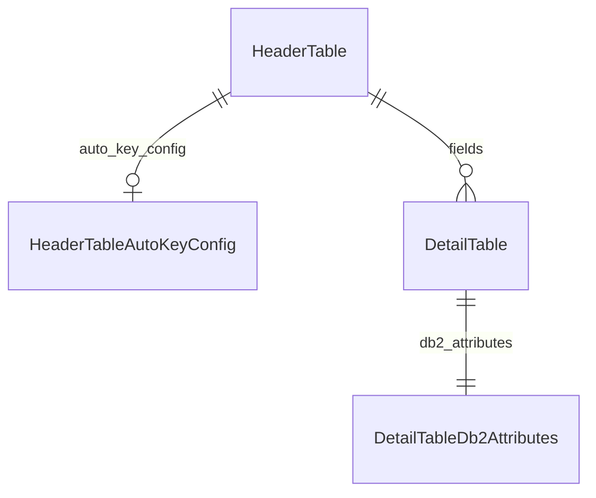

# CODAS — Atributos DB2 por columna (`DetailTableDb2Attributes`)

Documento de diseño para **`DetailTableDb2Attributes`**: atributos DB2 for i por columna (guía `db2_column_attributes.pdf` + atributos que antes vivían en `DetailTable`), en relación 1:1 con cada fila de detalle. Parámetros globales IDENTITY de cabecera: **`HeaderTableAutoKeyConfig`**.

**Estado:** modelo en fuente alineado a «detalle delgado + atributos 1:1» (may/2026). Migraciones `0007`/`0008`/`0010` en código. **UI implementada:** flujo en dos pasos (`field_db2_attributes`, § 3.1). DDL SIMPLE: **tipo** desde `DetailTable`; NULL/DEFAULT/IDENTITY/CCSID/hidden **solo** si existe fila `db2_attributes` (paso 2); extensiones PDF (CHECK, FIELDPROC, masking…) en generador **pendiente**. En fuente: sin `is_masked`; `user_defined_field` y `mask_function` para masking.

**Relacionado:** [`CODAS_TABLE_DESIGN.md`](CODAS_TABLE_DESIGN.md) (gestión de `DetailTable`), [`apps/table_design/models.py`](../apps/table_design/models.py).

---

## 1. Objetivo

Extender el diseño de columnas concentrando en **`DetailTableDb2Attributes`** los atributos DB2 por columna (incluidos nullability, defaults, IDENTITY flag, CCSID, hidden, signo, único e índice). **`DetailTable`** conserva solo el núcleo estructural (nombres, tipo, longitud, ALLOCATE, labels, llave, estado CODAS). La fila hija se crea o actualiza en el **paso 2** del flujo web (no en el alta del núcleo).

---

## 2. División de responsabilidades (modelo vigente en fuente)

### 2.1 Permanece en `DetailTable`

| Concepto | Campos |
|----------|--------|
| Relación y orden | `header`, `order_reg` |
| Identidad de columna | `field_name_long`, `field_name_short` |
| Tipo DB2 | `field_type`, `field_length`, `decimal_places` |
| VARCHAR / VARGRAPHIC | `allocate_length` |
| Metadatos LABEL | `column_label`, `column_text` |
| Llave compuesta | `is_key`, `order_key` |
| CODAS | `status`, auditoría, `script_*`, `notes` |

### 2.2 Vive en `DetailTableDb2Attributes` (1:1)

| Origen | Campos |
|--------|--------|
| Atributos movidos desde `DetailTable` (may/2026) | `is_identity`, `ccsid`, `is_hidden`, `default_sql_expression`, `nullable`, `default_value`, `signed`, `is_unique`, `is_indexed` |
| PDF / extensión DB2 (`0007`) | `check_constraint_sql`, `generated_kind`, `generated_expression`, `fieldproc_program`, `for_bit_data`, `compress_mode`, `identity_generation`, `mask_function`, `is_row_change_timestamp`, `is_generated_rowid`, `associated_trigger_name`, `security_label`, `temporal_role` |
| Extensión CODAS | `user_defined_field` |
| Auditoría extensión | `created_at`, `updated_at`, `created_by`, `updated_by` |

### 2.3 Cabecera (no duplicar en detalle)

| Concepto | Dónde |
|----------|--------|
| IDENTITY START/INCREMENT/CACHE/CYCLE | `HeaderTableAutoKeyConfig` (1:1 con `HeaderTable`) |
| PK constraint, RCDFMT | `HeaderTable` |

---

## 2bis. Referencia histórica (antes del split de atributos)

| PDF / concepto | Ubicación anterior | Ubicación actual (fuente) |
|----------------|-------------------|---------------------------|
| Tipo, longitud, decimales | `DetailTable` | `DetailTable` |
| IDENTITY (flag) | `DetailTable.is_identity` | `DetailTableDb2Attributes.is_identity` |
| CCSID | `DetailTable.ccsid` | `DetailTableDb2Attributes.ccsid` |
| ALLOCATE | `DetailTable.allocate_length` | `DetailTable` |
| IMPLICITLY HIDDEN | `DetailTable.is_hidden` | `DetailTableDb2Attributes.is_hidden` |
| LABEL / TEXT | `DetailTable.column_label`, `column_text` | `DetailTable` |
| DEFAULT literal / expresión | `DetailTable.default_*` | `DetailTableDb2Attributes` |
| NULL / NOT NULL | `DetailTable.nullable` | `DetailTableDb2Attributes.nullable` |
| Signo, único, índice | `DetailTable` | `DetailTableDb2Attributes` |
| Llave | `DetailTable.is_key`, `order_key` | `DetailTable` |

---

## 3. Relación entre entidades



- **Cardinalidad:** `OneToOneField(DetailTable, primary_key=True, on_delete=CASCADE, related_name="db2_attributes")`. Usar `detail` como PK evita un `id` suelto y garantiza 1:1 estricto.
- **Regla de negocio (flujo actual):** la fila `DetailTableDb2Attributes` se crea o actualiza al **guardar el paso 2** del flujo de campos (`field_db2_attributes`), mediante `persist_field_db2_attributes_from_form` (`get_or_create` sobre `detail`). El paso 1 (`field_create` / `field_update`) solo persiste `DetailTable`.

### 3.1 UI panel — paso 2 (implementado)

| Tema | Detalle |
|------|---------|
| **Ruta** | `table_design:field_db2_attributes` — `/panel/table-design/<header_pk>/fields/<field_pk>/db2-attributes/` |
| **Plantilla** | [`field_db2_attributes.html`](../apps/table_design/templates/table_design/field_db2_attributes.html) + [`includes/detail_field_db2_attributes_form.html`](../apps/table_design/templates/table_design/includes/detail_field_db2_attributes_form.html) |
| **Formulario** | [`DetailTableDb2AttributesForm`](../apps/table_design/forms_db2_attributes.py) |
| **Metadatos de filas** | [`db2_attributes_ui.py`](../apps/table_design/services/db2_attributes_ui.py) — `DB2_ATTRIBUTE_UI_ROWS` (orden, «Despliega campo de entrada» SI/NO, ejemplos) |
| **Persistencia** | [`persist_field_db2_attributes_from_form`](../apps/table_design/services/field_db2_attributes.py) — solo atributos con checkbox `sel_<campo>` marcado; excepción UDF |
| **Prototipo** | [`static/prototypes/detail_table/detail_field_db2_attributes_demo.html`](../static/prototypes/detail_table/detail_field_db2_attributes_demo.html) |

**Filas activas en la tabla UI (orden):** `ccsid`, `is_hidden`, `default_sql_expression`, `nullable`, `is_unique`, `check_constraint_sql`, `generated_expression`, `fieldproc_program`, `for_bit_data`, `compress_mode`, `is_masked` (→ `mask_function`), `user_defined_field`.

**Selección:** múltiple; si `user_defined_field` está activo, el resto se ignora y se resetean atributos gestionados a valores por defecto.

**Entrada `nullable`:** selector `nullable_mode` — `null` / `not_null` / `not_null_default` (mapeo a `nullable` y opcionalmente `default_sql_expression`).

---

## 4. Mapeo PDF → campos nuevos

Fuente: `db2_column_attributes.pdf` (atributos de columna en Db2 for i).

| # PDF | Atributo | Campo propuesto |
|-------|----------|-----------------|
| 1, 17, 21 | CHECK | `check_constraint_sql` |
| 5, 12, 26 | Columna generada | `generated_kind` + `generated_expression` |
| 6 | FIELDPROC | `fieldproc_program` |
| 8 | FOR BIT DATA | `for_bit_data` |
| 9 | COMPRESS | `compress_mode` |
| 11 vs 3 | IDENTITY BY DEFAULT vs ALWAYS | `identity_generation` (solo si `is_identity` en esta misma fila) |
| 13 | Data masking | `mask_function` (nombre de función para `MASKED WITH`; sin flag booleano) |
| 15 | ROW CHANGE TIMESTAMP | `is_row_change_timestamp` |
| 16 | ROWID generado | `is_generated_rowid` |
| 23 | Trigger asociado (referencia) | `associated_trigger_name` |
| 27 | SECURITY LABEL | `security_label` |
| 28–29 | PERIOD / ROW BEGIN–END | `temporal_role` |

**Fuera del MVP de columna (servicios o cabecera):** triggers completos (`CREATE TRIGGER`), `PERIOD SYSTEM_TIME` a nivel tabla, validación LUW — el PDF los menciona pero no son atributos simples de una sola columna.

---

## 5. Modelo completo propuesto

Ubicación prevista: `apps/table_design/models.py`, después de `DetailTable`.

```python
class DetailTableDb2Attributes(models.Model):
    """Atributos DB2 for i por columna (1:1 con DetailTable).

    Incluye atributos de columna para DDL SIMPLE (nullable, defaults, IDENTITY flag,
    CCSID, hidden, signo, único, índice) y extensiones del PDF db2_column_attributes.
    Parámetros globales IDENTITY (START/INC/CACHE/CYCLE) en HeaderTableAutoKeyConfig.
    """

    class IdentityGeneration(models.TextChoices):
        ALWAYS = "ALWAYS", "GENERATED ALWAYS AS IDENTITY"
        BY_DEFAULT = "BY_DEFAULT", "GENERATED BY DEFAULT AS IDENTITY"

    class GeneratedKind(models.TextChoices):
        NONE = "NONE", "Sin columna generada"
        EXPRESSION = "EXPR", "GENERATED ALWAYS AS (expresión)"
        ROW_CHANGE_TIMESTAMP = "RCTS", "ROW CHANGE TIMESTAMP"
        ROW_BEGIN = "RBEGIN", "GENERATED ALWAYS AS ROW BEGIN"
        ROW_END = "REND", "GENERATED ALWAYS AS ROW END"

    class CompressMode(models.TextChoices):
        NONE = "NONE", "Sin compresión"
        SYSTEM_DEFAULT = "SYSTEM_DEFAULT", "COMPRESS SYSTEM DEFAULT"

    class TemporalRole(models.TextChoices):
        NONE = "NONE", "Ninguno"
        SYSTEM_TIME_START = "ST_START", "PERIOD SYSTEM_TIME (inicio)"
        SYSTEM_TIME_END = "ST_END", "PERIOD SYSTEM_TIME (fin)"
        APPLICATION_TIME_START = "AT_START", "PERIOD APPLICATION_TIME (inicio)"
        APPLICATION_TIME_END = "AT_END", "PERIOD APPLICATION_TIME (fin)"

    detail = models.OneToOneField(
        DetailTable,
        on_delete=models.CASCADE,
        primary_key=True,
        related_name="db2_attributes",
        verbose_name="Campo de diseño",
    )

    # Atributos de columna (antes en DetailTable; movidos may/2026)
    is_identity = models.BooleanField(
        default=False,
        verbose_name="Columna IDENTITY",
    )
    ccsid = models.PositiveIntegerField(null=True, blank=True, verbose_name="CCSID")
    is_hidden = models.BooleanField(default=False, verbose_name="IMPLICITLY HIDDEN")
    default_sql_expression = models.CharField(max_length=200, null=True, blank=True, ...)
    nullable = models.BooleanField(default=True, verbose_name="Permite nulos")
    default_value = models.CharField(max_length=50, null=True, blank=True, ...)
    signed = models.BooleanField(default=True, verbose_name="Con signo")
    is_unique = models.BooleanField(default=False, verbose_name="Único")
    is_indexed = models.BooleanField(default=False, verbose_name="Indexado")

    # PDF §1, 17, 21 — CHECK
    check_constraint_sql = models.TextField(
        blank=True,
        default="",
        verbose_name="CHECK (expresión SQL)",
        help_text="Ej.: STATUS IN ('A','I','P'). Vacío = sin CHECK en DDL.",
    )

    # PDF §5, 12, 26 — columnas generadas (distinto del flag is_identity)
    generated_kind = models.CharField(
        max_length=8,
        choices=GeneratedKind.choices,
        default=GeneratedKind.NONE,
        verbose_name="Tipo de columna generada",
    )
    generated_expression = models.TextField(
        blank=True,
        default="",
        verbose_name="Expresión GENERATED ALWAYS AS",
        help_text="Obligatorio si generated_kind=EXPR. Ej.: CONCAT(a, ' - ', b).",
    )

    # PDF §6 — FIELDPROC
    fieldproc_program = models.CharField(
        max_length=128,
        blank=True,
        default="",
        verbose_name="FIELDPROC (programa calificado)",
        help_text="Ej.: CODASLIB/ENCRIPTAR_DOC",
    )

    # PDF §8 — FOR BIT DATA (BINARY / VARBINARY)
    for_bit_data = models.BooleanField(
        default=False,
        verbose_name="FOR BIT DATA",
    )

    # PDF §9 — COMPRESS
    compress_mode = models.CharField(
        max_length=16,
        choices=CompressMode.choices,
        default=CompressMode.NONE,
        verbose_name="Compresión de columna",
    )

    # PDF §11 — variante BY DEFAULT (flag is_identity en esta tabla)
    identity_generation = models.CharField(
        max_length=10,
        choices=IdentityGeneration.choices,
        default=IdentityGeneration.ALWAYS,
        verbose_name="Modo IDENTITY",
        help_text="Aplica solo si is_identity es verdadero.",
    )

    # PDF §13 — Data masking
    mask_function = models.CharField(
        max_length=64,
        blank=True,
        default="",
        verbose_name="Función MASKED WITH",
        help_text="EMAIL VARCHAR(254) MASKED WITH (FUNCTION 'EMAIL')",
    )

    # PDF §15 — ROW CHANGE TIMESTAMP
    is_row_change_timestamp = models.BooleanField(
        default=False,
        verbose_name="ROW CHANGE TIMESTAMP",
        help_text="GENERATED … FOR EACH ROW ON UPDATE AS ROW CHANGE TIMESTAMP.",
    )

    # PDF §16 — ROWID GENERATED ALWAYS
    is_generated_rowid = models.BooleanField(
        default=False,
        verbose_name="ROWID generado",
        help_text="Para field_type=ROWID: GENERATED ALWAYS.",
    )

    # PDF §23 — referencia a trigger (DDL aparte)
    associated_trigger_name = models.CharField(
        max_length=128,
        blank=True,
        default="",
        verbose_name="Trigger asociado (nombre)",
        help_text="Referencia documental; el DDL del trigger se gestiona aparte.",
    )

    # PDF §27 — SECURITY LABEL
    security_label = models.CharField(
        max_length=128,
        blank=True,
        default="",
        verbose_name="SECURITY LABEL",
    )

    # PDF §28–29 — rol en tablas temporales (par de columnas)
    temporal_role = models.CharField(
        max_length=12,
        choices=TemporalRole.choices,
        default=TemporalRole.NONE,
        verbose_name="Rol temporal (PERIOD / ROW BEGIN-END)",
    )

    user_defined_field = models.CharField(
        max_length=255,
        blank=True,
        default="",
        verbose_name="User Defined Field",
        help_text="Ej.: Definido por el usuario",
    )

    # Auditoría estándar CODAS
    created_at = models.DateTimeField(auto_now_add=True, verbose_name="Creado el")
    updated_at = models.DateTimeField(auto_now=True, verbose_name="Actualizado el")
    created_by = models.ForeignKey(
        settings.AUTH_USER_MODEL,
        on_delete=models.SET_NULL,
        null=True,
        blank=True,
        related_name="table_design_field_db2_attrs_created",
        verbose_name="Creado por",
    )
    updated_by = models.ForeignKey(
        settings.AUTH_USER_MODEL,
        on_delete=models.SET_NULL,
        null=True,
        blank=True,
        related_name="table_design_field_db2_attrs_updated",
        verbose_name="Actualizado por",
    )

    class Meta:
        verbose_name = "Atributos DB2 de columna"
        verbose_name_plural = "Atributos DB2 de columnas"

    def __str__(self) -> str:
        return f"DB2 attrs · {self.detail_id} · {self.detail.field_name_short}"

    def clean(self) -> None:
        super().clean()
        detail = self.detail

        if self.generated_kind == self.GeneratedKind.EXPRESSION and not self.generated_expression.strip():
            raise ValidationError(
                {"generated_expression": "Indique la expresión para columna generada."}
            )

        if self.generated_kind != self.GeneratedKind.NONE and self.is_identity:
            raise ValidationError(
                "No combine IDENTITY con columna generada por expresión."
            )

        if self.is_row_change_timestamp and self.generated_kind not in (
            self.GeneratedKind.NONE,
            self.GeneratedKind.ROW_CHANGE_TIMESTAMP,
        ):
            raise ValidationError(
                {"is_row_change_timestamp": "Conflicto con otro tipo de columna generada."}
            )

        if self.is_row_change_timestamp and detail.field_type != DetailTable.FieldDB2Type.TIMESTAMP:
            raise ValidationError(
                {"is_row_change_timestamp": "ROW CHANGE TIMESTAMP requiere tipo TIMESTAMP."}
            )

        if self.is_generated_rowid and detail.field_type != DetailTable.FieldDB2Type.ROWID:
            raise ValidationError(
                {"is_generated_rowid": "Solo aplica a columnas ROWID."}
            )

        if self.for_bit_data and detail.field_type not in (
            DetailTable.FieldDB2Type.BINARY,
            DetailTable.FieldDB2Type.VARBINARY,
        ):
            raise ValidationError(
                {"for_bit_data": "FOR BIT DATA solo aplica a BINARY o VARBINARY."}
            )

        # Nota: clean() en fuente aún referencia is_masked (campo retirado); pendiente alinear código.
```

---

## 6. Resumen por pantalla (grupos UI)

| Grupo UI | Campos |
|----------|--------|
| Atributos DDL SIMPLE (1:1 obligatorio) | `is_identity`, `nullable`, `default_value`, `default_sql_expression`, `ccsid`, `is_hidden`, `signed`, `is_unique`, `is_indexed` |
| Validación | `check_constraint_sql` |
| Columna generada | `generated_kind`, `generated_expression`, `is_row_change_timestamp` |
| Protección / formato | `fieldproc_program`, `for_bit_data`, `compress_mode` |
| IDENTITY (variante) | `identity_generation` |
| Seguridad | `mask_function`, `security_label` |
| Extensión / UDF | `user_defined_field` |
| Especiales | `is_generated_rowid`, `temporal_role`, `associated_trigger_name` |
| Sistema | `detail` (PK/FK), auditoría |

En **`DetailTable`** permanecen: tipo, longitud, decimales, `allocate_length`, labels, llaves, estado y script por fila.

---

## 7. Integración

1. [x] Migración `0007_detail_table_db2_attributes` + backfill `0008_backfill_detail_table_db2_attributes`.
2. [x] Migración `0010_detail_db2_attrs_column_split`: columnas DDL SIMPLE `DetailTable` → `DetailTableDb2Attributes`.
3. [x] Servicio paso 2: `get_or_create` en `field_db2_attributes` (`persist_field_db2_attributes_from_form`).
4. [x] UI paso 2: `field_db2_attributes` + tabla de atributos (no embebida en `field_list`).
5. [x] Generador DDL SIMPLE: NULL/DEFAULT/IDENTITY/CCSID/hidden desde `detail.db2_attributes` **cuando la fila existe** (sin inferir nullability en paso 1).
6. [ ] Generador DDL: extensiones PDF (CHECK, FIELDPROC, masking, GENERATED…).

---

## 8. Acceso desde código

```python
field = DetailTable.objects.select_related("db2_attributes").get(pk=...)
try:
    attrs = field.db2_attributes
except DetailTableDb2Attributes.DoesNotExist:
    attrs = None  # paso 2 pendiente; el generador DDL emite solo el tipo
```

Tras **0008**, cada `DetailTable` **existente en migración** tiene fila hija. Los **nuevos** campos obtienen `DetailTableDb2Attributes` al **guardar el paso 2** (`field_db2_attributes`); hasta entonces `field.db2_attributes` puede no existir.

---

## 9. Checklist de implementación

- [x] Añadir clase `DetailTableDb2Attributes` en `apps/table_design/models.py`
- [x] Migración + backfill 1:1 para cada `DetailTable` existente
- [x] Migración `0010` (split columnas)
- [x] `get_or_create` en POST `field_db2_attributes` (paso 2)
- [x] Pantalla dedicada `field_db2_attributes` (enlace **DB2** desde listado)
- [x] Generador DDL atributos SIMPLE
- [ ] Generador DDL extensiones PDF
- [x] Actualizar `CODAS_TABLE_DESIGN.md` §9 / §9.2.1

---

## 10. Evolución del documento

| Fecha | Cambio |
|-------|--------|
| 2026-05 | Documento inicial con diseño 1:1, mapeo PDF y modelo propuesto completo. |
| 2026-05 | Split de atributos: `is_identity`, `ccsid`, `is_hidden`, defaults, `nullable`, `signed`, `is_unique`, `is_indexed` pasan a `DetailTableDb2Attributes` en fuente (`models.py`); docs alineados; migración de BD pendiente. |
| 2026-05 | Fuente: eliminado `is_masked`; añadido `user_defined_field` (máx. 255). Documentación alineada; migración BD y `clean()` pendientes. |
| 2026-05 | Flujo en dos pasos implementado: `field_db2_attributes`, `DetailTableDb2AttributesForm`, tabla UI y persistencia selectiva. |
| 2026-05 | Generador DDL: nullability/defaults/IDENTITY/CCSID/hidden condicionados a fila paso 2; tipo siempre desde `DetailTable`. |
