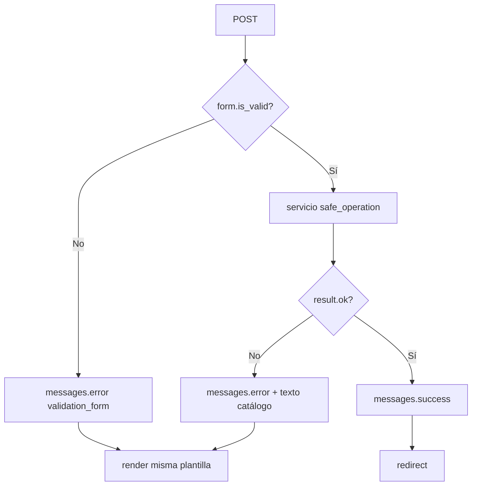

# CODAS — Catálogo de mensajes de operación (UI)

Documento oficial de textos mostrados al usuario tras operaciones de lectura, alta, búsqueda, actualización y eliminación. Complementa [`CODAS_CONTEXTO.md`](CODAS_CONTEXTO.md) § 6.4.

**Estado:** catálogo aprobado (jun/2026). **Implementado en código:** **`apps.company`**, **`apps.table_design`** (cabecera + campos); resto de apps pendiente (ver checklist § 0).

**Implementación prevista (no obligatoria en todas las apps aún):** `OperationResult` + `safe_operation` en `apps/core/services/`, consumido desde `services/` de cada app.

---

## 1. Principios

| Principio | Descripción |
|-----------|-------------|
| **Mensaje ≠ detalle técnico** | El usuario ve lenguaje de negocio. SQL, nombres de tablas, `str(exception)` y trazas van solo a **logs** (`logger.exception` / `DJANGO_LOG_LEVEL`). |
| **Un canal de modal** | `django.contrib.messages` → modal `#codas-msg-modal` en [`dashboard_base.html`](../apps/dashboard/templates/dashboard/dashboard_base.html) (`error`, `success`, `warning`, `info`). |
| **Errores por campo** | Validación de formularios: mensajes bajo el input (`form.errors`), además del modal genérico si la vista lo define. |
| **POST fallido sin redirect** | En crear/editar, si falla validación o persistencia: **re-render** de la misma pantalla con datos enviados; no redirigir al listado. |
| **POST exitoso** | `messages.success` + **redirect** al detalle o listado acordado. |
| **Forms primero** | `form.is_valid()` antes de llamar a servicios de persistencia con `OperationResult`. |

---

## 2. Códigos internos (`error_code`)

Identificadores estables para mapeo en código (no se muestran al usuario tal cual).

| `error_code` | Uso |
|--------------|-----|
| `success` | Operación completada (mensaje de éxito; suele ir con tag `success`). |
| `validation_form` | Formulario Django inválido. |
| `validation_model` | `ValidationError` en modelo / `full_clean`. |
| `duplicate` | `IntegrityError` por unicidad (nombre corto, constraint, etc.). |
| `not_found` | `ObjectDoesNotExist` / registro inexistente. |
| `multiple_found` | `MultipleObjectsReturned`. |
| `protected_delete` | `ProtectedError` al eliminar por FK `PROTECT`. |
| `data_error` | `DataError` (valor incompatible con columna). |
| `db_connection` | `OperationalError` (conexión, timeout). |
| `db_internal` | `ProgrammingError`, `DatabaseError` genérico. |
| `empty_search` | Búsqueda/listado sin filas (informativo, no fallo de sistema). |
| `unauthorized` | Sin permiso para la operación. |
| `business_blocked` | Regla de negocio (cabecera con script, inactiva, etc.). |
| `unexpected` | Cualquier otra excepción no clasificada. |

---

## 3. Catálogo de mensajes al usuario

### 3.1 Crear y actualizar (guardar)

| `error_code` / situación | Tag `messages` | Texto al usuario |
|------------------------|----------------|------------------|
| Guardado correcto | `success` | El registro se guardó correctamente. |
| Formulario inválido | `error` | Revise los datos marcados en rojo; no se pudo guardar. |
| Validación de modelo | `error` | Los datos no son válidos. Revise los campos indicados. |
| Registro duplicado | `error` | Ya existe un registro con ese identificador. Revise el nombre corto o el código. |
| Dato incompatible con la BD | `error` | Algún valor no es válido para el sistema. Revise longitudes y formatos. |
| Error de conexión a la BD | `error` | No se pudo completar la operación. Verifique la conexión o intente más tarde. |
| Error interno al guardar | `error` | Ocurrió un error al guardar. Si persiste, contacte al administrador de sistemas. |

### 3.2 Lectura y búsqueda

| `error_code` / situación | Tag `messages` | Texto al usuario |
|------------------------|----------------|------------------|
| Registro no encontrado | `error` | No se encontró el registro solicitado. |
| Búsqueda sin resultados | `info` | No hay registros que coincidan con la búsqueda. |
| Varios registros inesperados | `error` | Hay datos inconsistentes para esta consulta. Contacte al administrador de sistemas. |

### 3.3 Eliminar

| `error_code` / situación | Tag `messages` | Texto al usuario |
|------------------------|----------------|------------------|
| Eliminado correcto | `success` | El registro se eliminó correctamente. |
| No se puede eliminar (relacionados) | `error` | No se puede eliminar: existen datos asociados que deben resolverse antes. |
| Registro ya eliminado / no existe | `error` | El registro ya no existe o fue eliminado. |

### 3.4 Permisos y reglas CODAS (ya usados en apps)

| `error_code` / situación | Tag `messages` | Texto al usuario |
|------------------------|----------------|------------------|
| Sin permiso mantenimiento compañías | `warning` | Usuario no autorizado al mantenimiento de companies |
| Sin permiso table design | `error` | (mensajes definidos en `apps.table_design` — mantener coherencia de tono) |
| Sin compañía en perfil | `error` | Su perfil no tiene compañía asignada. |
| Cabecera bloqueada (script / inactiva) | `warning` / `error` | La operación no está permitida: la cabecera tiene script generado o está inactiva. |

*Nota:* los textos literales ya fijados en código (p. ej. `MSG_UNAUTHORIZED_COMPANY`) pueden conservarse; nuevas pantallas deben alinearse con esta tabla.

### 3.5 Mensajes específicos — piloto `apps.company`

| Situación | Texto al usuario |
|-----------|------------------|
| Compañía creada | Compañía creada correctamente. |
| Compañía actualizada | Compañía actualizada correctamente. |
| Compañía eliminada | Compañía eliminada correctamente. |
| Nombre corto duplicado (form) | Ya existe una compañía con este nombre corto. |
| Eliminar con diseños de tabla | No se puede eliminar la compañía: existen registros protegidos que deben resolverse antes (p. ej. diseños de tabla). |

---

## 4. Qué no mostrar al usuario

- Sentencias SQL, nombres de constraints (`uq_…`), tablas o columnas.
- `IntegrityError: …`, `ProgrammingError: …` literales.
- Pilas de excepción Python.
- Contenido de `DEBUG=True` en producción.

---

## 5. Flujo vista ↔ servicio (referencia implementación futura)

---

## 6. Evolución del documento

| Fase | Alcance |
|------|---------|
| **Fase 1** (actual) | Catálogo en documentación. |
| **Fase 2** | `apps/core/services/operation_result.py` + tests (**hecho**). |
| **Fase 3** | `apps/company/services/company_persistence.py` + tests (**hecho**). |
| **Fase 4** | Vistas `company_create` / `update` / `delete` con servicios (**hecho**). |
| **Fase 5** | Tests ampliados + [`CODAS_COMPANY_PILOT_CHECKLIST.md`](CODAS_COMPANY_PILOT_CHECKLIST.md) (**hecho** — rollout multi-app). |
| **Fase 6** | **`apps.table_design`** (**hecho**); `sp_asistido`, `maintenance_builder`, etc. **pendiente**. |

*Última revisión: jun/2026 — `company` + `table_design` con OperationResult; ver checklist § 0.*
